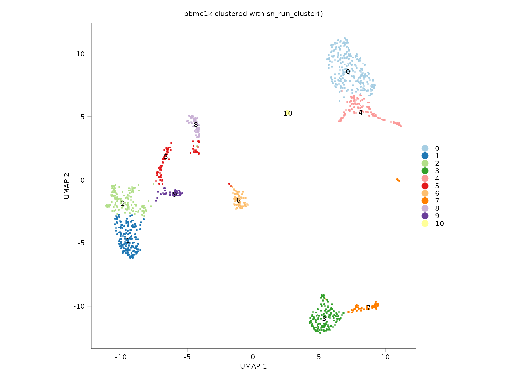
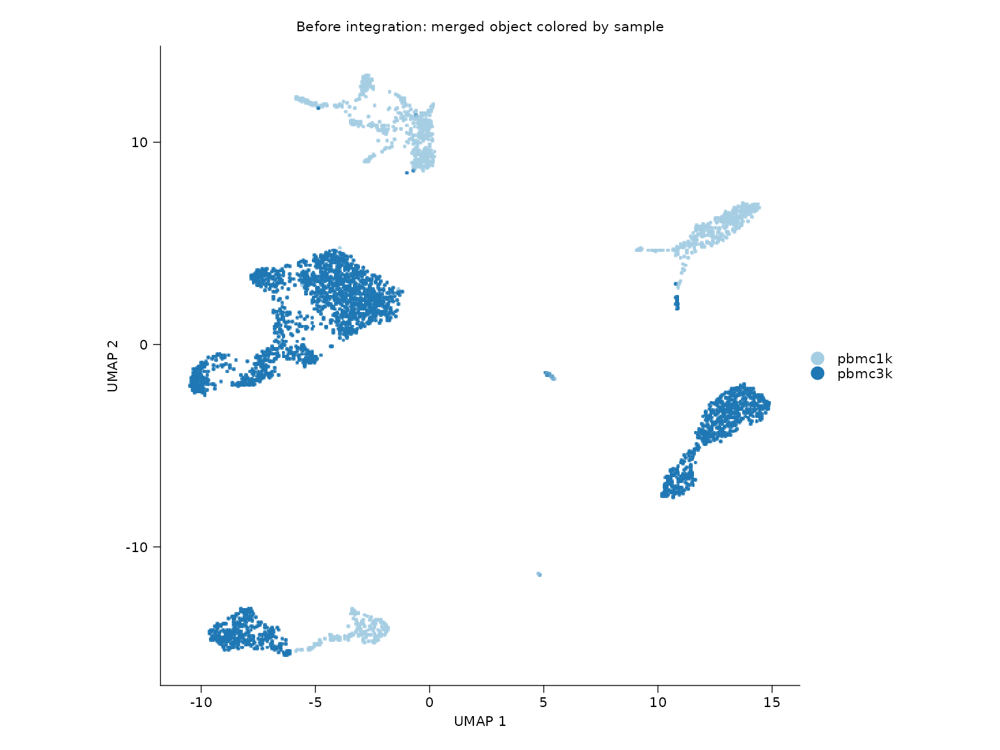
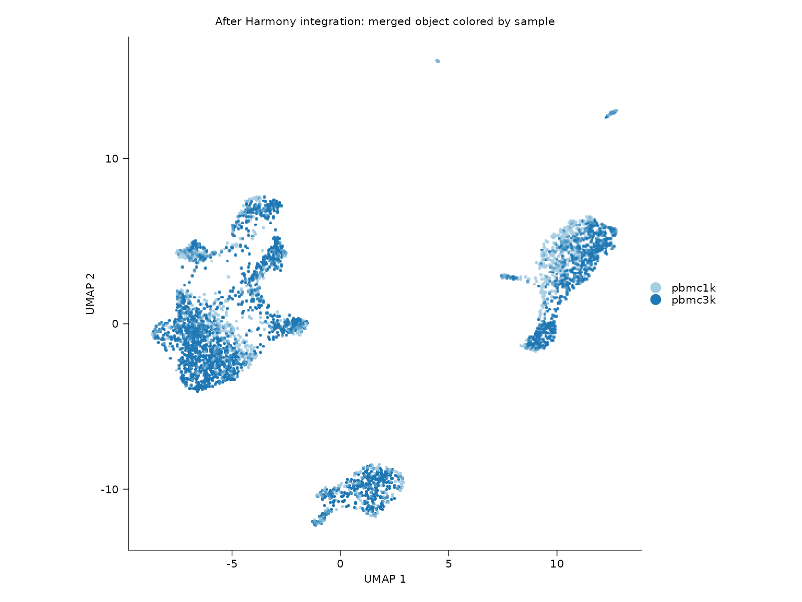
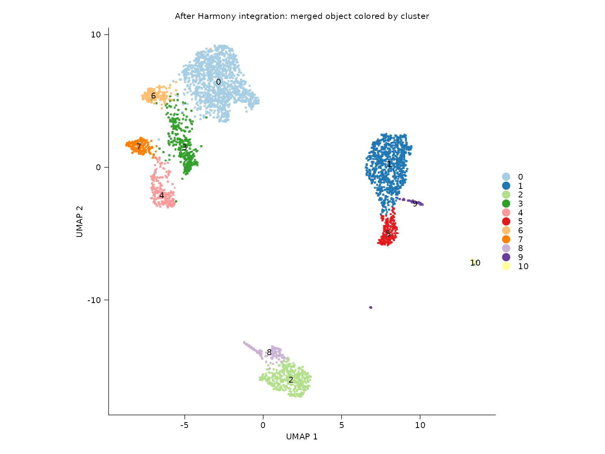
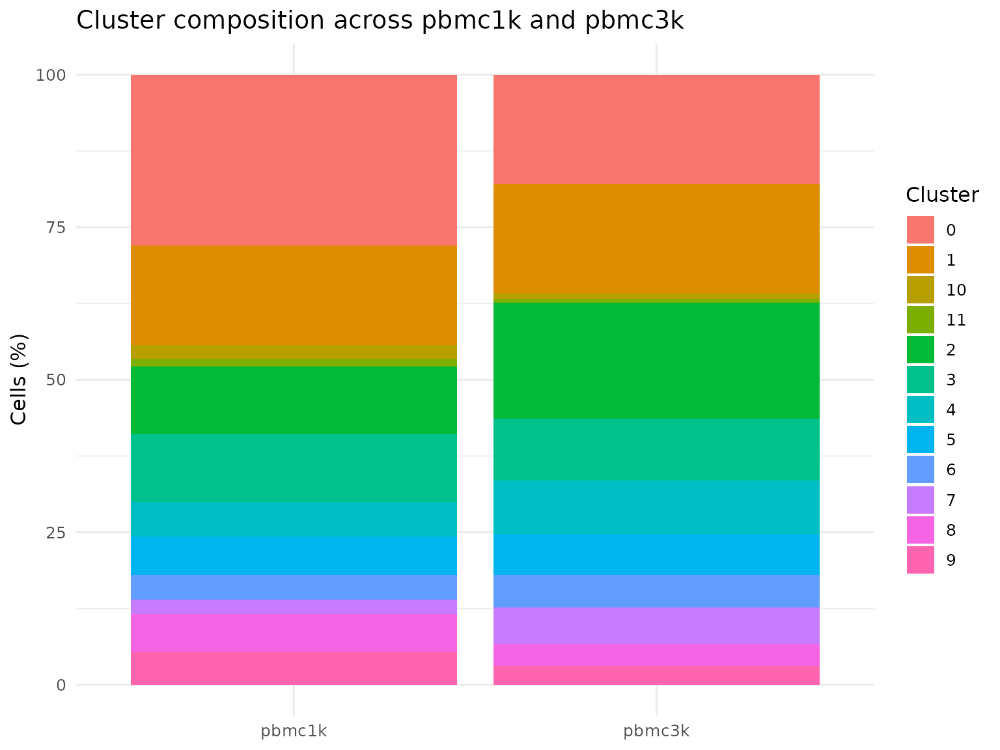
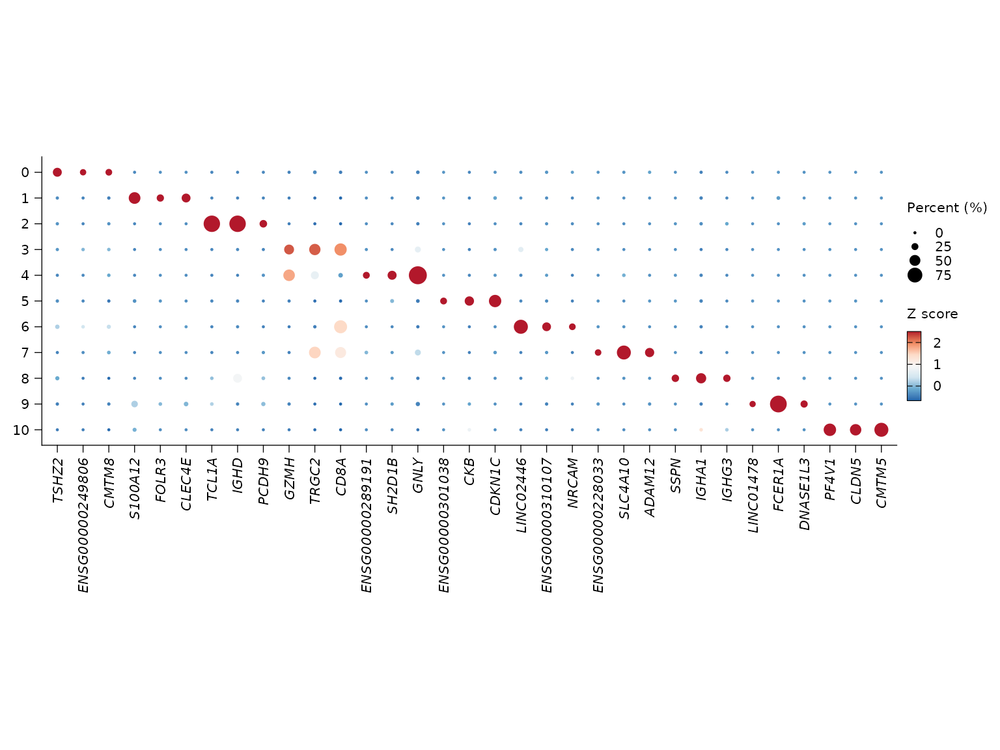

# PBMC workflow

This article runs a complete PBMC analysis using the built-in `pbmc1k`
and `pbmc3k` example datasets. The workflow covers QC-aware
preprocessing, single-sample clustering, pre/post integration
comparison, sample composition summaries, multi-metric integration
scoring, rare-group diagnostics, marker discovery, dot-plot
visualization, and functional enrichment from cluster markers.

To keep `R CMD check` deterministic, the analysis is only evaluated when
`SHENNONG_RUN_VIGNETTES=true` or during pkgdown builds.

Shennong also ships bundled human and mouse GENCODE gene annotations, so
[`sn_filter_genes()`](https://songqi.org/shennong/reference/sn_filter_genes.md)
can combine expression-threshold filtering with annotation-based
retention such as `gene_class = "coding"` or exact `gene_type` subsets.

``` r
library(Shennong)
library(dplyr)
library(ggplot2)
library(knitr)
library(Seurat)
```

## Inspect bundled signatures

Shennong now ships a tree-structured signature catalog derived from
`SignatuR` and stored as package data. You can inspect the available
signature paths and retrieve a specific signature either by short alias
or by full tree path.

``` r
signature_catalog <- sn_list_signatures(species = "human")
head(signature_catalog[, c("path", "n_genes")], 6)
#> # A tibble: 6 × 2
#>   path                   n_genes
#>   <chr>                    <int>
#> 1 Blocklists/Pseudogenes   12600
#> 2 Blocklists/Non-coding     7783
#> 3 Programs/HeatShock          97
#> 4 Programs/cellCycle.G1S      42
#> 5 Programs/cellCycle.G2M      52
#> 6 Programs/IFN               107

mito_genes <- sn_get_signatures(
  species = "human",
  category = c("mito", "Compartments/Ribo")
)
length(mito_genes)
#> [1] 205
```

## Data loaded for the workflow

``` r
knitr::kable(cell_summary, digits = 0)
```

| dataset             | cells | genes | clusters |
|:--------------------|------:|------:|---------:|
| pbmc1k              |  1141 | 24986 |       11 |
| pbmc3k              |  2671 | 19971 |       NA |
| merged_unintegrated |  3812 | 25597 |       14 |
| merged_integrated   |  3812 | 25597 |       11 |

The merged analysis is intentionally run twice: once without batch
correction and once with Harmony integration. This makes the
before/after comparison explicit instead of only showing the corrected
embedding.

## Single-sample clustering

``` r
sn_plot_dim(
  object = pbmc1k_clustered,
  reduction = "umap",
  group_by = "seurat_clusters",
  label = TRUE,
  show_legend = FALSE,
  title = "pbmc1k clustered with sn_run_cluster()"
)
```



## Before and after Harmony integration

``` r
sn_plot_dim(
  object = pbmc_unintegrated,
  reduction = "umap",
  group_by = "sample",
  title = "Before integration: merged object colored by sample"
)
```



``` r
sn_plot_dim(
  object = pbmc_integrated,
  reduction = "umap",
  group_by = "sample",
  title = "After Harmony integration: merged object colored by sample"
)
```



``` r
sn_plot_dim(
  object = pbmc_integrated,
  reduction = "umap",
  group_by = "seurat_clusters",
  label = TRUE,
  show_legend = FALSE,
  title = "After Harmony integration: merged object colored by cluster"
)
```



## Cluster composition by sample

``` r
knitr::kable(dplyr::slice_head(composition_tbl, n = 12), digits = 2)
```

| sample | seurat_clusters | proportion |
|:-------|:----------------|-----------:|
| pbmc1k | 0               |      27.52 |
| pbmc1k | 1               |      27.96 |
| pbmc1k | 10              |       1.31 |
| pbmc1k | 2               |      11.48 |
| pbmc1k | 3               |       6.05 |
| pbmc1k | 4               |       6.22 |
| pbmc1k | 5               |       2.28 |
| pbmc1k | 6               |       3.94 |
| pbmc1k | 7               |       6.05 |
| pbmc1k | 8               |       5.00 |
| pbmc1k | 9               |       2.19 |
| pbmc3k | 0               |      36.80 |

``` r
sn_plot_barplot(
  composition_tbl,
  x = sample,
  y = proportion,
  fill = seurat_clusters
) +
  labs(
    title = "Cluster composition across pbmc1k and pbmc3k",
    x = NULL,
    y = "Cells (%)",
    fill = "Cluster"
  ) +
  theme_minimal(base_size = 12)
```



## Integration quality summary with LISI

``` r
knitr::kable(lisi_summary, digits = 3)
```

| state              |   min |    q1 | median |  mean |    q3 | max |
|:-------------------|------:|------:|-------:|------:|------:|----:|
| after_integration  | 1.002 | 1.214 |  1.497 | 1.519 | 1.839 |   2 |
| before_integration | 1.000 | 1.000 |  1.000 | 1.024 | 1.000 |   2 |

Higher LISI values indicate better local sample mixing. In this
two-sample example the theoretical maximum is 2, so the post-Harmony
distribution should shift upward relative to the unintegrated baseline.

## Multi-metric integration assessment

``` r
knitr::kable(assessment_summary, digits = 3)
```

| metric               | category      | score | scaled_score | n_cells | source         | note                    |
|:---------------------|:--------------|------:|-------------:|--------:|:---------------|:------------------------|
| batch_silhouette     | batch_removal | 0.091 |        0.909 |    3812 | harmony        | Global batch silhouette |
| batch_lisi           | batch_removal | 1.519 |        0.519 |    3812 | harmony        |                         |
| cluster_connectivity | structure     | 1.000 |        1.000 |    3812 | RNA_nn         |                         |
| pcr_batch            | batch_removal | 0.007 |        0.929 |    3812 | harmony vs pca |                         |

[`sn_assess_integration()`](https://songqi.org/shennong/reference/sn_assess_integration.md)
combines local sample mixing, PCR batch reduction, graph connectivity,
and cluster-level diagnostics into one summary object while reusing the
stored neighbor graph when possible.

``` r
knitr::kable(challenging_groups, digits = 3)
```

| seurat_clusters | n_cells | fraction_cells | median_neighbor_purity | mean_neighbor_purity | graph_connectivity | mean_silhouette | separation_score | challenge_score | rare_group | challenging_group |
|:----------------|--------:|---------------:|-----------------------:|---------------------:|-------------------:|----------------:|-----------------:|----------------:|:-----------|:------------------|
| 9               |      49 |          0.013 |                  0.947 |                0.841 |                  1 |          -0.009 |            0.814 |           0.186 | TRUE       | FALSE             |
| 3               |     326 |          0.086 |                  0.979 |                0.886 |                  1 |           0.061 |            0.836 |           0.164 | FALSE      | FALSE             |
| 8               |     149 |          0.039 |                  1.000 |                0.900 |                  1 |           0.112 |            0.852 |           0.148 | FALSE      | FALSE             |
| 0               |    1297 |          0.340 |                  1.000 |                0.977 |                  1 |           0.196 |            0.866 |           0.134 | FALSE      | FALSE             |
| 4               |     245 |          0.064 |                  1.000 |                0.952 |                  1 |           0.217 |            0.869 |           0.131 | FALSE      | FALSE             |
| 2               |     393 |          0.103 |                  1.000 |                0.966 |                  1 |           0.273 |            0.879 |           0.121 | FALSE      | FALSE             |
| 6               |     176 |          0.046 |                  1.000 |                0.913 |                  1 |           0.305 |            0.884 |           0.116 | FALSE      | FALSE             |
| 7               |     163 |          0.043 |                  1.000 |                0.939 |                  1 |           0.317 |            0.886 |           0.114 | FALSE      | FALSE             |
| 5               |     185 |          0.049 |                  1.000 |                0.962 |                  1 |           0.380 |            0.897 |           0.103 | FALSE      | FALSE             |
| 1               |     799 |          0.210 |                  1.000 |                0.987 |                  1 |           0.383 |            0.897 |           0.103 | FALSE      | FALSE             |
| 10              |      30 |          0.008 |                  1.000 |                0.995 |                  1 |           0.740 |            0.957 |           0.043 | TRUE       | FALSE             |

The `challenging_groups` table is especially useful for surfacing rare
groups or poorly separated populations that may not stand out as
isolated UMAP islands.

## Marker genes from the integrated object

``` r
knitr::kable(marker_tbl, digits = 3)
```

| cluster | gene            | avg_log2FC | p_val_adj |
|:--------|:----------------|-----------:|----------:|
| 0       | TSHZ2           |      5.207 |         0 |
| 0       | ENSG00000249806 |      4.769 |         0 |
| 0       | CMTM8           |      3.697 |         0 |
| 1       | S100A12         |      8.658 |         0 |
| 1       | FOLR3           |      8.432 |         0 |
| 1       | CLEC4E          |      7.858 |         0 |
| 2       | TCL1A           |      8.094 |         0 |
| 2       | IGHD            |      6.872 |         0 |
| 2       | PCDH9           |      6.472 |         0 |
| 3       | GZMH            |      4.389 |         0 |
| 3       | TRGC2           |      4.112 |         0 |
| 3       | CD8A            |      3.710 |         0 |
| 4       | ENSG00000289191 |      7.489 |         0 |
| 4       | SH2D1B          |      7.260 |         0 |
| 4       | GNLY            |      7.171 |         0 |
| 5       | ENSG00000301038 |      8.422 |         0 |
| 5       | CKB             |      7.007 |         0 |
| 5       | CDKN1C          |      6.901 |         0 |
| 6       | LINC02446       |      5.625 |         0 |
| 6       | ENSG00000310107 |      4.914 |         0 |
| 6       | NRCAM           |      4.655 |         0 |
| 7       | ENSG00000228033 |      7.664 |         0 |
| 7       | SLC4A10         |      7.625 |         0 |
| 7       | ADAM12          |      6.432 |         0 |
| 8       | SSPN            |      8.854 |         0 |
| 8       | IGHA1           |      8.238 |         0 |
| 8       | IGHG3           |      8.030 |         0 |
| 9       | LINC01478       |     10.575 |         0 |
| 9       | FCER1A          |      8.814 |         0 |
| 9       | DNASE1L3        |      8.396 |         0 |
| 10      | PF4V1           |     15.175 |         0 |
| 10      | CLDN5           |     13.563 |         0 |
| 10      | CMTM5           |     13.046 |         0 |

``` r
sn_plot_dot(
  x = pbmc_integrated,
  features = "top_markers",
  de_name = "cluster_markers",
  n = 3
)
```



## Functional enrichment of marker genes

The table below shows the first non-empty GO Biological Process GSEA
result found among the cluster marker sets. In this run, enrichment was
computed from cluster 0.

``` r
knitr::kable(enrichment_tbl, digits = 4)
```

|              | ID           | Description                                                        |    NES | p.adjust |
|:-------------|:-------------|:-------------------------------------------------------------------|-------:|---------:|
| <GO:0042110> | <GO:0042110> | T cell activation                                                  | 2.1728 |        0 |
| <GO:0002250> | <GO:0002250> | adaptive immune response                                           | 2.2262 |        0 |
| <GO:0046649> | <GO:0046649> | lymphocyte activation                                              | 2.0296 |        0 |
| <GO:0001775> | <GO:0001775> | cell activation                                                    | 1.9828 |        0 |
| <GO:0045321> | <GO:0045321> | leukocyte activation                                               | 1.9731 |        0 |
| <GO:1903131> | <GO:1903131> | mononuclear cell differentiation                                   | 2.0381 |        0 |
| <GO:0002521> | <GO:0002521> | leukocyte differentiation                                          | 1.9958 |        0 |
| <GO:0006955> | <GO:0006955> | immune response                                                    | 1.9048 |        0 |
| <GO:0002684> | <GO:0002684> | positive regulation of immune system process                       | 1.9606 |        0 |
| <GO:0002429> | <GO:0002429> | immune response-activating cell surface receptor signaling pathway | 2.1443 |        0 |

``` r
sessioninfo::session_info()
#> ─ Session info ───────────────────────────────────────────────────────────────
#>  setting  value
#>  version  R version 4.5.3 (2026-03-11)
#>  os       Ubuntu 24.04.3 LTS
#>  system   x86_64, linux-gnu
#>  ui       X11
#>  language en
#>  collate  C.UTF-8
#>  ctype    C.UTF-8
#>  tz       UTC
#>  date     2026-03-25
#>  pandoc   3.1.11 @ /opt/hostedtoolcache/pandoc/3.1.11/x64/ (via rmarkdown)
#>  quarto   NA
#> 
#> ─ Packages ───────────────────────────────────────────────────────────────────
#>  package           * version  date (UTC) lib source
#>  abind               1.4-8    2024-09-12 [1] CRAN (R 4.5.3)
#>  AnnotationDbi       1.72.0   2025-10-29 [1] Bioconduc~
#>  ape                 5.8-1    2024-12-16 [1] CRAN (R 4.5.3)
#>  aplot               0.2.9    2025-09-12 [1] CRAN (R 4.5.3)
#>  Biobase             2.70.0   2025-10-29 [1] Bioconduc~
#>  BiocGenerics        0.56.0   2025-10-29 [1] Bioconduc~
#>  BiocParallel        1.44.0   2025-10-29 [1] Bioconduc~
#>  Biostrings          2.78.0   2025-10-29 [1] Bioconduc~
#>  bit                 4.6.0    2025-03-06 [1] CRAN (R 4.5.3)
#>  bit64               4.6.0-1  2025-01-16 [1] CRAN (R 4.5.3)
#>  blob                1.3.0    2026-01-14 [1] CRAN (R 4.5.3)
#>  bslib               0.10.0   2026-01-26 [1] CRAN (R 4.5.3)
#>  cachem              1.1.0    2024-05-16 [1] CRAN (R 4.5.3)
#>  catplot             0.1.0    2026-03-19 [1] Github (catplot/catplot@0fc2344)
#>  cli                 3.6.5    2025-04-23 [1] CRAN (R 4.5.3)
#>  cluster             2.1.8.2  2026-02-05 [3] CRAN (R 4.5.3)
#>  clusterProfiler     4.18.4   2025-12-15 [1] any (@4.18.4)
#>  codetools           0.2-20   2024-03-31 [3] CRAN (R 4.5.3)
#>  cowplot             1.2.0    2025-07-07 [1] CRAN (R 4.5.3)
#>  crayon              1.5.3    2024-06-20 [1] CRAN (R 4.5.3)
#>  curl                7.0.0    2025-08-19 [1] CRAN (R 4.5.3)
#>  data.table          1.18.2.1 2026-01-27 [1] CRAN (R 4.5.3)
#>  DBI                 1.3.0    2026-02-25 [1] CRAN (R 4.5.3)
#>  deldir              2.0-4    2024-02-28 [1] CRAN (R 4.5.3)
#>  desc                1.4.3    2023-12-10 [1] CRAN (R 4.5.3)
#>  digest              0.6.39   2025-11-19 [1] CRAN (R 4.5.3)
#>  DOSE                4.4.0    2025-10-29 [1] Bioconduc~
#>  dotCall64           1.2      2024-10-04 [1] CRAN (R 4.5.3)
#>  dplyr             * 1.2.0    2026-02-03 [1] CRAN (R 4.5.3)
#>  enrichplot          1.30.5   2026-03-02 [1] Bioconduc~
#>  evaluate            1.0.5    2025-08-27 [1] CRAN (R 4.5.3)
#>  farver              2.1.2    2024-05-13 [1] CRAN (R 4.5.3)
#>  fastDummies         1.7.5    2025-01-20 [1] CRAN (R 4.5.3)
#>  fastmap             1.2.0    2024-05-15 [1] CRAN (R 4.5.3)
#>  fastmatch           1.1-8    2026-01-17 [1] CRAN (R 4.5.3)
#>  fgsea               1.36.2   2026-01-05 [1] Bioconduc~
#>  fitdistrplus        1.2-6    2026-01-24 [1] CRAN (R 4.5.3)
#>  fontBitstreamVera   0.1.1    2017-02-01 [1] CRAN (R 4.5.3)
#>  fontLiberation      0.1.0    2016-10-15 [1] CRAN (R 4.5.3)
#>  fontquiver          0.2.1    2017-02-01 [1] CRAN (R 4.5.3)
#>  fs                  2.0.1    2026-03-24 [1] CRAN (R 4.5.3)
#>  future            * 1.70.0   2026-03-14 [1] CRAN (R 4.5.3)
#>  future.apply        1.20.2   2026-02-20 [1] CRAN (R 4.5.3)
#>  gdtools             0.5.0    2026-02-09 [1] CRAN (R 4.5.3)
#>  generics            0.1.4    2025-05-09 [1] CRAN (R 4.5.3)
#>  ggforce             0.5.0    2025-06-18 [1] CRAN (R 4.5.3)
#>  ggfun               0.2.0    2025-07-15 [1] CRAN (R 4.5.3)
#>  ggiraph             0.9.6    2026-02-21 [1] CRAN (R 4.5.3)
#>  ggnewscale          0.5.2    2025-06-20 [1] CRAN (R 4.5.3)
#>  ggplot2           * 4.0.2    2026-02-03 [1] CRAN (R 4.5.3)
#>  ggplotify           0.1.3    2025-09-20 [1] CRAN (R 4.5.3)
#>  ggrepel             0.9.8    2026-03-17 [1] CRAN (R 4.5.3)
#>  ggridges            0.5.7    2025-08-27 [1] CRAN (R 4.5.3)
#>  ggtangle            0.1.1    2026-01-16 [1] CRAN (R 4.5.3)
#>  ggtree              4.0.5    2026-03-17 [1] Bioconduc~
#>  globals             0.19.1   2026-03-13 [1] CRAN (R 4.5.3)
#>  glue                1.8.0    2024-09-30 [1] CRAN (R 4.5.3)
#>  GO.db               3.22.0   2026-03-19 [1] Bioconductor
#>  goftest             1.2-3    2021-10-07 [1] CRAN (R 4.5.3)
#>  GOSemSim            2.36.0   2025-10-29 [1] Bioconduc~
#>  gridExtra           2.3      2017-09-09 [1] CRAN (R 4.5.3)
#>  gridGraphics        0.5-1    2020-12-13 [1] CRAN (R 4.5.3)
#>  gson                0.1.0    2023-03-07 [1] CRAN (R 4.5.3)
#>  gtable              0.3.6    2024-10-25 [1] CRAN (R 4.5.3)
#>  harmony             2.0.0    2026-03-24 [1] Github (immunogenomics/harmony@3617c00)
#>  hdf5r               1.3.12   2025-01-20 [1] any (@1.3.12)
#>  HGNChelper          0.8.15   2024-11-16 [1] any (@0.8.15)
#>  htmltools           0.5.9    2025-12-04 [1] CRAN (R 4.5.3)
#>  htmlwidgets         1.6.4    2023-12-06 [1] CRAN (R 4.5.3)
#>  httpuv              1.6.17   2026-03-18 [1] CRAN (R 4.5.3)
#>  httr                1.4.8    2026-02-13 [1] CRAN (R 4.5.3)
#>  ica                 1.0-3    2022-07-08 [1] CRAN (R 4.5.3)
#>  igraph              2.2.2    2026-02-12 [1] CRAN (R 4.5.3)
#>  IRanges             2.44.0   2025-10-29 [1] Bioconduc~
#>  irlba               2.3.7    2026-01-30 [1] CRAN (R 4.5.3)
#>  jquerylib           0.1.4    2021-04-26 [1] CRAN (R 4.5.3)
#>  jsonlite            2.0.0    2025-03-27 [1] CRAN (R 4.5.3)
#>  KEGGREST            1.50.0   2025-10-29 [1] Bioconduc~
#>  KernSmooth          2.23-26  2025-01-01 [3] CRAN (R 4.5.3)
#>  knitr             * 1.51     2025-12-20 [1] CRAN (R 4.5.3)
#>  labeling            0.4.3    2023-08-29 [1] CRAN (R 4.5.3)
#>  later               1.4.8    2026-03-05 [1] CRAN (R 4.5.3)
#>  lattice             0.22-9   2026-02-09 [3] CRAN (R 4.5.3)
#>  lazyeval            0.2.2    2019-03-15 [1] CRAN (R 4.5.3)
#>  lifecycle           1.0.5    2026-01-08 [1] CRAN (R 4.5.3)
#>  limma               3.66.0   2025-10-29 [1] Bioconduc~
#>  lisi                1.0      2026-03-19 [1] Github (immunogenomics/lisi@a917556)
#>  listenv             0.10.1   2026-03-10 [1] CRAN (R 4.5.3)
#>  lmtest              0.9-40   2022-03-21 [1] CRAN (R 4.5.3)
#>  logger              0.4.1    2025-09-11 [1] CRAN (R 4.5.3)
#>  magrittr            2.0.4    2025-09-12 [1] CRAN (R 4.5.3)
#>  MASS                7.3-65   2025-02-28 [3] CRAN (R 4.5.3)
#>  Matrix              1.7-4    2025-08-28 [3] CRAN (R 4.5.3)
#>  matrixStats         1.5.0    2025-01-07 [1] CRAN (R 4.5.3)
#>  memoise             2.0.1    2021-11-26 [1] CRAN (R 4.5.3)
#>  mime                0.13     2025-03-17 [1] CRAN (R 4.5.3)
#>  miniUI              0.1.2    2025-04-17 [1] CRAN (R 4.5.3)
#>  nlme                3.1-168  2025-03-31 [3] CRAN (R 4.5.3)
#>  org.Hs.eg.db        3.22.0   2026-03-19 [1] bioc (@3.22.0)
#>  otel                0.2.0    2025-08-29 [1] CRAN (R 4.5.3)
#>  parallelly          1.46.1   2026-01-08 [1] CRAN (R 4.5.3)
#>  patchwork           1.3.2    2025-08-25 [1] CRAN (R 4.5.3)
#>  pbapply             1.7-4    2025-07-20 [1] CRAN (R 4.5.3)
#>  pillar              1.11.1   2025-09-17 [1] CRAN (R 4.5.3)
#>  pkgconfig           2.0.3    2019-09-22 [1] CRAN (R 4.5.3)
#>  pkgdown             2.2.0    2025-11-06 [1] any (@2.2.0)
#>  plotly              4.12.0   2026-01-24 [1] CRAN (R 4.5.3)
#>  plyr                1.8.9    2023-10-02 [1] CRAN (R 4.5.3)
#>  png                 0.1-9    2026-03-15 [1] CRAN (R 4.5.3)
#>  polyclip            1.10-7   2024-07-23 [1] CRAN (R 4.5.3)
#>  progressr           0.18.0   2025-11-06 [1] CRAN (R 4.5.3)
#>  promises            1.5.0    2025-11-01 [1] CRAN (R 4.5.3)
#>  purrr               1.2.1    2026-01-09 [1] CRAN (R 4.5.3)
#>  qvalue              2.42.0   2025-10-29 [1] Bioconduc~
#>  R.methodsS3         1.8.2    2022-06-13 [1] CRAN (R 4.5.3)
#>  R.oo                1.27.1   2025-05-02 [1] CRAN (R 4.5.3)
#>  R.utils             2.13.0   2025-02-24 [1] CRAN (R 4.5.3)
#>  R6                  2.6.1    2025-02-15 [1] CRAN (R 4.5.3)
#>  ragg                1.5.2    2026-03-23 [1] CRAN (R 4.5.3)
#>  RANN                2.6.2    2024-08-25 [1] CRAN (R 4.5.3)
#>  rappdirs            0.3.4    2026-01-17 [1] CRAN (R 4.5.3)
#>  RColorBrewer        1.1-3    2022-04-03 [1] CRAN (R 4.5.3)
#>  Rcpp                1.1.1    2026-01-10 [1] CRAN (R 4.5.3)
#>  RcppAnnoy           0.0.23   2026-01-12 [1] CRAN (R 4.5.3)
#>  RcppHNSW            0.6.0    2024-02-04 [1] CRAN (R 4.5.3)
#>  reshape2            1.4.5    2025-11-12 [1] CRAN (R 4.5.3)
#>  reticulate          1.45.0   2026-02-13 [1] CRAN (R 4.5.3)
#>  RhpcBLASctl         0.23-42  2023-02-11 [1] CRAN (R 4.5.3)
#>  rio                 1.2.4    2025-09-26 [1] any (@1.2.4)
#>  rlang               1.1.7    2026-01-09 [1] CRAN (R 4.5.3)
#>  rmarkdown           2.30     2025-09-28 [1] CRAN (R 4.5.3)
#>  ROCR                1.0-12   2026-01-23 [1] CRAN (R 4.5.3)
#>  RSpectra            0.16-2   2024-07-18 [1] CRAN (R 4.5.3)
#>  RSQLite             2.4.6    2026-02-06 [1] CRAN (R 4.5.3)
#>  Rtsne               0.17     2023-12-07 [1] CRAN (R 4.5.3)
#>  S4Vectors           0.48.0   2025-10-29 [1] Bioconduc~
#>  S7                  0.2.1    2025-11-14 [1] CRAN (R 4.5.3)
#>  sass                0.4.10   2025-04-11 [1] CRAN (R 4.5.3)
#>  scales              1.4.0    2025-04-24 [1] CRAN (R 4.5.3)
#>  scattermore         1.2      2023-06-12 [1] CRAN (R 4.5.3)
#>  scatterpie          0.2.6    2025-09-12 [1] CRAN (R 4.5.3)
#>  sctransform         0.4.3    2026-01-10 [1] CRAN (R 4.5.3)
#>  Seqinfo             1.0.0    2025-10-29 [1] Bioconduc~
#>  sessioninfo         1.2.3    2025-02-05 [1] any (@1.2.3)
#>  Seurat            * 5.4.0    2025-12-14 [1] any (@5.4.0)
#>  SeuratObject      * 5.3.0    2025-12-12 [1] CRAN (R 4.5.3)
#>  Shennong          * 0.1.1    2026-03-25 [1] local
#>  shiny               1.13.0   2026-02-20 [1] CRAN (R 4.5.3)
#>  sp                * 2.2-1    2026-02-13 [1] CRAN (R 4.5.3)
#>  spam                2.11-3   2026-01-08 [1] CRAN (R 4.5.3)
#>  spatstat.data       3.1-9    2025-10-18 [1] CRAN (R 4.5.3)
#>  spatstat.explore    3.8-0    2026-03-22 [1] CRAN (R 4.5.3)
#>  spatstat.geom       3.7-3    2026-03-23 [1] CRAN (R 4.5.3)
#>  spatstat.random     3.4-5    2026-03-22 [1] CRAN (R 4.5.3)
#>  spatstat.sparse     3.1-0    2024-06-21 [1] CRAN (R 4.5.3)
#>  spatstat.univar     3.1-7    2026-03-18 [1] CRAN (R 4.5.3)
#>  spatstat.utils      3.2-2    2026-03-10 [1] CRAN (R 4.5.3)
#>  splitstackshape     1.4.8.1  2026-03-21 [1] CRAN (R 4.5.3)
#>  statmod             1.5.1    2025-10-09 [1] CRAN (R 4.5.3)
#>  stringi             1.8.7    2025-03-27 [1] CRAN (R 4.5.3)
#>  stringr             1.6.0    2025-11-04 [1] CRAN (R 4.5.3)
#>  survival            3.8-6    2026-01-16 [3] CRAN (R 4.5.3)
#>  systemfonts         1.3.2    2026-03-05 [1] CRAN (R 4.5.3)
#>  tensor              1.5.1    2025-06-17 [1] CRAN (R 4.5.3)
#>  textshaping         1.0.5    2026-03-06 [1] CRAN (R 4.5.3)
#>  tibble              3.3.1    2026-01-11 [1] CRAN (R 4.5.3)
#>  tictoc              1.2.1    2024-03-18 [1] CRAN (R 4.5.3)
#>  tidydr              0.0.6    2025-07-25 [1] CRAN (R 4.5.3)
#>  tidyr               1.3.2    2025-12-19 [1] CRAN (R 4.5.3)
#>  tidyselect          1.2.1    2024-03-11 [1] CRAN (R 4.5.3)
#>  tidytree            0.4.7    2026-01-08 [1] CRAN (R 4.5.3)
#>  treeio              1.34.0   2025-10-30 [1] Bioconduc~
#>  tweenr              2.0.3    2024-02-26 [1] CRAN (R 4.5.3)
#>  utf8                1.2.6    2025-06-08 [1] CRAN (R 4.5.3)
#>  uwot                0.2.4    2025-11-10 [1] CRAN (R 4.5.3)
#>  vctrs               0.7.2    2026-03-21 [1] CRAN (R 4.5.3)
#>  viridisLite         0.4.3    2026-02-04 [1] CRAN (R 4.5.3)
#>  withr               3.0.2    2024-10-28 [1] CRAN (R 4.5.3)
#>  xfun                0.57     2026-03-20 [1] CRAN (R 4.5.3)
#>  xtable              1.8-8    2026-02-22 [1] CRAN (R 4.5.3)
#>  XVector             0.50.0   2025-10-29 [1] Bioconduc~
#>  yaml                2.3.12   2025-12-10 [1] CRAN (R 4.5.3)
#>  yulab.utils         0.2.4    2026-02-02 [1] CRAN (R 4.5.3)
#>  zoo                 1.8-15   2025-12-15 [1] CRAN (R 4.5.3)
#> 
#>  [1] /home/runner/work/_temp/Library
#>  [2] /opt/R/4.5.3/lib/R/site-library
#>  [3] /opt/R/4.5.3/lib/R/library
#>  * ── Packages attached to the search path.
#> 
#> ──────────────────────────────────────────────────────────────────────────────
```
