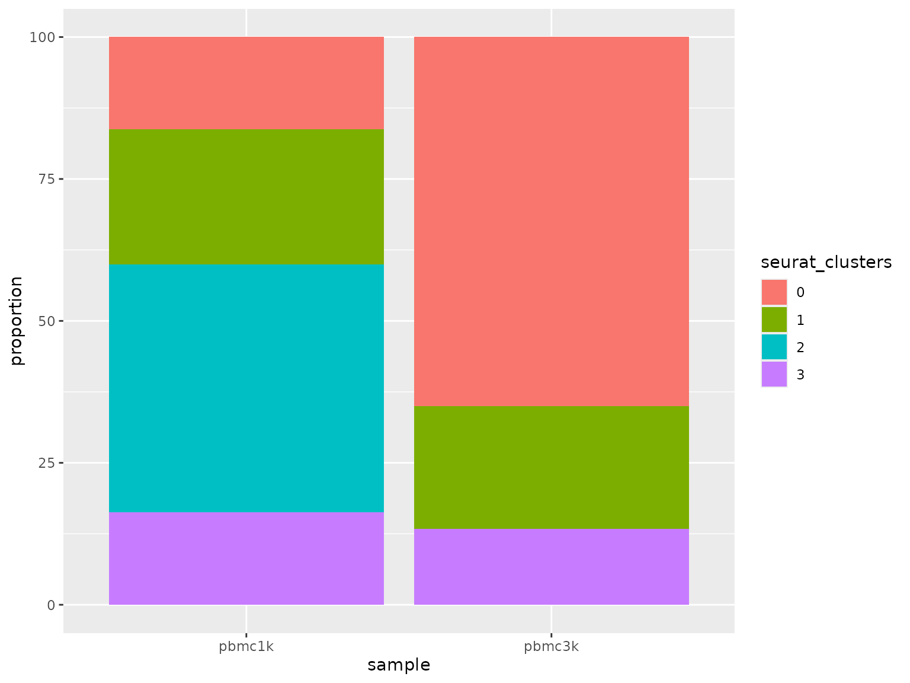
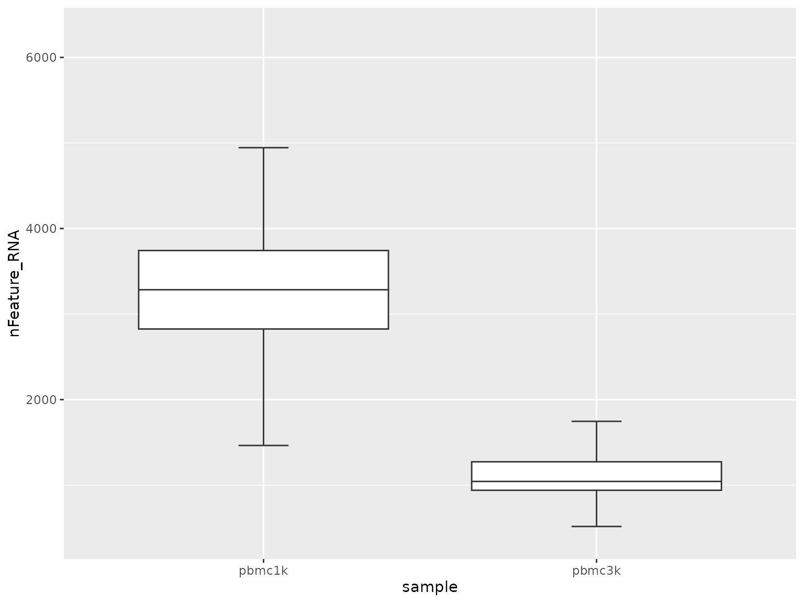
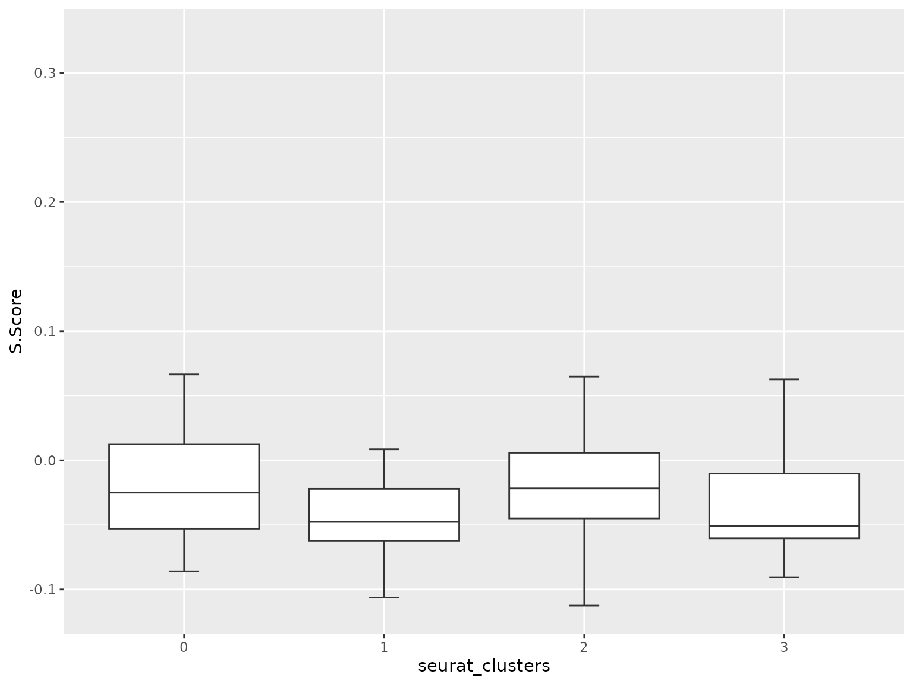

# Composition and comparative analysis workflow

This workflow covers the analysis tasks that happen after clusters or
cell types already exist and the main question becomes comparative
rather than structural:

- how cell states are distributed across samples
- whether cluster proportions shift between groups
- how QC or score columns differ across categories

``` r
library(Shennong)
library(dplyr)
library(knitr)
library(Seurat)

if (!exists("pbmc_small", inherits = FALSE)) {
  try(data("pbmc_small", package = "Shennong", envir = environment()), silent = TRUE)
}
if (!exists("pbmc_small", inherits = FALSE) && file.exists(file.path("data", "pbmc_small.rda"))) {
  load(file.path("data", "pbmc_small.rda"))
}
```

## 1. Summarize cell-state proportions

[`sn_calculate_composition()`](https://songqi.org/shennong/reference/sn_calculate_composition.md)
is the main helper for grouped proportion summaries. The most common
pattern is sample-by-cluster composition.

``` r
knitr::kable(composition_tbl, digits = 2)
```

| sample | seurat_clusters | proportion |
|:-------|:----------------|-----------:|
| pbmc1k | 0               |      16.25 |
| pbmc1k | 1               |      23.75 |
| pbmc1k | 2               |      43.75 |
| pbmc1k | 3               |      16.25 |
| pbmc3k | 0               |      65.00 |
| pbmc3k | 1               |      21.67 |
| pbmc3k | 3               |      13.33 |

## 2. Plot proportions across groups

The returned composition table can be fed directly into
[`sn_plot_barplot()`](https://songqi.org/shennong/reference/sn_plot_barplot.md).

``` r
sn_plot_barplot(
  composition_tbl,
  x = sample,
  y = proportion,
  fill = seurat_clusters
)
```



## 3. Compare categorical structure beyond clusters

The same composition helper also works for cell-cycle phase, annotation
labels, or any other metadata column.

``` r
knitr::kable(phase_tbl, digits = 2)
```

| sample | Phase | proportion |
|:-------|:------|-----------:|
| pbmc1k | G1    |      58.75 |
| pbmc1k | G2M   |      21.25 |
| pbmc1k | S     |      20.00 |
| pbmc3k | G1    |      49.17 |
| pbmc3k | G2M   |      26.67 |
| pbmc3k | S     |      24.17 |

## 4. Compare continuous scores across groups

Once a grouped table exists, Shennong’s plotting helpers can summarize
how QC or score columns differ by sample or cluster.

``` r
sn_plot_boxplot(score_tbl, x = sample, y = nFeature_RNA)
```



``` r
sn_plot_boxplot(score_tbl, x = seurat_clusters, y = S.Score)
```



## 5. Keep comparative analysis downstream of stable labels

Composition and grouped-score analysis become much more interpretable
once the labels are stable. In practice the recommended order is:

1.  preprocessing and QC
2.  clustering or integration
3.  marker or reference-based annotation
4.  composition and grouped comparisons

That order reduces the chance of over-interpreting composition shifts
that are actually caused by unstable clustering.
