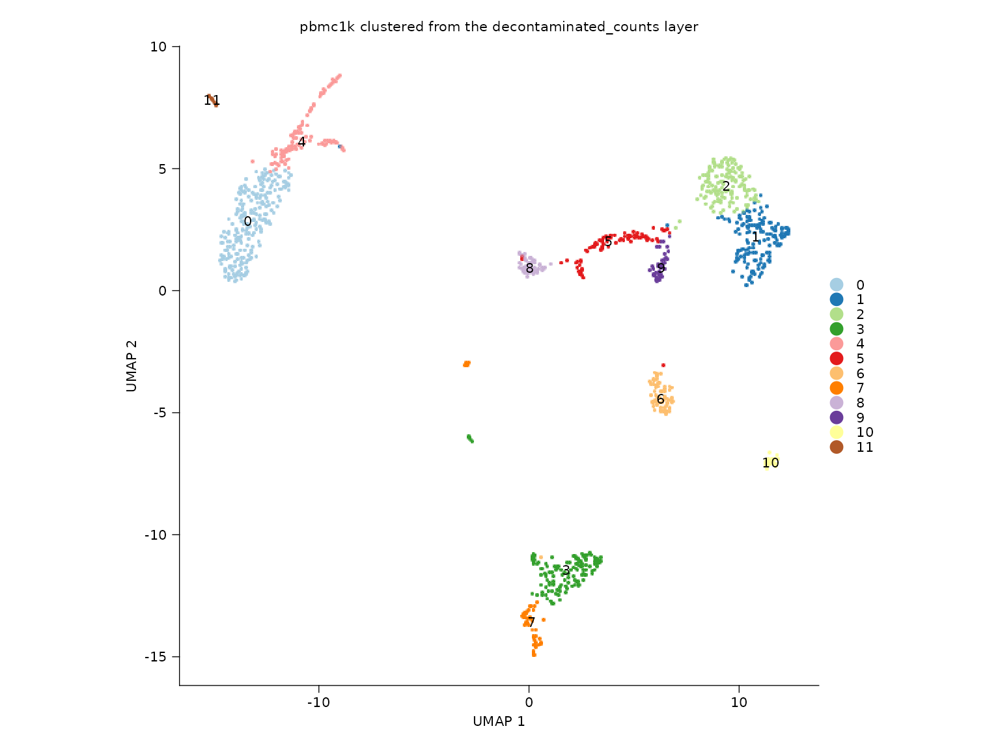
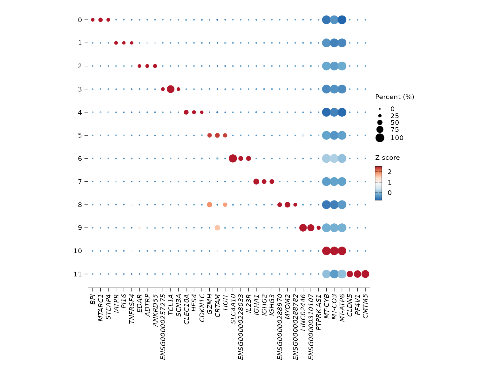

# Advanced layer-aware workflow

This article demonstrates three Shennong behaviors that are important in
modern multi-layer Seurat workflows:

- automatic species inference when `species` is not provided
- running analysis from a non-default count layer
- storing DE metadata in `object@misc$de_results`

``` r
library(Shennong)
library(dplyr)
library(knitr)
library(Seurat)
```

## Automatic species inference

The count matrix is initialized without an explicit `species` argument,
but Shennong still infers the species from feature names using
`hom_genes` and common mitochondrial patterns.

``` r
knitr::kable(
  tibble::tibble(
    object = c("raw_counts", "pbmc_inferred"),
    species = c(inferred_species, sn_get_species(pbmc_inferred))
  )
)
```

| object        | species |
|:--------------|:--------|
| raw_counts    | human   |
| pbmc_inferred | human   |

## Layer-aware clustering

The object below is clustered from the `decontaminated_counts` layer
rather than the default `counts` layer.

``` r
sn_plot_dim(
  pbmc_layered,
  reduction = "umap",
  group_by = "seurat_clusters",
  label = TRUE,
  show_legend = FALSE,
  title = "pbmc1k clustered from the decontaminated_counts layer"
)
```



## Stored differential expression metadata

`sn_find_de(..., return_object = TRUE)` stores both the marker table and
the analysis metadata required for later reuse in plotting and
enrichment.

``` r
knitr::kable(de_summary)
```

| field           | value           |
|:----------------|:----------------|
| schema_version  | 1.0.0           |
| package_version | 0.1.2           |
| analysis        | markers         |
| group_by        | seurat_clusters |
| rank_col        | avg_log2FC      |
| p_col           | p_val_adj       |
| n_genes         | 15690           |

## Reusing stored markers

``` r
sn_plot_dot(
  pbmc_layered,
  features = "top_markers",
  de_name = "cluster_markers",
  n = 3
)
```


