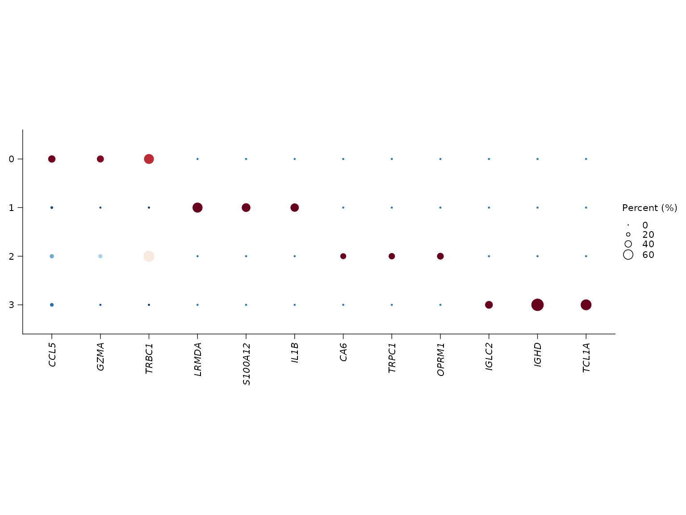

# Annotation, markers, and pathways workflow

This article covers the main biological-interpretation stage after
clustering:

- inspect bundled signatures
- score marker structure with differential expression
- visualize top markers
- run ORA or GSEA with
  [`sn_enrich()`](https://songqi.org/shennong/dev/reference/sn_enrich.md)
- optionally bring in reference-based annotation with
  [`sn_run_celltypist()`](https://songqi.org/shennong/dev/reference/sn_run_celltypist.md)

``` r
library(Shennong)
library(dplyr)
library(knitr)
library(Seurat)

if (!exists("pbmc_small", inherits = FALSE)) {
  try(data("pbmc_small", package = "Shennong", envir = environment()), silent = TRUE)
}
if (!exists("pbmc_small", inherits = FALSE) && file.exists(file.path("data", "pbmc_small.rda"))) {
  load(file.path("data", "pbmc_small.rda"))
}
```

## 1. Start from bundled signatures

Bundled signatures provide a stable set of marker programs and technical
gene sets for filtering, scoring, or interpretation.

``` r
knitr::kable(head(signature_tbl[, c("path", "n_genes")], 8))
```

| path                        | n_genes |
|:----------------------------|--------:|
| Blocklists/Pseudogenes      |   12600 |
| Blocklists/Non-coding       |    7783 |
| Programs/HeatShock          |      97 |
| Programs/cellCycle.G1S      |      42 |
| Programs/cellCycle.G2M      |      52 |
| Programs/IFN                |     107 |
| Programs/Tcell.cytotoxicity |       3 |
| Programs/Tcell.exhaustion   |       5 |

``` r
length(stress_genes)
#> [1] 134
```

## 2. Find marker genes

Cluster markers are usually the first evidence layer for annotation.

``` r
knitr::kable(marker_tbl)
```

|   p_val | avg_log2FC | pct.1 | pct.2 | p_val_adj | cluster | gene    |
|--------:|-----------:|------:|------:|----------:|:--------|:--------|
| 8.9e-06 |   5.159201 | 0.330 | 0.101 | 0.4901319 | 0       | NKG7    |
| 7.0e-07 |   5.143783 | 0.352 | 0.092 | 0.0407973 | 0       | CCL5    |
| 1.0e-07 |   4.070451 | 0.330 | 0.046 | 0.0039324 | 0       | GZMA    |
| 0.0e+00 |   9.635408 | 0.533 | 0.000 | 0.0000000 | 1       | LRMDA   |
| 0.0e+00 |   9.603413 | 0.444 | 0.000 | 0.0000000 | 1       | S100A12 |
| 0.0e+00 |   9.137996 | 0.422 | 0.000 | 0.0000000 | 1       | IL1B    |
| 0.0e+00 |   6.317317 | 0.257 | 0.000 | 0.0000017 | 2       | CA6     |
| 0.0e+00 |   6.152965 | 0.286 | 0.000 | 0.0000001 | 2       | TRPC1   |
| 0.0e+00 |   6.144032 | 0.314 | 0.000 | 0.0000000 | 2       | OPRM1   |
| 0.0e+00 |  11.461813 | 0.379 | 0.000 | 0.0000000 | 3       | IGLC2   |
| 0.0e+00 |  10.040121 | 0.690 | 0.000 | 0.0000000 | 3       | IGHD    |
| 0.0e+00 |   9.743428 | 0.586 | 0.000 | 0.0000000 | 3       | TCL1A   |

## 3. Visualize top markers

[`sn_plot_dot()`](https://songqi.org/shennong/dev/reference/sn_plot_dot.md)
can reuse the stored DE result directly, which avoids manual gene
selection in routine cluster review.

``` r
sn_plot_dot(
  pbmc_clustered,
  features = "top_markers",
  de_name = "cluster_markers",
  n = 3
)
```



## 4. Run pathway analysis

[`sn_enrich()`](https://songqi.org/shennong/dev/reference/sn_enrich.md)
now supports grouped ORA and ranked GSEA through the same
`gene_clusters` formula interface. It can also query multiple databases
in one call.

``` r
if (!is.null(stored_pathways)) {
  knitr::kable(stored_pathways, digits = 4)
}
```

Grouped ORA uses a categorical right-hand side:

``` r
ora_result <- sn_enrich(
  x = pbmc_clustered,
  source_de_name = "cluster_markers",
  gene_clusters = gene ~ cluster,
  database = c("H", "C2:CP:REACTOME"),
  species = "human"
)
```

Ranked GSEA uses a numeric right-hand side:

``` r
gsea_result <- sn_enrich(
  marker_table,
  gene_clusters = gene ~ avg_log2FC,
  database = "GOBP",
  species = "human"
)
```

## 5. Optional reference-based annotation

If CellTypist is configured in the local environment, Shennong can add
reference labels to the Seurat object:

``` r
pbmc_annotated <- sn_run_celltypist(
  pbmc_clustered,
  model = "Immune_All_Low.pkl"
)
```

That annotation can then be reused as the `label` input for downstream
integration metrics or cluster summaries.
