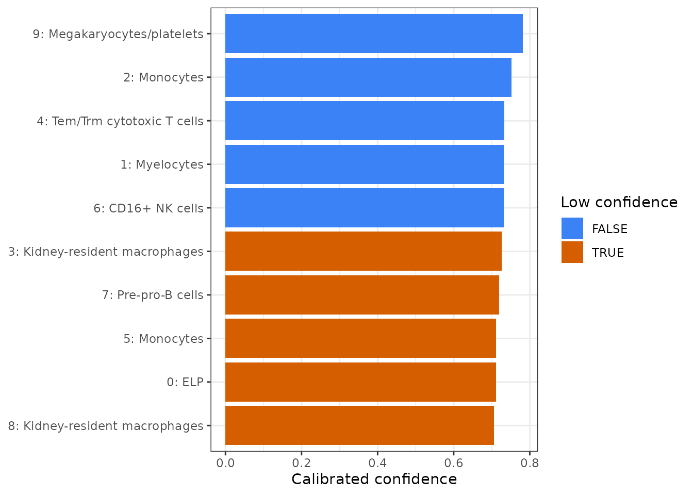
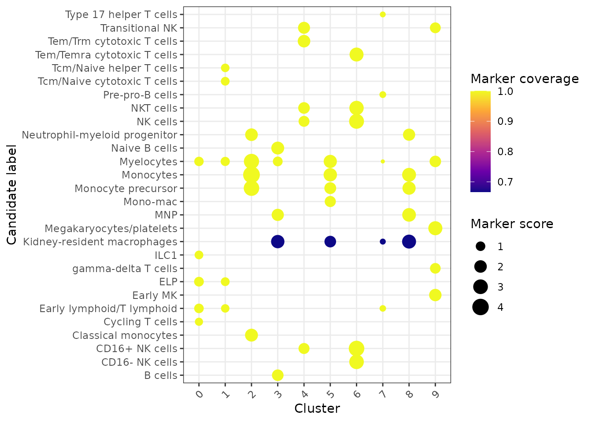
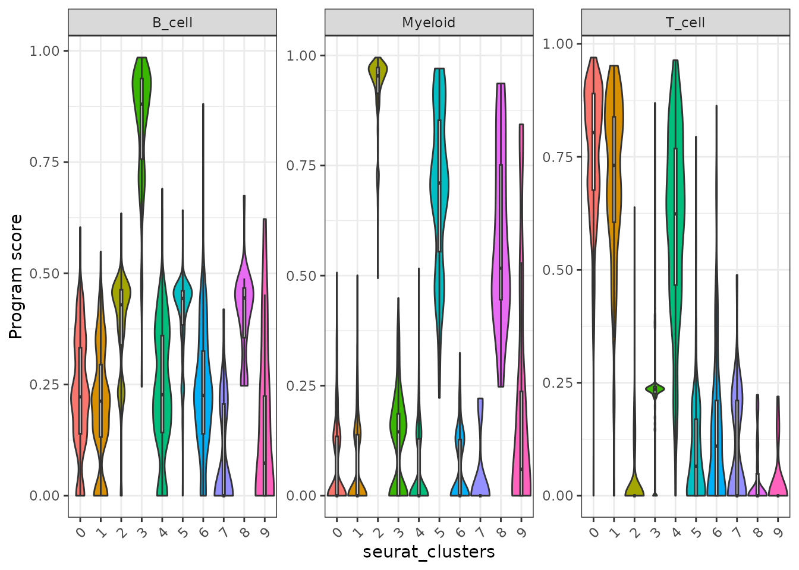
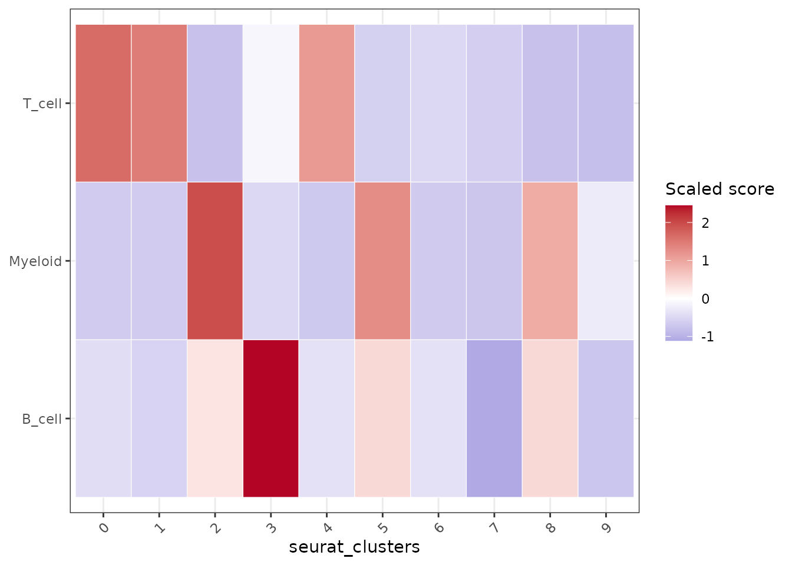

# Markers, signatures, pathways, and annotation

After clustering, users usually ask three linked questions:

1.  Which genes define each cluster?
2.  Which known signatures or pathways explain those genes?
3.  How can the evidence be reused for plots and annotation?

Shennong stores DE and enrichment results on the Seurat object so the
same tables can feed dot plots, interpretation prompts, and later
reports.

## Cluster PBMC3k and find markers

``` r

library(Shennong)
library(Seurat)
library(dplyr)

pbmc <- sn_load_data("pbmc3k")
#> INFO [2026-07-15 08:25:53] Initializing Seurat object for project: pbmc3k.
#> INFO [2026-07-15 08:25:53] Running QC metrics for human.
#> INFO [2026-07-15 08:25:54] Seurat object initialization complete.

pbmc <- sn_run_cluster(
  object = pbmc,
  normalization_method = "seurat",
  nfeatures = 1500,
  dims = 1:15,
  resolution = 0.6,
  species = "human",
  verbose = FALSE
)

pbmc <- sn_find_de(
  object = pbmc,
  analysis = "markers",
  group_by = "seurat_clusters",
  layer = "data",
  min_pct = 0.25,
  logfc_threshold = 0.25,
  store_name = "cluster_markers",
  return_object = TRUE,
  verbose = FALSE
)
```

The result is stored under `object@misc$de_results`. Retrieve it by name
instead of relying on a temporary variable from an earlier script.

``` r

marker_tbl <- sn_get_de_result(
  pbmc,
  de_name = "cluster_markers",
  top_n = 5
)

head(marker_tbl)
#> # A tibble: 6 × 7
#>       p_val avg_log2FC pct.1 pct.2 p_val_adj cluster gene  
#>       <dbl>      <dbl> <dbl> <dbl>     <dbl> <fct>   <chr> 
#> 1 6.44e- 89       2.52 0.42  0.083  3.54e-84 0       AQP3  
#> 2 2.85e- 60       2.49 0.278 0.049  1.56e-55 0       CD40LG
#> 3 7.42e- 59       2.38 0.295 0.06   4.07e-54 0       LMNA  
#> 4 1.08e- 48       1.81 0.371 0.116  5.93e-44 0       TRADD 
#> 5 1.28e- 54       1.78 0.381 0.105  7.01e-50 0       TRAT1 
#> 6 4.22e-102       2.49 0.512 0.118  2.31e-97 1       CCR7
names(pbmc@misc$de_results)
#> [1] "cluster_markers"
```

## Prioritize interpretable marker classes

Marker tables often contain hundreds of significant genes. Use
[`sn_annotate_de_features()`](https://songqi.org/shennong/dev/reference/sn_annotate_de_features.md)
to flag marker genes that are especially useful for mechanistic
interpretation or validation, such as transcription factors, surface or
plasma-membrane genes, cytokines, and chemokines. When called on a
Seurat object, the annotated table is stored as another DE result, so it
can be discovered and retrieved with the same result helpers.

``` r

pbmc <- sn_annotate_de_features(
  pbmc,
  de_name = "cluster_markers",
  species = "human"
)

sn_list_results(pbmc)
#> # A tibble: 2 × 8
#>   collection type  name        analysis method created_at n_rows source
#>   <chr>      <chr> <chr>       <chr>    <chr>  <chr>       <int> <chr> 
#> 1 de_results de    cluster_ma… markers  wilcox 2026-07-1…   4670 NA    
#> 2 de_results de    cluster_ma… markers  wilcox 2026-07-1…   4670 NA

sn_get_de_result(
  pbmc,
  de_name = "cluster_markers_feature_classes",
  top_n = 5
) |>
  dplyr::select(
    cluster,
    gene,
    avg_log2FC,
    feature_classes,
    starts_with("is_")
  ) |>
  head()
#> # A tibble: 6 × 8
#>   cluster gene   avg_log2FC feature_classes      is_transcription_fac…¹
#>   <fct>   <chr>       <dbl> <chr>                <lgl>                 
#> 1 0       AQP3         2.52 surface_membrane     FALSE                 
#> 2 0       CD40LG       2.49 surface_membrane;cy… FALSE                 
#> 3 0       LMNA         2.38 NA                   FALSE                 
#> 4 0       TRADD        1.81 NA                   FALSE                 
#> 5 0       TRAT1        1.78 NA                   FALSE                 
#> 6 1       CCR7         2.49 surface_membrane     FALSE                 
#> # ℹ abbreviated name: ¹​is_transcription_factor
#> # ℹ 3 more variables: is_surface_membrane <lgl>, is_cytokine <lgl>,
#> #   is_chemokine <lgl>
```

## Plot stored markers without hand-copying gene lists

Because the DE result is stored,
[`sn_plot_dot()`](https://songqi.org/shennong/dev/reference/sn_plot_dot.md)
can select top markers per cluster directly.

``` r

sn_plot_dot(
  x = pbmc,
  features = "top_markers",
  de_name = "cluster_markers",
  n = 4,
  group_by = "seurat_clusters",
  palette = "RdBu",
  title = "Top PBMC3k markers"
)
```


For canonical checks, pass marker genes explicitly.

``` r

sn_plot_dot(
  x = pbmc,
  features = c("IL7R", "CCR7", "MS4A1", "CD79A", "LYZ", "S100A8", "NKG7"),
  group_by = "seurat_clusters",
  palette = "Purples",
  direction = 1,
  title = "Canonical PBMC markers"
)
```


## Run traceable consensus annotation

[`sn_run_annotation()`](https://songqi.org/shennong/dev/reference/sn_run_annotation.md)
is the stable annotation entry point. Its default `method = "consensus"`
scores the bundled canonical marker database, retains the best and
second-best candidate, calibrates a confidence margin, assigns
hierarchical labels, and maps known labels to a versioned Cell Ontology
snapshot. It supports both cluster- and cell-level output; without a
reference, each cell inherits the traceable consensus of its cluster.

``` r

pbmc <- sn_run_annotation(
  pbmc,
  group_by = "seurat_clusters",
  method = "consensus",
  species = "human",
  tissue = "peripheral blood",
  ontology = TRUE,
  store_name = "pbmc_consensus"
)

annotation_index <- sn_list_results(pbmc, type = "annotation")
annotation_index
#> # A tibble: 1 × 8
#>   collection       type  name  analysis method created_at n_rows source
#>   <chr>            <chr> <chr> <chr>    <chr>  <chr>       <int> <chr> 
#> 1 analysis_results anno… pbmc… annotat… conse… 2026-07-1…   4037 NA

annotation <- sn_get_result(
  pbmc,
  type = "annotation",
  name = "pbmc_consensus"
)

head(annotation$tables$clusters)
#> # A tibble: 6 × 16
#>   cluster prediction          second_best_label prediction_score margin
#>   <chr>   <chr>               <chr>                        <dbl>  <dbl>
#> 1 0       ELP                 Early lymphoid/T…            0.711 0.0364
#> 2 1       Myelocytes          ELP                          0.732 0.106 
#> 3 2       Monocytes           Monocyte precurs…            0.752 0.172 
#> 4 3       Kidney-resident ma… Naive B cells                0.726 0.0860
#> 5 4       Tem/Trm cytotoxic … Transitional NK              0.732 0.108 
#> 6 5       Monocytes           Myelocytes                   0.712 0.0385
#> # ℹ 11 more variables: method_count <int>, methods <chr>,
#> #   low_confidence <lgl>, level_1 <chr>, level_2 <chr>, level_3 <chr>,
#> #   supporting_markers <chr>, conflicting_markers <chr>,
#> #   reference_coverage <dbl>, ontology_id <chr>, ontology_label <chr>
head(annotation$tables$cells)
#> # A tibble: 6 × 17
#>   cell     cluster prediction second_best_label prediction_score margin
#>   <chr>    <chr>   <chr>      <chr>                        <dbl>  <dbl>
#> 1 AAACATA… 0       ELP        Early lymphoid/T…            0.711 0.0364
#> 2 AAACATT… 3       Kidney-re… Naive B cells                0.726 0.0860
#> 3 AAACATT… 0       ELP        Early lymphoid/T…            0.711 0.0364
#> 4 AAACCGT… 2       Monocytes  Monocyte precurs…            0.752 0.172 
#> 5 AAACCGT… 6       CD16+ NK … NK cells                     0.731 0.104 
#> 6 AAACGCA… 0       ELP        Early lymphoid/T…            0.711 0.0364
#> # ℹ 11 more variables: method_count <int>, methods <chr>,
#> #   low_confidence <lgl>, level_1 <chr>, level_2 <chr>, level_3 <chr>,
#> #   supporting_markers <chr>, conflicting_markers <chr>,
#> #   reference_coverage <dbl>, ontology_id <chr>, ontology_label <chr>
annotation$diagnostics
#> $low_confidence_cells
#> [1] 1193
#> 
#> $low_confidence_clusters
#> [1] 5
#> 
#> $unmapped_ontology_labels
#> [1] "ELP"                         "Myelocytes"                 
#> [3] "Kidney-resident macrophages" "Tem/Trm cytotoxic T cells"  
#> [5] "Pre-pro-B cells"
```

Every final label remains linked to marker support, conflicts, reference
coverage, confidence, and provenance. LLM helpers can explain this
evidence but cannot replace the stored computational label. Review
uncertain assignments before using them as biological truth.

``` r

sn_review_annotation(pbmc, "pbmc_consensus")
#> $cells
#> # A tibble: 1,193 × 17
#>    cell    cluster prediction second_best_label prediction_score margin
#>    <chr>   <chr>   <chr>      <chr>                        <dbl>  <dbl>
#>  1 AAACAT… 0       ELP        Early lymphoid/T…            0.711 0.0364
#>  2 AAACAT… 3       Kidney-re… Naive B cells                0.726 0.0860
#>  3 AAACAT… 0       ELP        Early lymphoid/T…            0.711 0.0364
#>  4 AAACGC… 0       ELP        Early lymphoid/T…            0.711 0.0364
#>  5 AAACGC… 5       Monocytes  Myelocytes                   0.712 0.0385
#>  6 AAACTT… 3       Kidney-re… Naive B cells                0.726 0.0860
#>  7 AAAGAG… 0       ELP        Early lymphoid/T…            0.711 0.0364
#>  8 AAAGCC… 0       ELP        Early lymphoid/T…            0.711 0.0364
#>  9 AAAGGC… 3       Kidney-re… Naive B cells                0.726 0.0860
#> 10 AAAGTT… 3       Kidney-re… Naive B cells                0.726 0.0860
#> # ℹ 1,183 more rows
#> # ℹ 11 more variables: method_count <int>, methods <chr>,
#> #   low_confidence <lgl>, level_1 <chr>, level_2 <chr>, level_3 <chr>,
#> #   supporting_markers <chr>, conflicting_markers <chr>,
#> #   reference_coverage <dbl>, ontology_id <chr>, ontology_label <chr>
#> 
#> $clusters
#> # A tibble: 5 × 16
#>   cluster prediction          second_best_label prediction_score margin
#>   <chr>   <chr>               <chr>                        <dbl>  <dbl>
#> 1 0       ELP                 Early lymphoid/T…            0.711 0.0364
#> 2 3       Kidney-resident ma… Naive B cells                0.726 0.0860
#> 3 5       Monocytes           Myelocytes                   0.712 0.0385
#> 4 7       Pre-pro-B cells     Early lymphoid/T…            0.719 0.0644
#> 5 8       Kidney-resident ma… Monocytes                    0.706 0.0200
#> # ℹ 11 more variables: method_count <int>, methods <chr>,
#> #   low_confidence <lgl>, level_1 <chr>, level_2 <chr>, level_3 <chr>,
#> #   supporting_markers <chr>, conflicting_markers <chr>,
#> #   reference_coverage <dbl>, ontology_id <chr>, ontology_label <chr>
#> 
#> $evidence
#> # A tibble: 980 × 8
#>    entity label          parent_label   score method supporting_markers
#>    <chr>  <chr>          <chr>          <dbl> <chr>  <chr>             
#>  1 0      Age-associate… B cells      0.00528 marke… TBX21;FCRL2;ITGAX 
#>  2 0      Alveolar macr… Macrophages  0       marke… GPNMB;TREM2;BHLHE…
#>  3 0      B cells        B cells      0.0190  marke… CD79A;MS4A1;CD19  
#>  4 0      CD16- NK cells ILC          0.0662  marke… NKG7;GNLY;CD160   
#>  5 0      CD16+ NK cells ILC          0.0731  marke… NKG7;GNLY;FCGR3A  
#>  6 0      CD8a/a         T cells      0.0162  marke… PDCD1;ZNF683;GNG4 
#>  7 0      CD8a/b(entry)  T cells      0.0607  marke… SATB1;TOX2;CCR9   
#>  8 0      Classical mon… Monocytes    0.0455  marke… S100A9;CD14;S100A…
#>  9 0      CMP            HSC/MPP      0       marke… MPO;CTSG;FLT3     
#> 10 0      CRTAM+ gamma-… T cells      0.0216  marke… IKZF2;TRDC;ITGAD  
#> # ℹ 970 more rows
#> # ℹ 2 more variables: conflicting_markers <chr>,
#> #   reference_coverage <dbl>
#> 
#> $diagnostics
#> $diagnostics$low_confidence_cells
#> [1] 1193
#> 
#> $diagnostics$low_confidence_clusters
#> [1] 5
#> 
#> $diagnostics$unmapped_ontology_labels
#> [1] "ELP"                         "Myelocytes"                 
#> [3] "Kidney-resident macrophages" "Tem/Trm cytotoxic T cells"  
#> [5] "Pre-pro-B cells"            
#> 
#> 
#> $provenance
#> $provenance$package_versions
#> $provenance$package_versions$Shennong
#> [1] "0.2.0"
#> 
#> $provenance$package_versions$R
#> [1] "4.6.1"
#> 
#> 
#> $provenance$random_seed
#> [1] NA
#> 
#> $provenance$timestamp
#> [1] "2026-07-15 08:27:05 UTC"

sn_plot_annotation_confidence(
  pbmc,
  store_name = "pbmc_consensus",
  level = "cluster"
)
```



``` r


sn_plot_annotation_markers(
  pbmc,
  store_name = "pbmc_consensus",
  top_n = 5
)
```



If trusted labels are present, a confusion heatmap makes disagreements
visible.

``` r

sn_plot_annotation_confusion(
  pbmc,
  truth = "curated_cell_type",
  store_name = "pbmc_consensus"
)
```

## Choose a reference backend deliberately

Use `sn_list_methods("annotation")` and
[`sn_method_status()`](https://songqi.org/shennong/dev/reference/sn_method_status.md)
to inspect current availability. Reference methods should not be used
when tissue, disease, species, assay chemistry, or cell-state coverage
is badly mismatched; a high similarity to an incomplete reference is not
evidence that the missing cell type is absent.

| Backend | Best use | Input and runtime | Stored output |
|----|----|----|----|
| SingleR | Default reference prediction with per-label scores | Query and annotated Seurat/SummarizedExperiment reference; CPU; optional `SingleR` | Full score evidence, pruned label, delta, coverage |
| CellTypist | External pretrained immune atlases | Counts plus model; CPU CLI on `PATH` | Original label columns and consensus evidence |
| Seurat | Anchor transfer from a compatible Seurat reference | Query/reference assays and labels; CPU; optional `Seurat` | Transferred labels and all returned score columns |
| Symphony | Repeated mapping to a compressed atlas | Built reference or Seurat reference; CPU; optional `symphony` | kNN confidence and mapped embedding |
| scmap | Conservative projection to indexed expression centroids | Shared features and annotated reference; CPU; optional `scmap` | Label, similarity, and unassigned status |
| scANVI | Semi-supervised mapping with batch structure | Raw counts, labels, batch metadata; CPU or CUDA through pixi | Labels and managed backend artifacts |

Backend-specific functions stay internal rather than creating parallel
result types. Select the backend with `sn_run_annotation(method = ...)`
and retrieve every result with the same
`sn_get_result(object, "annotation", name)` contract.

The underlying methods should be cited in publications: SingleR (Aran et
al., 2019), CellTypist (Dominguez Conde et al., 2022), Seurat mapping
(Hao et al., 2021), Symphony (Kang et al., 2021), scmap (Kiselev et al.,
2018), and scANVI (Xu et al., 2021). Cell Ontology identifiers come from
the bundled 2026-06-08 CL snapshot; verify current author and ontology
guidelines when preparing a submission.

``` r

pbmc <- sn_run_annotation(
  pbmc,
  group_by = "seurat_clusters",
  method = "consensus",
  reference = reference,
  reference_label_by = "cell_type",
  consensus_reference_method = "singleR",
  species = "human",
  store_name = "pbmc_reference_consensus"
)

reference_result <- sn_get_result(
  pbmc,
  type = "annotation",
  name = "pbmc_reference_consensus"
)

head(reference_result$tables$backend_predictions)
head(reference_result$tables$backend_evidence)
```

## Transfer labels from a reference

Marker tables are useful when you want to name clusters manually. When a
trusted reference already exists,
[`sn_transfer_labels()`](https://songqi.org/shennong/dev/reference/sn_transfer_labels.md)
follows Seurat’s anchor workflow and writes the projected label plus a
confidence score back to the query metadata. The wrapper keeps the
source label and transfer settings in `query@misc$label_transfer`, so
the annotation is not just a loose metadata column.

``` r

reference <- pbmc
query <- pbmc

reference$cell_type <- reference$seurat_clusters

query <- sn_transfer_labels(
  object = query,
  reference = reference,
  label_by = "cell_type",
  prediction_prefix = "pbmc_reference",
  dims = 1:15,
  verbose = FALSE
)

table(query$pbmc_reference_label)
head(query[[]][, c("pbmc_reference_label", "pbmc_reference_score")])
```

The same query-first interface can use Coralysis reference mapping when
the reference was trained with
`sn_run_cluster(integration_method = "coralysis")`. By default, Shennong
keeps the native Coralysis-trained SingleCellExperiment and PCA model
under `reference@misc$coralysis`, so the returned object can be used
directly as a label-transfer reference.

``` r

reference <- sn_run_cluster(
  reference,
  batch = "sample_id",
  integration_method = "coralysis",
  normalization_method = "seurat",
  verbose = FALSE
)

query <- sn_transfer_labels(
  object = query,
  reference = reference,
  label_by = "cell_type",
  method = "coralysis",
  prediction_prefix = "coral_reference",
  transfer_control = list(k.nn = 10),
  verbose = FALSE
)
```

For durable handoffs, prepare a compact transfer-ready reference instead
of saving the full analysis object. Coralysis references keep the
trained models, PCA model, feature names, and selected labels while
dropping the large reference assay matrices and joint-probability
tables.

``` r

coral_reference <- sn_prepare_label_transfer_reference(
  reference,
  label_by = "cell_type",
  method = "coralysis",
  path = "data/processed/pbmc_coralysis_reference.qs2",
  overwrite = TRUE
)

query <- sn_transfer_labels(
  object = query,
  reference = coral_reference,
  label_by = "cell_type",
  method = "coralysis",
  prediction_prefix = "coral_reference",
  verbose = FALSE
)
```

## Discover and manage bundled signatures

Shennong ships a signature catalog so blocking genes, marker sets, and
report features do not need to be redefined in every analysis.

``` r

signature_index <- sn_list_signatures(species = "human")
head(signature_index)
#> # A tibble: 6 × 5
#>   species path                   name          kind      n_genes
#>   <chr>   <chr>                  <chr>         <chr>       <int>
#> 1 human   Blocklists/Pseudogenes Pseudogenes   signature   12600
#> 2 human   Blocklists/Non-coding  Non-coding    signature    7783
#> 3 human   Programs/HeatShock     HeatShock     signature      97
#> 4 human   Programs/cellCycle.G1S cellCycle.G1S signature      42
#> 5 human   Programs/cellCycle.G2M cellCycle.G2M signature      52
#> 6 human   Programs/IFN           IFN           signature     107

immune_signatures <- sn_get_signatures(
  species = "human",
  category = c("mito", "ribo")
)

head(immune_signatures)
#> [1] "MT-ATP6" "MT-ATP8" "MT-CO1"  "MT-CO2"  "MT-CO3"  "MT-CYB"
```

Custom signatures can be added, renamed, and deleted through the same
API. Use a project-specific catalog path when you do not want to modify
the package-level catalog.

``` r

catalog_path <- "config/signatures/pbmc_signatures.csv"

sn_add_signature(
  species = "human",
  path = "custom/t_cell_activation",
  genes = c("IL7R", "CCR7", "LTB"),
  catalog_path = catalog_path,
  source = "project"
)

sn_update_signature(
  species = "human",
  path = "custom/t_cell_activation",
  rename_to = "custom/naive_t_cell",
  catalog_path = catalog_path
)

sn_delete_signature(
  species = "human",
  path = "custom/naive_t_cell",
  catalog_path = catalog_path
)
```

## Score programs in cells and samples

[`sn_score_programs()`](https://songqi.org/shennong/dev/reference/sn_score_programs.md)
accepts named gene-set lists, program/gene tables, named gene vectors,
or bundled signature queries. UCell is the default for per-cell work
because its rank-based score works directly with sparse expression and
is less sensitive to dataset composition than a raw mean. AUCell is
useful when area-under-recovery-curve activity is the intended
statistic, but its ranking step is more expensive. GSVA and ssGSEA are
intended primarily for samples or aggregated groups; supply `group_by`
for large single-cell objects. The `mean` backend is dependency-free and
transparent, but it is more sensitive to assay scale and signature size.

``` r

immune_programs <- list(
  B_cell = c("MS4A1", "CD79A", "CD37", "CD74"),
  T_cell = c("CD3D", "CD3E", "TRAC", "LTB"),
  Myeloid = c("LYZ", "FCN1", "S100A8", "CTSS")
)

pbmc <- sn_score_programs(
  pbmc,
  signatures = immune_programs,
  method = "ucell",
  assay = "RNA",
  layer = "data",
  name = "immune_programs",
  min_genes = 2
)

program_result <- sn_get_result(
  pbmc,
  type = "program_scoring",
  name = "immune_programs"
)

program_result$tables$coverage
#> # A tibble: 3 × 6
#>   program n_genes n_matched coverage matched_genes        missing_genes
#>   <chr>     <int>     <int>    <dbl> <chr>                <chr>        
#> 1 B_cell        4         4        1 MS4A1;CD79A;CD37;CD… ""           
#> 2 T_cell        4         4        1 CD3D;CD3E;TRAC;LTB   ""           
#> 3 Myeloid       4         4        1 LYZ;FCN1;S100A8;CTSS ""
head(program_result$tables$scores)
#> # A tibble: 6 × 5
#>   entity           program score level group_by
#>   <chr>            <chr>   <dbl> <chr> <chr>   
#> 1 AAACATACAACCAC-1 B_cell  0.352 cell  NA      
#> 2 AAACATTGAGCTAC-1 B_cell  0.913 cell  NA      
#> 3 AAACATTGATCAGC-1 B_cell  0.177 cell  NA      
#> 4 AAACCGTGCTTCCG-1 B_cell  0.464 cell  NA      
#> 5 AAACCGTGTATGCG-1 B_cell  0.181 cell  NA      
#> 6 AAACGCACTGGTAC-1 B_cell  0     cell  NA
```

UCell and AUCell require their optional Bioconductor packages and run on
CPU. GSVA/ssGSEA require `GSVA` and run on CPU; Shennong blocks per-cell
GSVA on more than 5,000 sparse columns unless users aggregate
explicitly. Cite UCell (Andreatta and Carmona, 2021), AUCell (Aibar et
al., 2017), GSVA (Hänzelmann et al., 2013), or ssGSEA (Barbie et al.,
2009) according to the selected backend.

``` r

sn_plot_program_activity(
  pbmc,
  name = "immune_programs",
  group_by = "seurat_clusters"
)
```



``` r


sn_plot_program_heatmap(
  pbmc,
  name = "immune_programs",
  group_by = "seurat_clusters"
)
```



For comparative studies, preserve the sample or patient as the
inferential unit.
[`sn_test_programs()`](https://songqi.org/shennong/dev/reference/sn_test_programs.md)
first averages cell scores within each sample/condition/stratum, then
runs the selected test; omitting `sample_by` is explicitly marked as
exploratory cell-level inference.

``` r

pbmc <- sn_test_programs(
  pbmc,
  score_name = "immune_programs",
  condition_by = "condition",
  sample_by = "patient",
  group_by = "cell_type",
  contrast = c("treated", "control"),
  method = "limma",
  store_name = "immune_program_condition"
)

sn_get_result(
  pbmc,
  type = "program_comparison",
  name = "immune_program_condition"
)$tables$primary
```

## Run enrichment from stored marker results

[`sn_enrich()`](https://songqi.org/shennong/dev/reference/sn_enrich.md)
can accept a gene vector, a ranked vector, a data frame, or a Seurat
object with stored DE results. For cluster markers, the Seurat-object
path is the most reproducible because the enrichment knows which DE
result it came from.

``` r

pbmc <- sn_enrich(
  x = pbmc,
  source_de_name = "cluster_markers",
  species = "human",
  database = "GOBP",
  store_name = "cluster_gobp",
  return_object = TRUE
)
#> INFO [2026-07-15 08:27:31] Running ORA analysis for the GOBP database.

pathways <- sn_get_enrichment_result(
  pbmc,
  enrichment_name = "cluster_gobp",
  top_n = 5
)

head(pathways)
#> # A tibble: 5 × 12
#>   ID     Description GeneRatio BgRatio RichFactor FoldEnrichment zScore
#>   <chr>  <chr>       <chr>     <chr>        <dbl>          <dbl>  <dbl>
#> 1 GO:00… regulation… 159/2481  453/18…      0.351           2.67   14.0
#> 2 GO:19… mononuclea… 152/2481  439/18…      0.346           2.63   13.5
#> 3 GO:00… generation… 147/2481  438/18…      0.336           2.55   12.8
#> 4 GO:00… regulation… 146/2481  472/18…      0.309           2.35   11.6
#> 5 GO:00… nucleotide… 146/2481  478/18…      0.305           2.32   11.4
#> # ℹ 5 more variables: pvalue <dbl>, p.adjust <dbl>, qvalue <dbl>,
#> #   geneID <chr>, Count <int>
```

If you already have an enrichment table from another tool, store it with
[`sn_store_enrichment()`](https://songqi.org/shennong/dev/reference/sn_store_enrichment.md)
so the interpretation layer can find it.

``` r

external_terms <- data.frame(
  cluster = "0",
  ID = "GO:0006955",
  Description = "immune response",
  p.adjust = 0.001,
  geneID = "IL7R/CCR7/LTB"
)

pbmc <- sn_store_enrichment(
  object = pbmc,
  result = external_terms,
  store_name = "external_gobp",
  analysis = "ora",
  database = "GOBP",
  species = "human",
  source_de_name = "cluster_markers",
  return_object = TRUE
)
```

## Cell communication and regulatory activity

Cell communication should be run through a real backend rather than an
ad hoc ligand-receptor table.
[`sn_run_cell_communication()`](https://songqi.org/shennong/dev/reference/sn_run_cell_communication.md)
keeps the same stored-result pattern used by DE and enrichment. Use
CellChat for a global interaction network, NicheNet when the question is
sender-to-receiver ligand activity, or LIANA when the optional LIANA
package is available and consensus scoring is preferred.

``` r

pbmc <- sn_run_cell_communication(
  object = pbmc,
  method = "cellchat",
  group_by = "seurat_clusters",
  species = "human",
  store_name = "cluster_cellchat"
)

cellchat_tbl <- sn_get_cell_communication_result(
  pbmc,
  communication_name = "cluster_cellchat"
)

head(cellchat_tbl)
```

NicheNet needs its ligand-target matrix and ligand-receptor network.
Shennong requires those priors explicitly so the output remains
traceable to the real NicheNet model rather than an inferred placeholder
network.

``` r

pbmc <- sn_run_cell_communication(
  object = pbmc,
  method = "nichenetr",
  group_by = "seurat_clusters",
  sender = c("0", "1"),
  receiver = "2",
  geneset = c("IL7R", "CCR7", "LTB"),
  ligand_target_matrix = ligand_target_matrix,
  lr_network = lr_network,
  store_name = "sender_receiver_nichenet"
)
```

For transcription-factor and pathway activity,
[`sn_run_regulatory_activity()`](https://songqi.org/shennong/dev/reference/sn_run_regulatory_activity.md)
uses fast footprint methods through `decoupleR`. DoRothEA reports TF
activity; PROGENy reports pathway activity.

``` r

pbmc <- sn_run_regulatory_activity(
  object = pbmc,
  method = "dorothea",
  group_by = "seurat_clusters",
  species = "human",
  store_name = "cluster_dorothea"
)

tf_activity <- sn_get_regulatory_activity_result(
  pbmc,
  activity_name = "cluster_dorothea",
  sources = c("NFKB1", "STAT1")
)

head(tf_activity)
```

## Optional reference annotation with CellTypist

CellTypist is a Python command-line tool, so Shennong keeps it explicit.
When the input is a Seurat object, predictions are written back to
metadata. When the input is a file path, Shennong returns the prediction
table because there is no object to update.

``` r

pbmc <- sn_run_celltypist(
  x = pbmc,
  model = "Immune_All_Low.pkl",
  over_clustering = "seurat_clusters",
  majority_voting = TRUE,
  quiet = TRUE
)

grep("Immune_All_Low", colnames(pbmc[[]]), value = TRUE)
```

``` r

prediction_tbl <- sn_run_celltypist(
  x = "pbmc3k_counts.csv",
  model = "Immune_All_Low.pkl",
  over_clustering = "obs_cluster",
  quiet = TRUE
)

head(prediction_tbl)
```

The intended pattern is evidence first, label second: markers and
pathways are computed and stored before automated or LLM-assisted
annotation consumes them.
