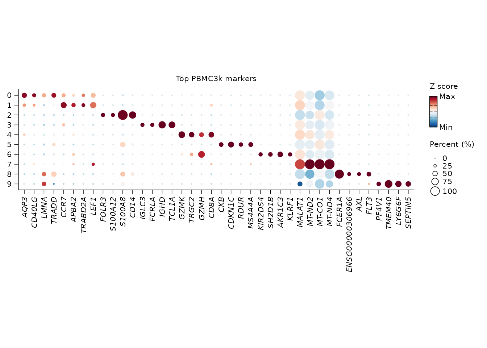
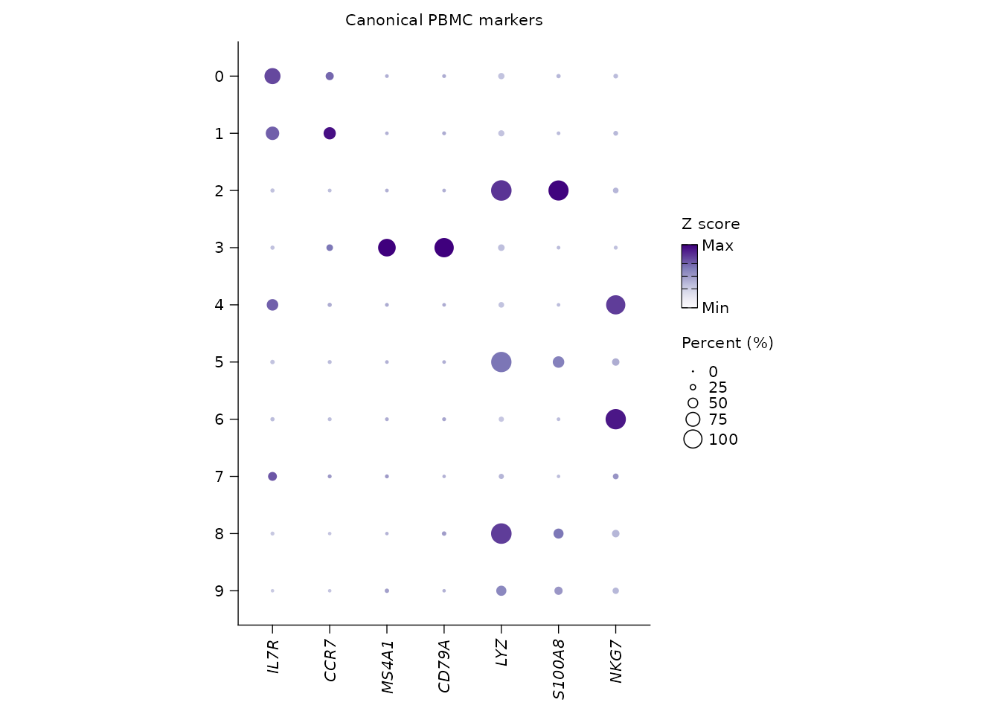

# Markers, signatures, pathways, and annotation

After clustering, users usually ask three linked questions:

1.  Which genes define each cluster?
2.  Which known signatures or pathways explain those genes?
3.  How can the evidence be reused for plots and annotation?

Shennong stores DE and enrichment results on the Seurat object so the
same tables can feed dot plots, interpretation prompts, and later
reports.

## Cluster PBMC3k and find markers

``` r

library(Shennong)
library(Seurat)
library(dplyr)

pbmc <- sn_load_data("pbmc3k")
#> INFO [2026-05-05 23:43:48] Initializing Seurat object for project: pbmc3k.
#> INFO [2026-05-05 23:43:48] Running QC metrics for human.
#> INFO [2026-05-05 23:43:49] Seurat object initialization complete.

pbmc <- sn_run_cluster(
  object = pbmc,
  normalization_method = "seurat",
  nfeatures = 1500,
  dims = 1:15,
  resolution = 0.6,
  species = "human",
  verbose = FALSE
)

pbmc <- sn_find_de(
  object = pbmc,
  analysis = "markers",
  group_by = "seurat_clusters",
  layer = "data",
  min_pct = 0.25,
  logfc_threshold = 0.25,
  store_name = "cluster_markers",
  return_object = TRUE,
  verbose = FALSE
)
```

The result is stored under `object@misc$de_results`. Retrieve it by name
instead of relying on a temporary variable from an earlier script.

``` r

marker_tbl <- sn_get_de_result(
  pbmc,
  de_name = "cluster_markers",
  top_n = 5
)

head(marker_tbl)
#> # A tibble: 6 × 7
#>       p_val avg_log2FC pct.1 pct.2 p_val_adj cluster gene  
#>       <dbl>      <dbl> <dbl> <dbl>     <dbl> <fct>   <chr> 
#> 1 6.44e- 89       2.52 0.42  0.083  3.54e-84 0       AQP3  
#> 2 2.85e- 60       2.49 0.278 0.049  1.56e-55 0       CD40LG
#> 3 7.42e- 59       2.38 0.295 0.06   4.07e-54 0       LMNA  
#> 4 1.08e- 48       1.81 0.371 0.116  5.93e-44 0       TRADD 
#> 5 1.28e- 54       1.78 0.381 0.105  7.01e-50 0       TRAT1 
#> 6 4.22e-102       2.49 0.512 0.118  2.31e-97 1       CCR7
names(pbmc@misc$de_results)
#> [1] "cluster_markers"
```

## Plot stored markers without hand-copying gene lists

Because the DE result is stored,
[`sn_plot_dot()`](https://songqi.org/shennong/dev/reference/sn_plot_dot.md)
can select top markers per cluster directly.

``` r

sn_plot_dot(
  x = pbmc,
  features = "top_markers",
  de_name = "cluster_markers",
  n = 4,
  group_by = "seurat_clusters",
  palette = "RdBu",
  title = "Top PBMC3k markers"
)
```



For canonical checks, pass marker genes explicitly.

``` r

sn_plot_dot(
  x = pbmc,
  features = c("IL7R", "CCR7", "MS4A1", "CD79A", "LYZ", "S100A8", "NKG7"),
  group_by = "seurat_clusters",
  palette = "Purples",
  direction = 1,
  title = "Canonical PBMC markers"
)
```



## Transfer labels from a reference

Marker tables are useful when you want to name clusters manually. When a
trusted reference already exists,
[`sn_transfer_labels()`](https://songqi.org/shennong/dev/reference/sn_transfer_labels.md)
follows Seurat’s anchor workflow and writes the projected label plus a
confidence score back to the query metadata. The wrapper keeps the
source label and transfer settings in `query@misc$label_transfer`, so
the annotation is not just a loose metadata column.

``` r

reference <- pbmc
query <- pbmc

reference$cell_type <- reference$seurat_clusters

query <- sn_transfer_labels(
  object = query,
  reference = reference,
  label_by = "cell_type",
  prediction_prefix = "pbmc_reference",
  dims = 1:15,
  verbose = FALSE
)

table(query$pbmc_reference_label)
head(query[[]][, c("pbmc_reference_label", "pbmc_reference_score")])
```

The same query-first interface can use Coralysis reference mapping when
the reference was trained with
`sn_run_cluster(integration_method = "coralysis")`. For mapping, keep
the Coralysis SingleCellExperiment and PCA model in the reference by
leaving `store_sce = TRUE` and `return.model = TRUE`.

``` r

reference <- sn_run_cluster(
  reference,
  batch = "sample_id",
  integration_method = "coralysis",
  normalization_method = "seurat",
  integration_control = list(
    store_sce = TRUE,
    pca_args = list(return.model = TRUE)
  ),
  verbose = FALSE
)

query <- sn_transfer_labels(
  object = query,
  reference = reference,
  label_by = "cell_type",
  method = "coralysis",
  prediction_prefix = "coral_reference",
  transfer_control = list(k.nn = 10),
  verbose = FALSE
)
```

## Discover and manage bundled signatures

Shennong ships a signature catalog so blocking genes, marker sets, and
report features do not need to be redefined in every analysis.

``` r

signature_index <- sn_list_signatures(species = "human")
head(signature_index)
#> # A tibble: 6 × 5
#>   species path                   name          kind      n_genes
#>   <chr>   <chr>                  <chr>         <chr>       <int>
#> 1 human   Blocklists/Pseudogenes Pseudogenes   signature   12600
#> 2 human   Blocklists/Non-coding  Non-coding    signature    7783
#> 3 human   Programs/HeatShock     HeatShock     signature      97
#> 4 human   Programs/cellCycle.G1S cellCycle.G1S signature      42
#> 5 human   Programs/cellCycle.G2M cellCycle.G2M signature      52
#> 6 human   Programs/IFN           IFN           signature     107

immune_signatures <- sn_get_signatures(
  species = "human",
  category = c("mito", "ribo")
)

head(immune_signatures)
#> [1] "MT-ATP6" "MT-ATP8" "MT-CO1"  "MT-CO2"  "MT-CO3"  "MT-CYB"
```

Custom signatures can be added, renamed, and deleted through the same
API. Use a project-specific catalog path when you do not want to modify
the package-level catalog.

``` r

catalog_path <- "config/signatures/pbmc_signatures.csv"

sn_add_signature(
  species = "human",
  path = "custom/t_cell_activation",
  genes = c("IL7R", "CCR7", "LTB"),
  catalog_path = catalog_path,
  source = "project"
)

sn_update_signature(
  species = "human",
  path = "custom/t_cell_activation",
  rename_to = "custom/naive_t_cell",
  catalog_path = catalog_path
)

sn_delete_signature(
  species = "human",
  path = "custom/naive_t_cell",
  catalog_path = catalog_path
)
```

## Run enrichment from stored marker results

[`sn_enrich()`](https://songqi.org/shennong/dev/reference/sn_enrich.md)
can accept a gene vector, a ranked vector, a data frame, or a Seurat
object with stored DE results. For cluster markers, the Seurat-object
path is the most reproducible because the enrichment knows which DE
result it came from.

``` r

pbmc <- sn_enrich(
  x = pbmc,
  source_de_name = "cluster_markers",
  species = "human",
  database = "GOBP",
  store_name = "cluster_gobp",
  return_object = TRUE
)
#> INFO [2026-05-05 23:44:54] Running ORA analysis for the GOBP database.

pathways <- sn_get_enrichment_result(
  pbmc,
  enrichment_name = "cluster_gobp",
  top_n = 5
)

head(pathways)
#> # A tibble: 5 × 12
#>   ID     Description GeneRatio BgRatio RichFactor FoldEnrichment zScore
#>   <chr>  <chr>       <chr>     <chr>        <dbl>          <dbl>  <dbl>
#> 1 GO:00… regulation… 159/2481  453/18…      0.351           2.67   14.0
#> 2 GO:19… mononuclea… 152/2481  439/18…      0.346           2.63   13.5
#> 3 GO:00… generation… 147/2481  438/18…      0.336           2.55   12.8
#> 4 GO:00… regulation… 146/2481  472/18…      0.309           2.35   11.6
#> 5 GO:00… nucleotide… 146/2481  478/18…      0.305           2.32   11.4
#> # ℹ 5 more variables: pvalue <dbl>, p.adjust <dbl>, qvalue <dbl>,
#> #   geneID <chr>, Count <int>
```

If you already have an enrichment table from another tool, store it with
[`sn_store_enrichment()`](https://songqi.org/shennong/dev/reference/sn_store_enrichment.md)
so the interpretation layer can find it.

``` r

external_terms <- data.frame(
  cluster = "0",
  ID = "GO:0006955",
  Description = "immune response",
  p.adjust = 0.001,
  geneID = "IL7R/CCR7/LTB"
)

pbmc <- sn_store_enrichment(
  object = pbmc,
  result = external_terms,
  store_name = "external_gobp",
  analysis = "ora",
  database = "GOBP",
  species = "human",
  source_de_name = "cluster_markers",
  return_object = TRUE
)
```

## Cell communication and regulatory activity

Cell communication should be run through a real backend rather than an
ad hoc ligand-receptor table.
[`sn_run_cell_communication()`](https://songqi.org/shennong/dev/reference/sn_run_cell_communication.md)
keeps the same stored-result pattern used by DE and enrichment. Use
CellChat for a global interaction network, NicheNet when the question is
sender-to-receiver ligand activity, or LIANA when the optional LIANA
package is available and consensus scoring is preferred.

``` r

pbmc <- sn_run_cell_communication(
  object = pbmc,
  method = "cellchat",
  group_by = "seurat_clusters",
  species = "human",
  store_name = "cluster_cellchat"
)

cellchat_tbl <- sn_get_cell_communication_result(
  pbmc,
  communication_name = "cluster_cellchat"
)

head(cellchat_tbl)
```

NicheNet needs its ligand-target matrix and ligand-receptor network.
Shennong requires those priors explicitly so the output remains
traceable to the real NicheNet model rather than an inferred placeholder
network.

``` r

pbmc <- sn_run_cell_communication(
  object = pbmc,
  method = "nichenetr",
  group_by = "seurat_clusters",
  sender = c("0", "1"),
  receiver = "2",
  geneset = c("IL7R", "CCR7", "LTB"),
  ligand_target_matrix = ligand_target_matrix,
  lr_network = lr_network,
  store_name = "sender_receiver_nichenet"
)
```

For transcription-factor and pathway activity,
[`sn_run_regulatory_activity()`](https://songqi.org/shennong/dev/reference/sn_run_regulatory_activity.md)
uses fast footprint methods through `decoupleR`. DoRothEA reports TF
activity; PROGENy reports pathway activity.

``` r

pbmc <- sn_run_regulatory_activity(
  object = pbmc,
  method = "dorothea",
  group_by = "seurat_clusters",
  species = "human",
  store_name = "cluster_dorothea"
)

tf_activity <- sn_get_regulatory_activity_result(
  pbmc,
  activity_name = "cluster_dorothea",
  sources = c("NFKB1", "STAT1")
)

head(tf_activity)
```

## Optional reference annotation with CellTypist

CellTypist is a Python command-line tool, so Shennong keeps it explicit.
When the input is a Seurat object, predictions are written back to
metadata. When the input is a file path, Shennong returns the prediction
table because there is no object to update.

``` r

pbmc <- sn_run_celltypist(
  x = pbmc,
  model = "Immune_All_Low.pkl",
  over_clustering = "seurat_clusters",
  majority_voting = TRUE,
  quiet = TRUE
)

grep("Immune_All_Low", colnames(pbmc[[]]), value = TRUE)
```

``` r

prediction_tbl <- sn_run_celltypist(
  x = "pbmc3k_counts.csv",
  model = "Immune_All_Low.pkl",
  over_clustering = "obs_cluster",
  quiet = TRUE
)

head(prediction_tbl)
```

The intended pattern is evidence first, label second: markers and
pathways are computed and stored before automated or LLM-assisted
annotation consumes them.
