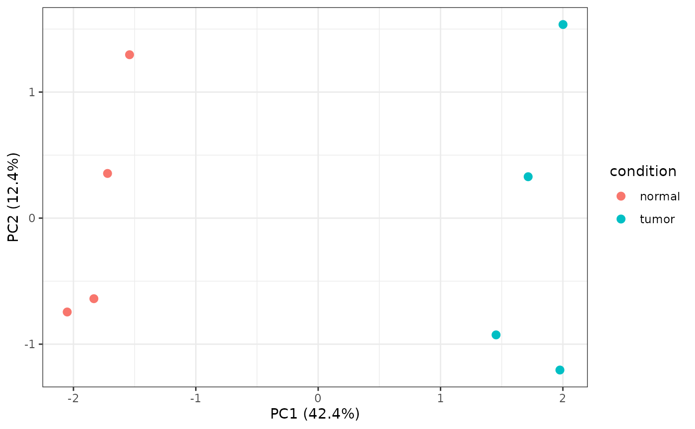

# Bulk transcriptomics from QC to clinical association

Shennong’s standalone bulk workflow keeps samples as the inferential
unit. The same feature-by-sample matrix and aligned sample metadata can
be supplied as a matrix plus data frame, a list, or a
`SummarizedExperiment`.

``` r

set.seed(83)
sample_data <- data.frame(
  condition = factor(rep(c("normal", "tumor"), each = 4),
                     levels = c("normal", "tumor")),
  batch = factor(rep(1:2, 4)),
  time = seq(10, 45, by = 5),
  event = rep(c(1, 0), 4),
  row.names = paste0("sample_", 1:8)
)
counts <- matrix(
  rpois(80 * 8, 30), nrow = 80,
  dimnames = list(paste0("gene_", 1:80), rownames(sample_data))
)
counts[1:8, sample_data$condition == "tumor"] <-
  counts[1:8, sample_data$condition == "tumor"] + 35
```

## Audit samples before modeling

[`sn_assess_bulk_qc()`](https://songqi.org/shennong/dev/reference/sn_assess_bulk_qc.md)
retains sample metrics, expression quantiles, PCA, correlation, and
robust outlier flags in one validated result.

``` r

qc <- sn_assess_bulk_qc(counts, sample_data)
qc$tables$samples[, c("sample", "library_size", "outlier")]
#> # A tibble: 8 × 3
#>   sample   library_size outlier
#>   <chr>           <dbl> <lgl>  
#> 1 sample_1         2404 FALSE  
#> 2 sample_2         2433 FALSE  
#> 3 sample_3         2405 FALSE  
#> 4 sample_4         2309 FALSE  
#> 5 sample_5         2733 FALSE  
#> 6 sample_6         2741 FALSE  
#> 7 sample_7         2734 FALSE  
#> 8 sample_8         2553 FALSE
sn_plot_bulk_pca(qc, sample_data, color_by = "condition")
```



## Validate the design and contrast

The contrast contract is always `c(variable, numerator, denominator)`.
With integer counts, `method = "auto"` chooses edgeR; normalized
continuous input chooses limma; a mixed-effects formula selects dream.
Explicit DESeq2, edgeR, limma, and dream choices remain available.

``` r

de <- sn_find_bulk_de(
  counts,
  metadata = sample_data,
  design = ~ batch + condition,
  contrast = c("condition", "tumor", "normal"),
  method = "auto"
)

# Discover and retrieve the standardized evidence table.
names(de$tables)
head(de$tables$differential_expression)
sn_plot_bulk_de(de)
```

## Pathways, networks, and clinical models

Pathway scoring reports gene-set coverage before returning sample
scores. WGCNA returns modules, eigengenes, power diagnostics, and
module-trait associations. Cox models and general clinical associations
can use either genes from the expression matrix or numeric columns from
sample metadata.

``` r

pathways <- sn_score_bulk_pathways(
  counts,
  signatures = list(inflammation = paste0("gene_", 1:10)),
  metadata = sample_data
)
pathways$tables$coverage
pathways$tables$scores

network <- sn_run_wgcna(counts, sample_data, traits = "condition")
network$tables$modules
network$tables$trait_associations

survival <- sn_run_survival(
  counts, time = "time", event = "event",
  features = c("gene_1", "gene_2"), metadata = sample_data
)
survival$tables$survival
sn_plot_survival(survival)
```

[`sn_run_bulk()`](https://songqi.org/shennong/dev/reference/sn_run_bulk.md)
dispatches the same workflows through `workflow = "qc"`, `"de"`,
`"pathway"`, `"network"`, or `"survival"`. The explicit functions are
preferable in scripts because their required inputs are easier to
review.
