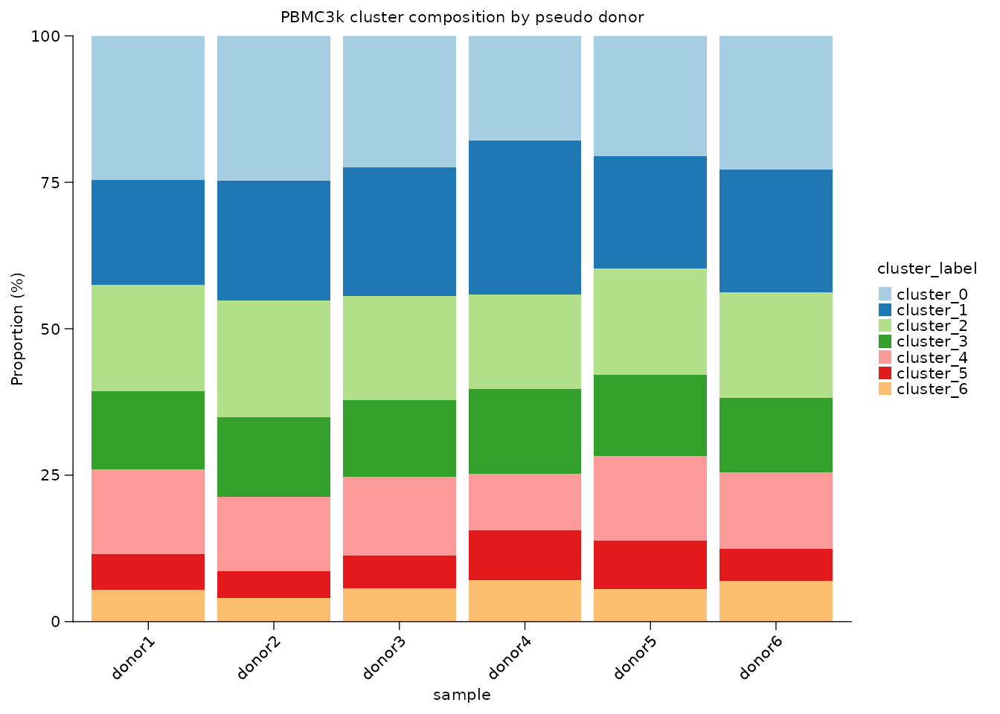
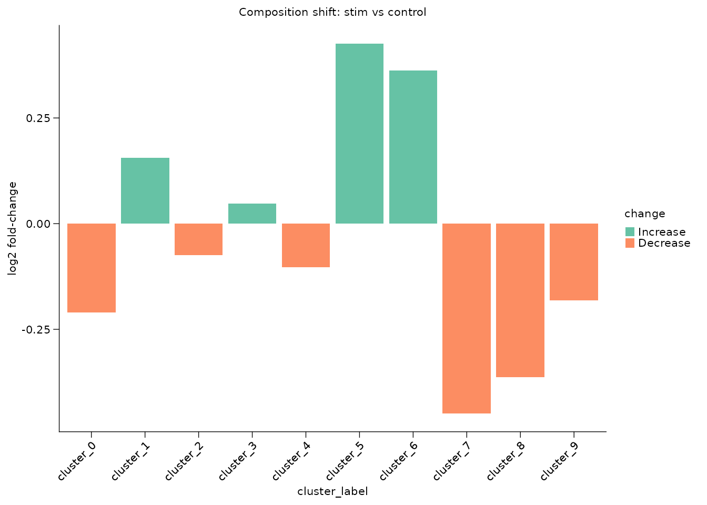
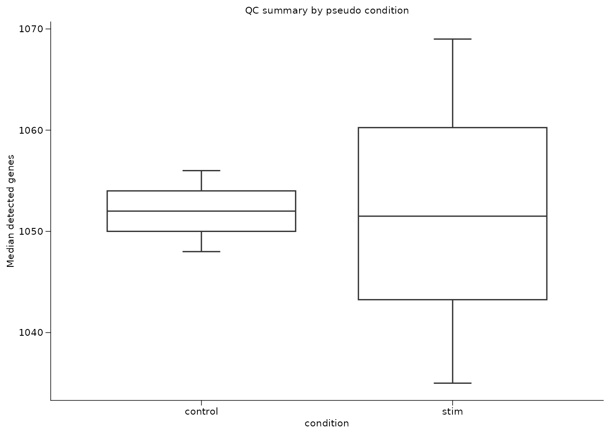
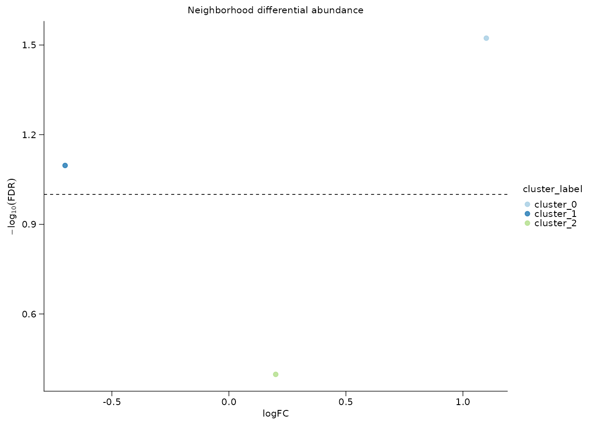

# Composition and differential abundance

Composition analysis should not treat every cell as an independent
biological replicate. Shennong separates cell-level counting from
sample-level comparison: first compute proportions, then compare
replicate samples.

This article uses PBMC3k with teaching-only pseudo samples and
conditions.

## Prepare cluster labels and sample metadata

``` r

library(Shennong)
library(Seurat)
library(dplyr)

pbmc <- sn_load_data("pbmc3k")
#> INFO [2026-05-05 23:57:24] Initializing Seurat object for project: pbmc3k.
#> INFO [2026-05-05 23:57:24] Running QC metrics for human.
#> INFO [2026-05-05 23:57:25] Seurat object initialization complete.

pbmc <- sn_run_cluster(
  object = pbmc,
  normalization_method = "seurat",
  nfeatures = 1500,
  dims = 1:15,
  resolution = 0.6,
  species = "human",
  verbose = FALSE
)

pbmc$sample <- rep(paste0("donor", 1:6), length.out = ncol(pbmc))
pbmc$condition <- ifelse(pbmc$sample %in% paste0("donor", 1:3), "control", "stim")
pbmc$cluster_label <- paste0("cluster_", pbmc$seurat_clusters)
```

The pseudo labels are only for demonstration. In a real analysis,
`sample` should be a biological replicate and `condition` should come
from experimental metadata.

## Count cells before comparing groups

[`sn_calculate_composition()`](https://songqi.org/shennong/dev/reference/sn_calculate_composition.md)
returns a transparent table with group totals, category counts, and
percentages.

``` r

composition <- sn_calculate_composition(
  x = pbmc,
  group_by = "sample",
  variable = "cluster_label",
  min_cells = 10,
  measure = "both"
)

head(composition)
#> # A tibble: 6 × 5
#>   sample cluster_label count group_total proportion
#>   <chr>  <chr>         <int>       <int>      <dbl>
#> 1 donor1 cluster_0       109         442      24.7 
#> 2 donor1 cluster_1        79         442      17.9 
#> 3 donor1 cluster_2        80         442      18.1 
#> 4 donor1 cluster_3        59         442      13.3 
#> 5 donor1 cluster_4        64         442      14.5 
#> 6 donor1 cluster_5        27         442       6.11
```

The denominator is visible in `group_total`, which makes it easy to
audit whether a proportion is based on enough cells.

Observed-over-expected enrichment is useful when you want to ask which
clusters are enriched or depleted relative to the full contingency
table.

``` r

roe <- sn_calculate_roe(
  x = pbmc,
  group_by = "condition",
  variable = "cluster_label"
)

head(roe)
#>   condition cluster_label observed row_total col_total grand_total
#> 1   control     cluster_0      317      1377       590        2753
#> 2      stim     cluster_0      273      1376       590        2753
#> 3   control     cluster_3      177      1377       360        2753
#> 4      stim     cluster_3      183      1376       360        2753
#> 5   control     cluster_2      246      1377       479        2753
#> 6      stim     cluster_2      233      1376       479        2753
#>   expected       roe    log2_roe
#> 1 295.1072 1.0741861  0.10324394
#> 2 294.8928 0.9257600 -0.11128986
#> 3 180.0654 0.9829763 -0.02477150
#> 4 179.9346 1.0170361  0.02437088
#> 5 239.5870 1.0267669  0.03810871
#> 6 239.4130 0.9732136 -0.03917156
```

``` r

roe_matrix <- sn_calculate_roe(
  x = pbmc,
  group_by = "condition",
  variable = "cluster_label",
  return_matrix = TRUE
)

roe_matrix[, seq_len(min(4, ncol(roe_matrix))), drop = FALSE]
#>         cluster_0 cluster_3 cluster_2 cluster_6
#> control  1.074186 0.9829763 1.0267669 0.8642022
#> stim     0.925760 1.0170361 0.9732136 1.1358965
```

``` r

sn_plot_composition(
  composition,
  x = sample,
  fill = cluster_label,
  y = proportion,
  position = "stack",
  palette = "Paired",
  title = "PBMC3k cluster composition by pseudo donor"
)
```



## Compare sample-level proportions

[`sn_compare_composition()`](https://songqi.org/shennong/dev/reference/sn_compare_composition.md)
summarizes each sample first, then compares those sample-level
proportions between conditions. That avoids pseudo-replication.

``` r

comparison <- sn_compare_composition(
  x = pbmc,
  sample_by = "sample",
  group_by = "condition",
  variable = "cluster_label",
  contrast = c("stim", "control"),
  min_cells = 20,
  test = "wilcox"
)

comparison
#>    cluster_label  mean_case mean_control median_case median_control
#> 1      cluster_0 19.8417229   23.0210603  20.0435730     23.7472767
#> 2      cluster_1 21.5833738   19.3173566  20.3056769     19.6078431
#> 3      cluster_2 16.9335274   17.8649237  17.4672489     17.4291939
#> 4      cluster_3 13.2986399   12.8540305  13.5076253     12.8540305
#> 5      cluster_4 12.0643891   12.9992738  12.6637555     12.8540305
#> 6      cluster_5  7.1933480    5.2287582   8.0610022      5.4466231
#> 7      cluster_6  6.3956199    4.8656500   6.7685590      5.2287582
#> 8      cluster_7  1.0902760    1.6702977   1.3071895      1.7429194
#> 9      cluster_8  1.0174958    1.4524328   1.0917031      1.5250545
#> 10     cluster_9  0.5816074    0.7262164   0.4357298      0.6535948
#>    difference     log2_fc n_case n_control   p_value contrast_case
#> 1  -3.1793374 -0.20951122      3         3 0.1840386          stim
#> 2   2.2660172  0.15619606      3         3 0.6625206          stim
#> 3  -0.9313963 -0.07508840      3         3 1.0000000          stim
#> 4   0.4446093  0.04725083      3         3 0.6625206          stim
#> 5  -0.9348847 -0.10354127      3         3 1.0000000          stim
#> 6   1.9645898  0.42538913      3         3 0.3827331          stim
#> 7   1.5299699  0.36192730      3         3 0.1211833          stim
#> 8  -0.5800218 -0.44861581      3         3 0.0765225          stim
#> 9  -0.4349370 -0.36358040      3         3 0.1156880          stim
#> 10 -0.1446090 -0.18103672      3         3 0.6530951          stim
#>    contrast_control   change     p_adj
#> 1           control Decrease 0.4600966
#> 2           control Increase 0.8281507
#> 3           control Decrease 1.0000000
#> 4           control Increase 0.8281507
#> 5           control Decrease 1.0000000
#> 6           control Increase 0.7654662
#> 7           control Increase 0.4039442
#> 8           control Decrease 0.4039442
#> 9           control Decrease 0.4039442
#> 10          control Decrease 0.8281507
```

Use the plotting helpers for the summary table when you want a compact
figure-ready view.

``` r

sn_plot_barplot(
  comparison,
  x = cluster_label,
  y = log2_fc,
  fill = change,
  stat = "identity",
  palette = "Set2",
  angle_x = 45,
  y_label = "log2 fold-change",
  title = "Composition shift: stim vs control"
)
```



## Compare continuous metadata with boxplots

Composition is categorical. For continuous per-cell or per-sample
summaries, summarize to the replicate level first, then plot.

``` r

sample_qc <- pbmc[[]] |>
  dplyr::group_by(sample, condition) |>
  dplyr::summarise(
    median_features = median(nFeature_RNA),
    median_mito = median(percent.mt),
    .groups = "drop"
  )

sn_plot_boxplot(
  sample_qc,
  x = condition,
  y = median_features,
  y_label = "Median detected genes",
  title = "QC summary by pseudo condition"
)
```



## Local differential abundance with miloR

Global proportions can miss local shifts inside an embedding.
[`sn_run_milo()`](https://songqi.org/shennong/dev/reference/sn_run_milo.md)
wraps the miloR neighborhood workflow for sample-level differential
abundance.

``` r

milo_tbl <- sn_run_milo(
  x = pbmc,
  sample_by = "sample",
  group_by = "condition",
  contrast = c("stim", "control"),
  reduction = "pca",
  dims = 1:15,
  annotation_by = "cluster_label",
  max_cells = 1500,
  store_name = "condition_da",
  return_object = FALSE
)

head(milo_tbl)
```

If a milo result was generated elsewhere, store and retrieve it with the
same object-level convention used for DE and enrichment.

``` r

mock_milo <- data.frame(
  logFC = c(1.1, -0.7, 0.2),
  SpatialFDR = c(0.03, 0.08, 0.4),
  cluster_label = c("cluster_0", "cluster_1", "cluster_2")
)

pbmc <- sn_store_milo(
  object = pbmc,
  result = mock_milo,
  store_name = "condition_da",
  sample_by = "sample",
  group_by = "condition",
  comparison = "stim_vs_control",
  reduction = "pca",
  annotation_by = "cluster_label",
  return_object = TRUE
)

sn_get_milo_result(pbmc, milo_name = "condition_da")
#> # A tibble: 3 × 3
#>   logFC SpatialFDR cluster_label
#>   <dbl>      <dbl> <chr>        
#> 1   1.1       0.03 cluster_0    
#> 2  -0.7       0.08 cluster_1    
#> 3   0.2       0.4  cluster_2
```

[`sn_plot_milo()`](https://songqi.org/shennong/dev/reference/sn_plot_milo.md)
then displays the stored neighborhood-level table.

``` r

sn_plot_milo(
  pbmc,
  milo_name = "condition_da",
  annotation_by = "cluster_label",
  title = "Neighborhood differential abundance"
)
```



The recommended reporting pattern is to show both global composition and
local neighborhood abundance when a biological claim depends on changes
in cell-state frequency.
