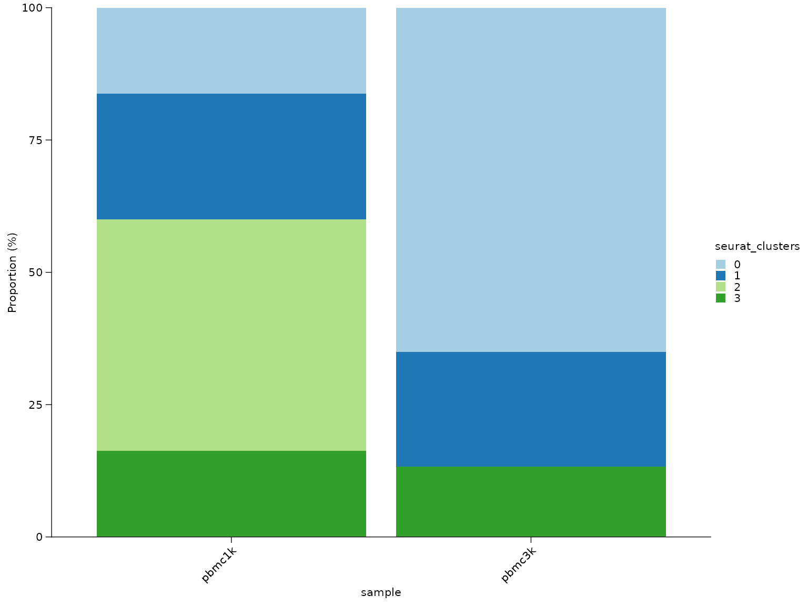
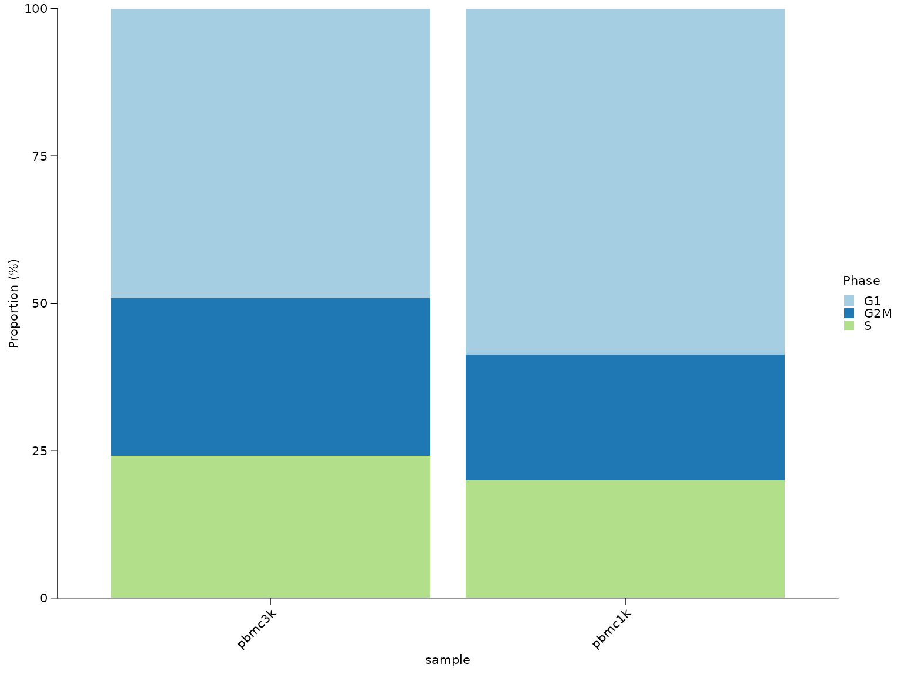
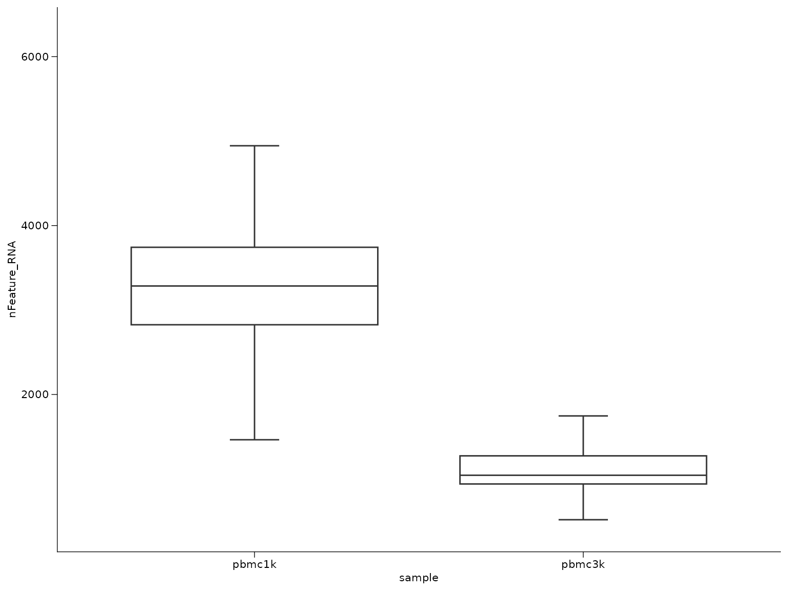
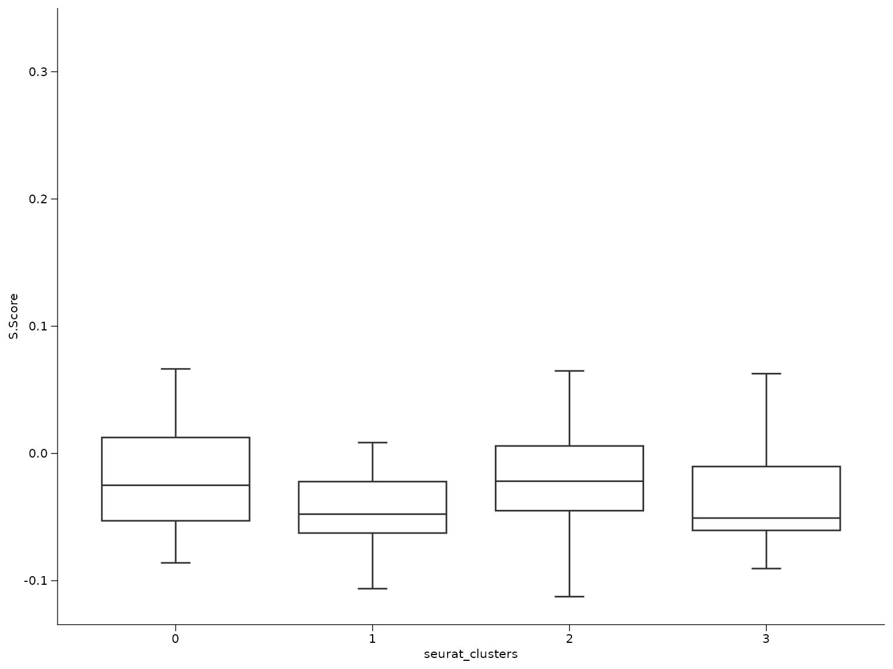

# Composition and comparative analysis workflow

This workflow covers the analysis tasks that happen after clusters or
cell types already exist and the main question becomes comparative
rather than structural:

- how cell states are distributed across samples
- whether cluster proportions shift between groups
- how QC or score columns differ across categories

``` r
library(Shennong)
library(dplyr)
library(knitr)
library(Seurat)

if (!exists("pbmc_small", inherits = FALSE)) {
  try(data("pbmc_small", package = "Shennong", envir = environment()), silent = TRUE)
}
if (!exists("pbmc_small", inherits = FALSE) && file.exists(file.path("data", "pbmc_small.rda"))) {
  load(file.path("data", "pbmc_small.rda"))
}
```

## 1. Summarize cell-state proportions

[`sn_calculate_composition()`](https://songqi.org/shennong/dev/reference/sn_calculate_composition.md)
is the main helper for grouped proportion summaries. The most common
pattern is sample-by-cluster composition. When you need a nested summary
such as phase proportions within each cell type inside each sample, pass
multiple grouping columns.

``` r
knitr::kable(composition_tbl, digits = 2)
```

| sample | seurat_clusters | proportion |
|:-------|:----------------|-----------:|
| pbmc1k | 0               |      16.25 |
| pbmc1k | 1               |      23.75 |
| pbmc1k | 2               |      43.75 |
| pbmc1k | 3               |      16.25 |
| pbmc3k | 0               |      65.00 |
| pbmc3k | 1               |      21.67 |
| pbmc3k | 3               |      13.33 |

## 2. Plot proportions across groups

The returned composition table can be plotted directly with
[`sn_plot_composition()`](https://songqi.org/shennong/dev/reference/sn_plot_composition.md).
It automatically uses the `proportion` column when present and can order
the x-axis by one fill category.

``` r
sn_plot_composition(
  composition_tbl,
  x = sample,
  fill = seurat_clusters
)
```



When ordering matters, request it during composition summarization or at
plot time. This is useful for comparisons such as mutation fractions
across cell types.

``` r
phase_tbl_ordered <- sn_calculate_composition(
  seu,
  group_by = "sample",
  variable = "Phase",
  min_cells = 10,
  sort_by = "proportion",
  sort_value = "G1"
)

sn_plot_composition(
  phase_tbl_ordered,
  x = sample,
  fill = Phase
)
```



## 3. Compare categorical structure beyond clusters

The same composition helper also works for cell-cycle phase, annotation
labels, or any other metadata column.

``` r
knitr::kable(phase_tbl, digits = 2)
```

| sample | cell_type | Phase | count | group_total | proportion |
|:-------|:----------|:------|------:|------------:|-----------:|
| pbmc1k | cluster_0 | G1    |     6 |          13 |      46.15 |
| pbmc1k | cluster_0 | G2M   |     3 |          13 |      23.08 |
| pbmc1k | cluster_0 | S     |     4 |          13 |      30.77 |
| pbmc1k | cluster_1 | G1    |    15 |          19 |      78.95 |
| pbmc1k | cluster_1 | G2M   |     4 |          19 |      21.05 |
| pbmc1k | cluster_2 | G1    |    19 |          35 |      54.29 |
| pbmc1k | cluster_2 | G2M   |     7 |          35 |      20.00 |
| pbmc1k | cluster_2 | S     |     9 |          35 |      25.71 |
| pbmc1k | cluster_3 | G1    |     7 |          13 |      53.85 |
| pbmc1k | cluster_3 | G2M   |     3 |          13 |      23.08 |
| pbmc1k | cluster_3 | S     |     3 |          13 |      23.08 |
| pbmc3k | cluster_0 | G1    |    39 |          78 |      50.00 |
| pbmc3k | cluster_0 | G2M   |    18 |          78 |      23.08 |
| pbmc3k | cluster_0 | S     |    21 |          78 |      26.92 |
| pbmc3k | cluster_1 | G1    |    13 |          26 |      50.00 |
| pbmc3k | cluster_1 | G2M   |     9 |          26 |      34.62 |
| pbmc3k | cluster_1 | S     |     4 |          26 |      15.38 |
| pbmc3k | cluster_3 | G1    |     7 |          16 |      43.75 |
| pbmc3k | cluster_3 | G2M   |     5 |          16 |      31.25 |
| pbmc3k | cluster_3 | S     |     4 |          16 |      25.00 |

## 4. Compare composition shifts between groups

When replicate samples are available, compare sample-level proportions
instead of pooling all cells together.
[`sn_compare_composition()`](https://songqi.org/shennong/dev/reference/sn_compare_composition.md)
computes per-sample composition first, then reports group means,
differences, log2 fold changes, and optional Wilcoxon statistics.

``` r
composition_comparison <- sn_compare_composition(
  seu,
  sample_col = "sample",
  group_col = "study",
  variable = "seurat_clusters",
  contrast = c("pbmc3k", "pbmc1k"),
  min_cells = 10,
  test = "none"
)

knitr::kable(composition_comparison, digits = 2)
```

| seurat_clusters | mean_case | mean_control | median_case | median_control | difference | log2_fc | n_case | n_control | p_value | contrast_case | contrast_control | change   | p_adj |
|:----------------|----------:|-------------:|------------:|---------------:|-----------:|--------:|-------:|----------:|--------:|:--------------|:-----------------|:---------|------:|
| 0               |     65.00 |        16.25 |       65.00 |          16.25 |      48.75 |    1.97 |      1 |         1 |      NA | pbmc3k        | pbmc1k           | Increase |    NA |
| 1               |     21.67 |        23.75 |       21.67 |          23.75 |      -2.08 |   -0.13 |      1 |         1 |      NA | pbmc3k        | pbmc1k           | Decrease |    NA |
| 2               |      0.00 |        43.75 |        0.00 |          43.75 |     -43.75 |   -6.47 |      1 |         1 |      NA | pbmc3k        | pbmc1k           | Decrease |    NA |
| 3               |     13.33 |        16.25 |       13.33 |          16.25 |      -2.92 |   -0.28 |      1 |         1 |      NA | pbmc3k        | pbmc1k           | Decrease |    NA |

## 5. Test neighborhood abundance shifts with miloR

When the question is not just “does this label’s global proportion
change?” but “which local transcriptional neighborhoods expand or
contract between sample groups?”, use
[`sn_run_milo()`](https://songqi.org/shennong/dev/reference/sn_run_milo.md).
This is especially useful when abundance shifts cut across coarse
cluster labels.

``` r
milo_tbl <- sn_run_milo(
  seu,
  sample_col = "sample",
  group_col = "study",
  contrast = c("pbmc3k", "pbmc1k"),
  reduction = "pca",
  dims = 1:20,
  annotation_col = "seurat_clusters"
)

head(milo_tbl)
```

## 6. Compare continuous scores across groups

Once a grouped table exists, Shennong’s plotting helpers can summarize
how QC or score columns differ by sample or cluster.

``` r
sn_plot_boxplot(score_tbl, x = sample, y = nFeature_RNA)
```



``` r
sn_plot_boxplot(score_tbl, x = seurat_clusters, y = S.Score)
```



## 7. Keep comparative analysis downstream of stable labels

Composition and grouped-score analysis become much more interpretable
once the labels are stable. In practice the recommended order is:

1.  preprocessing and QC
2.  clustering or integration
3.  marker or reference-based annotation
4.  composition and grouped comparisons

That order reduces the chance of over-interpreting composition shifts
that are actually caused by unstable clustering.
