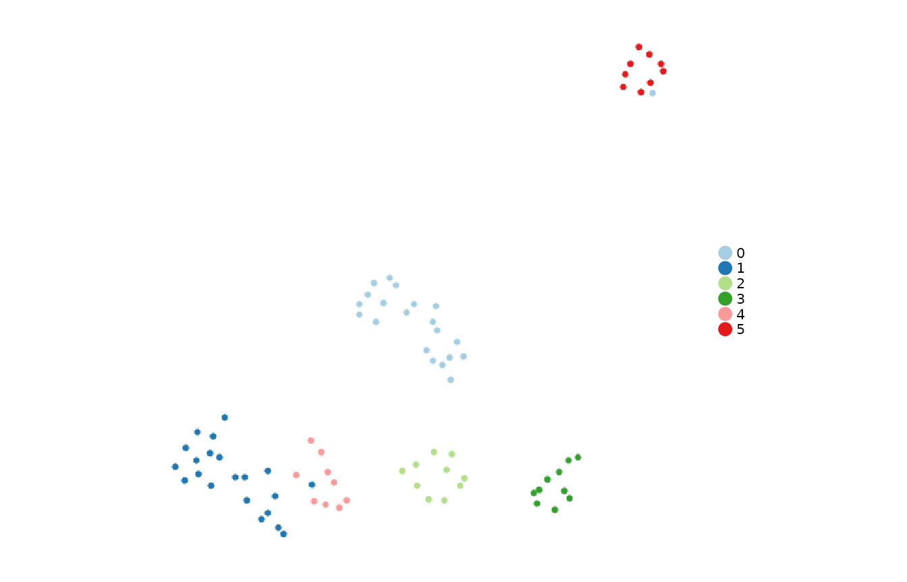

# Get started: counts to markers and scores

Run this page from top to bottom to create a Seurat object, cluster
cells, find markers, score a gene set, and retrieve the saved results.
It uses the small PBMC dataset included in **SeuratObject**, so no data
download, Python runtime, API key, or local fixture is needed. The tiny
dataset demonstrates usage; it is not suitable for condition-level
biological conclusions.

## 1. Install and load

Run installation once. Shennong is under development; the documentation
tracks GitHub `main`.

``` r

install.packages(c("remotes", "Seurat"))
remotes::install_github("zerostwo/shennong")
```

``` r

library(Shennong)
data("pbmc_small", package = "SeuratObject")
```

## 2. Start from counts

Expression matrices have **genes in rows and cells in columns**. Cell
names must match the row names of any metadata you add. Recreate the
example from counts so the steps below do not reuse its precomputed
analysis.

``` r

counts <- SeuratObject::GetAssayData(pbmc_small, assay = "RNA", layer = "counts")
pbmc <- SeuratObject::CreateSeuratObject(counts = counts, project = "quickstart")
dim(pbmc)
#> [1] 230  80
head(pbmc[[]])
#>                orig.ident nCount_RNA nFeature_RNA
#> ATGCCAGAACGACT quickstart         70           47
#> CATGGCCTGTGCAT quickstart         85           52
#> GAACCTGATGAACC quickstart         87           50
#> TGACTGGATTCTCA quickstart        127           56
#> AGTCAGACTGCACA quickstart        173           53
#> TCTGATACACGTGT quickstart         70           48
```

For your own data, replace `counts` with an imported matrix. For
example, `counts <- sn_read("path/to/filtered_feature_bc_matrix")` reads
a 10x directory. For multimodal 10x input, select the gene-expression
matrix from the returned list before creating an RNA object. See [data
input and
output](https://zerostwo.github.io/shennong/dev/articles/data-io-projects.md)
for metadata alignment, backed matrices, and file formats.

## 3. Normalize, reduce dimensions, and cluster

[`sn_run_cluster()`](https://zerostwo.github.io/shennong/dev/reference/sn_run_cluster.md)
performs normalization, variable-feature selection, PCA, neighbors,
clustering, and UMAP. Set `integration_method = "unintegrated"` for a
baseline analysis. Here the feature and dimension counts are
deliberately small because the bundled example is small.

``` r

pbmc <- sn_run_cluster(
  pbmc,
  assay = "RNA", layer = "counts",
  normalization_method = "seurat",
  integration_method = "unintegrated",
  nfeatures = 100, npcs = 10, dims = 1:10,
  resolution = 1.2, seed = 717,
  verbose = FALSE
)
#> WARN [2026-09-24 00:29:30] Skipping cell cycle scoring because the selected assay has insufficient overlap with human cell-cycle markers (S: 0, G2M: 0).
table(pbmc$seurat_clusters)
#> 
#>  0  1  2  3  4  5 
#> 21 21 10 10  9  9
```

`assay` chooses the modality; `layer` chooses the expression matrix
within it. `npcs` controls how many PCs are computed and `dims` selects
those used downstream. Cluster labels are computational groups, not
cell-type annotations.

``` r

sn_plot_dim(pbmc, reduction = "umap", group_by = "seurat_clusters")
```



For multiple batches, first inspect a baseline and the experimental
design. Then add `batch_by = "batch"` and choose an integration method.
See [clustering and
integration](https://zerostwo.github.io/shennong/dev/articles/clustering.md)
for batch-aware examples and [parameter
conventions](https://zerostwo.github.io/shennong/dev/articles/parameters-and-results.html#choose-the-input-and-grouping)
for the distinct roles of `batch_by`, `group_by`, and `sample_by`.

## 4. Find markers and select a table

The analysis stores all tested results. The getter selects the rows you
want to display. These two steps use separate filters.

``` r

pbmc <- sn_find_de(
  pbmc, analysis = "markers", group_by = "seurat_clusters",
  assay = "RNA", layer = "data", method = "wilcox",
  min_pct = 0.1, logfc_threshold = 0,
  result_id = "cluster_markers", verbose = FALSE
)

markers <- sn_get_de_result(
  pbmc, result_id = "cluster_markers",
  direction = "up", top_n = 3, top_scope = "group"
)
head(markers)
#> # A tibble: 6 × 7
#>          p_val avg_log2FC pct.1 pct.2  p_val_adj cluster gene  
#>          <dbl>      <dbl> <dbl> <dbl>      <dbl> <fct>   <chr> 
#> 1 0.000000756       10.1  0.381     0 0.000174   0       LILRA3
#> 2 0.00000431         9.40 0.333     0 0.000991   0       VSTM1 
#> 3 0.000128           9.33 0.238     0 0.0293     0       IL17RA
#> 4 0.0000000208      13.0  0.476     0 0.00000479 1       GZMH  
#> 5 0.000000756       11.5  0.381     0 0.000174   1       AKR1C3
#> 6 0.00346           11.0  0.143     0 0.796      1       S100B
```

This selects up to three positive markers **per cluster**. Add
`p_adjusted_cutoff = 0.05` and `logfc_threshold = 0.25` to the getter to
select significant effects for a report. Use `top_scope = "all"` for one
top-N list across the selected groups. A significance filter may return
zero rows on a small dataset; that is a valid result.

## 5. Score a gene set

A signature is a named list of gene vectors. This example computes the
mean normalized expression of an illustrative B-cell marker panel.
Scoring a panel does not by itself establish a cell identity.

``` r

signatures <- list(B_cell = c("MS4A1", "CD79A", "CD79B"))
pbmc <- sn_score_programs(
  pbmc, signatures = signatures, method = "mean",
  assay = "RNA", layer = "data", seed = 717,
  result_id = "marker_panel"
)

scores <- sn_get_result(pbmc, type = "program_scoring", result_id = "marker_panel")
head(scores$tables$primary)
#> # A tibble: 6 × 5
#>   entity         program score level group_by
#>   <chr>          <chr>   <dbl> <chr> <chr>   
#> 1 ATGCCAGAACGACT B_cell   1.66 cell  NA      
#> 2 CATGGCCTGTGCAT B_cell   0    cell  NA      
#> 3 GAACCTGATGAACC B_cell   0    cell  NA      
#> 4 TGACTGGATTCTCA B_cell   0    cell  NA      
#> 5 AGTCAGACTGCACA B_cell   0    cell  NA      
#> 6 TCTGATACACGTGT B_cell   0    cell  NA
scores$tables$coverage
#> # A tibble: 1 × 6
#>   program n_genes n_matched coverage matched_genes     missing_genes
#>   <chr>     <int>     <int>    <dbl> <chr>             <chr>        
#> 1 B_cell        3         3        1 MS4A1;CD79A;CD79B ""
```

Inspect `tables$coverage` to see which genes were measured. Missing
genes are not negative expression evidence. For rank-based UCell scores,
install UCell and use `method = "ucell"`. Group summaries require an
explicit order of operations; see [group
scoring](https://zerostwo.github.io/shennong/dev/articles/parameters-and-results.html#score-cells-or-group-profiles).

## 6. Discover, retrieve, and save

``` r

sn_list_results(pbmc)
#> # A tibble: 2 × 8
#>   collection       type       result_id analysis method created_at n_rows source
#>   <chr>            <chr>      <chr>     <chr>    <chr>  <chr>       <int> <chr> 
#> 1 shennong.results de         cluster_… de       wilcox 2026-09-2…    236 NA    
#> 2 shennong.results program_s… marker_p… program… mean   2026-09-2…     80 NA
full_de <- sn_get_result(pbmc, type = "de", result_id = "cluster_markers")
full_de$parameters
#> list()
head(full_de$tables$primary)
#> # A tibble: 6 × 7
#>      p_val avg_log2FC pct.1 pct.2     p_val_adj cluster gene    
#>      <dbl>      <dbl> <dbl> <dbl>         <dbl> <fct>   <chr>   
#> 1 2.12e-11       4.47 0.81  0.068 0.00000000488 0       CFD     
#> 2 4.94e-11       3.50 0.952 0.254 0.0000000114  0       LST1    
#> 3 5.91e-11       3.31 1     0.322 0.0000000136  0       AIF1    
#> 4 1.04e-10       4.29 0.81  0.119 0.0000000238  0       SERPINA1
#> 5 1.52e-10       2.59 1     0.22  0.0000000350  0       TYMP    
#> 6 1.78e-10       3.69 0.857 0.136 0.0000000409  0       IFITM3
```

[`sn_list_results()`](https://zerostwo.github.io/shennong/dev/reference/sn_list_results.md)
lists stored analyses,
[`sn_get_result()`](https://zerostwo.github.io/shennong/dev/reference/sn_get_result.md)
returns one complete result, and table getters such as
[`sn_get_de_result()`](https://zerostwo.github.io/shennong/dev/reference/sn_get_de_result.md)
return a data frame. Always assign the returned object when you want to
retain a new analysis.

``` r

saveRDS(pbmc, "pbmc-analysed.rds")
pbmc <- readRDS("pbmc-analysed.rds")
sn_list_results(pbmc)
```

| Next task | Read next |
|----|----|
| Select layers, parameters, result IDs, or overwrite behavior | [Parameters and results](https://zerostwo.github.io/shennong/dev/articles/parameters-and-results.md) |
| Test markers or replicated conditions, then enrich pathways | [Differential expression and enrichment](https://zerostwo.github.io/shennong/dev/articles/differential-expression.md) |
| Filter cells, normalize counts, or correct ambient RNA | [Preprocessing and QC](https://zerostwo.github.io/shennong/dev/articles/preprocessing-qc.md) |
| Integrate batches and assess the embedding | [Clustering](https://zerostwo.github.io/shennong/dev/articles/clustering.md) and [diagnostics](https://zerostwo.github.io/shennong/dev/articles/metrics-diagnostics.md) |
| Make figures from expression or stored results | [Visualization](https://zerostwo.github.io/shennong/dev/articles/visualization.md) |
| Choose a spatial, bulk, or dynamics workflow | [All workflows](https://zerostwo.github.io/shennong/dev/articles/index.md) |
