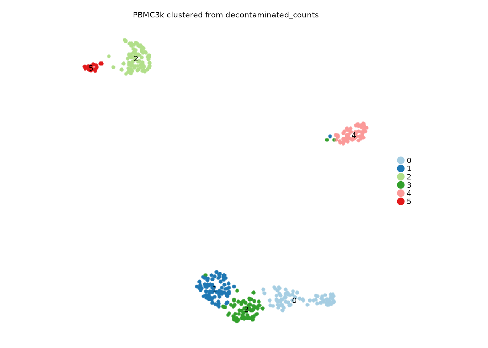

# Layer-aware workflows

Seurat v5 objects can store multiple assay layers. Shennong exposes
`assay` and `layer` in the functions where the count source matters, so
workflows can use raw counts, decontaminated counts, or other matrix
layers without rewriting the analysis.

This article uses PBMC3k and creates a demonstration layer by copying
counts. In real work, that layer might come from decontX, SoupX,
CellBender, or another preprocessing tool.

## Create a demonstration layer

``` r

library(Shennong)
library(Seurat)
library(dplyr)

pbmc <- sn_load_data("pbmc3k")
#> INFO [2026-05-05 20:34:11] Initializing Seurat object for project: pbmc3k.
#> INFO [2026-05-05 20:34:11] Running QC metrics for human.
#> INFO [2026-05-05 20:34:12] Seurat object initialization complete.
counts_full <- SeuratObject::LayerData(pbmc, assay = "RNA", layer = "counts")
demo_features <- names(sort(Matrix::rowSums(counts_full), decreasing = TRUE))[
  seq_len(min(1000, nrow(counts_full)))
]
demo_cells <- colnames(pbmc)[seq_len(min(400, ncol(pbmc)))]
pbmc <- subset(pbmc, features = demo_features, cells = demo_cells)

counts <- SeuratObject::LayerData(pbmc, assay = "RNA", layer = "counts")
SeuratObject::LayerData(pbmc, assay = "RNA", layer = "decontaminated_counts") <- counts

SeuratObject::Layers(pbmc[["RNA"]])
#> [1] "counts"                "decontaminated_counts"
```

The object still has its original counts. The new layer is simply
another input matrix that layer-aware Shennong functions can target.

## Cluster from a selected layer

[`sn_run_cluster()`](https://songqi.org/shennong/dev/reference/sn_run_cluster.md)
temporarily uses the requested layer for the workflow and restores the
original count layer before returning the object.

``` r

pbmc_layered <- sn_run_cluster(
  object = pbmc,
  normalization_method = "seurat",
  assay = "RNA",
  layer = "decontaminated_counts",
  nfeatures = 500,
  dims = 1:10,
  resolution = 0.6,
  species = "human",
  verbose = FALSE
)
#> WARN [2026-05-05 20:34:13] Skipping cell cycle scoring because the selected assay has insufficient overlap with human cell-cycle markers (S: 0, G2M: 1).

sn_plot_dim(
  pbmc_layered,
  reduction = "umap",
  group_by = "seurat_clusters",
  label = TRUE,
  title = "PBMC3k clustered from decontaminated_counts"
)
```



## Run DE on the right layer

Marker and contrast analyses usually use normalized data; pseudobulk
analyses usually use counts. Shennong keeps that distinction explicit
through `layer`.

``` r

pbmc_layered <- sn_find_de(
  object = pbmc_layered,
  analysis = "markers",
  group_by = "seurat_clusters",
  assay = "RNA",
  layer = "data",
  store_name = "cluster_markers",
  return_object = TRUE,
  verbose = FALSE
)

sn_get_de_result(
  pbmc_layered,
  de_name = "cluster_markers",
  top_n = 3,
  with_metadata = TRUE
)
#> $schema_version
#> [1] "1.0.0"
#> 
#> $package_version
#> [1] "0.1.4"
#> 
#> $created_at
#> [1] "2026-05-05 20:34:21 UTC"
#> 
#> $table
#> # A tibble: 1,004 × 7
#>       p_val avg_log2FC pct.1 pct.2 p_val_adj cluster gene  
#>       <dbl>      <dbl> <dbl> <dbl>     <dbl> <fct>   <chr> 
#>  1 3.25e-64      5.86  0.872 0.038  3.25e-61 0       CST7  
#>  2 8.30e-61      6.67  0.802 0.022  8.30e-58 0       GZMA  
#>  3 1.49e-60      6.65  0.93  0.102  1.49e-57 0       NKG7  
#>  4 2.17e-57      4.30  0.965 0.131  2.17e-54 0       CCL5  
#>  5 4.56e-43      4.66  0.826 0.143  4.56e-40 0       CTSW  
#>  6 2.57e-36      6.11  0.57  0.035  2.57e-33 0       PRF1  
#>  7 5.96e-32      6.91  0.453 0.013  5.96e-29 0       GZMK  
#>  8 4.57e-31      8.48  0.43  0.01   4.57e-28 0       FGFBP2
#>  9 3.88e-30      0.999 1     0.997  3.88e-27 0       B2M   
#> 10 3.80e-28      7.81  0.384 0.006  3.80e-25 0       GZMH  
#> # ℹ 994 more rows
#> 
#> $analysis
#> [1] "markers"
#> 
#> $method
#> [1] "wilcox"
#> 
#> $group_by
#> [1] "seurat_clusters"
#> 
#> $group_col
#> [1] "cluster"
#> 
#> $ident_1
#> NULL
#> 
#> $ident_2
#> NULL
#> 
#> $subset_by
#> NULL
#> 
#> $sample_col
#> NULL
#> 
#> $assay
#> [1] "RNA"
#> 
#> $layer
#> [1] "data"
#> 
#> $rank_col
#> [1] "avg_log2FC"
#> 
#> $p_col
#> [1] "p_val_adj"
#> 
#> $p_val_cutoff
#> [1] 0.05
#> 
#> $de_logfc
#> [1] 0.25
#> 
#> $min_pct
#> [1] 0.25
#> 
#> $logfc_threshold
#> [1] 0.1
#> 
#> $n_genes
#> [1] 1004
```

The stored metadata records the analysis context, which helps downstream
plotting and interpretation recover how the result was made.

## Use the same layer in other workflows

Layer selection appears in functions where using the wrong matrix would
change the answer.

``` r

pbmc_layered <- sn_filter_genes(
  pbmc_layered,
  min_cells = 5,
  assay = "RNA",
  layer = "decontaminated_counts",
  species = "human"
)

pbmc_layered <- sn_run_celltypist(
  x = pbmc_layered,
  assay = "RNA",
  layer = "decontaminated_counts",
  over_clustering = "seurat_clusters",
  quiet = TRUE
)

rogue_tbl <- sn_calculate_rogue(
  pbmc_layered,
  cluster_by = "seurat_clusters",
  assay = "RNA",
  layer = "decontaminated_counts"
)
```

## Simulate from the current object

Simulation is useful when you need a controlled object with the same
covariate structure as a real experiment.
[`sn_simulate()`](https://songqi.org/shennong/dev/reference/sn_simulate.md)
keeps the API method-based, so new simulation engines can be added
later. With `method = "scdesign3"`, it converts the selected Seurat
layer to a SingleCellExperiment, calls scDesign3, and returns a
simulated Seurat object by default. It does not merge original and
simulated cells unless `combine_original = TRUE`.

``` r

sim_pbmc <- sn_simulate(
  object = pbmc_layered,
  method = "scdesign3",
  celltype = "seurat_clusters",
  ncell = 100,
  assay = "RNA",
  layer = "decontaminated_counts",
  n_cores = 1,
  return = "seurat"
)

sim_pbmc
sim_pbmc@misc$scdesign3
```

## Cache layer-aware artifacts

Layer-aware results are still regular Seurat objects and tables, so the
same IO helpers from the first article apply.

``` r

outdir <- sn_set_path(file.path(tempdir(), "shennong-pbmc3k-layered"))

object_path <- file.path(outdir, "pbmc3k_layered.qs2")
markers_path <- file.path(outdir, "pbmc3k_layered_markers.csv")

sn_write(pbmc_layered, object_path)
sn_write(
  sn_get_de_result(pbmc_layered, "cluster_markers", top_n = 5),
  markers_path
)

sn_check_file(c(object_path, markers_path))
```

The main habit is to name the layer in every step where it matters. That
makes the workflow readable months later and reduces the chance of
silently switching between raw and corrected matrices.
