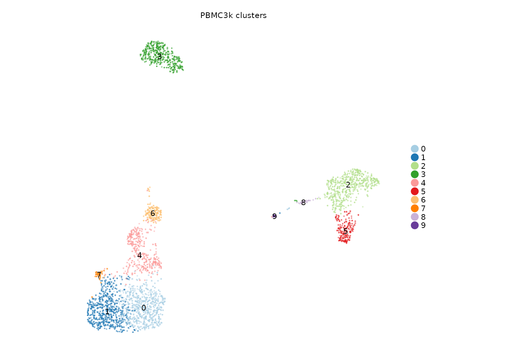
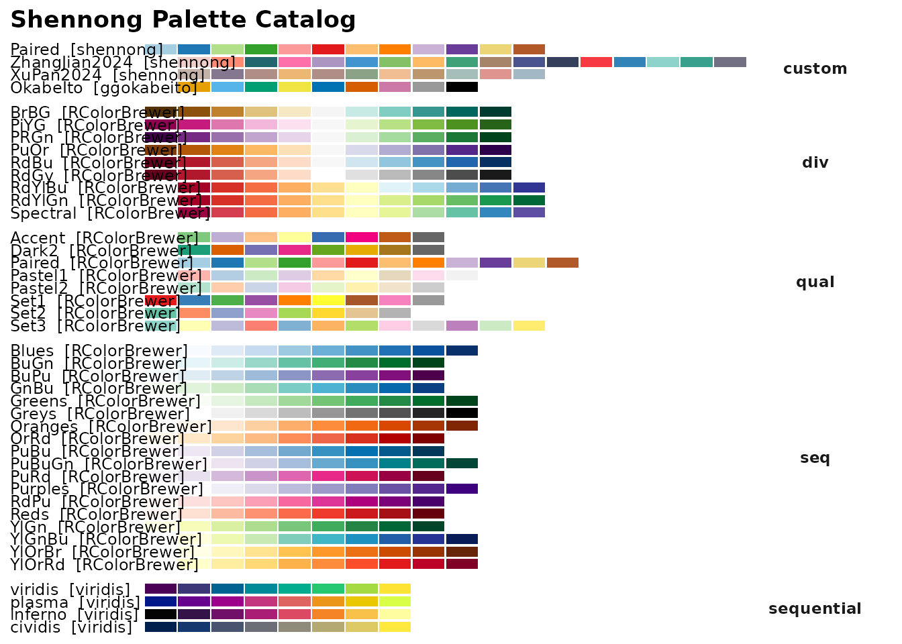
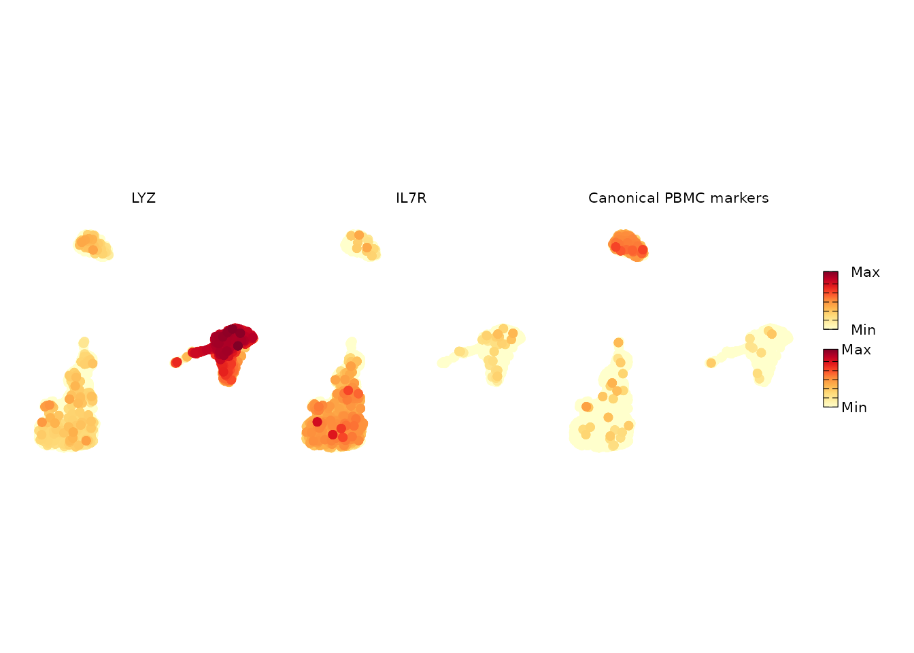
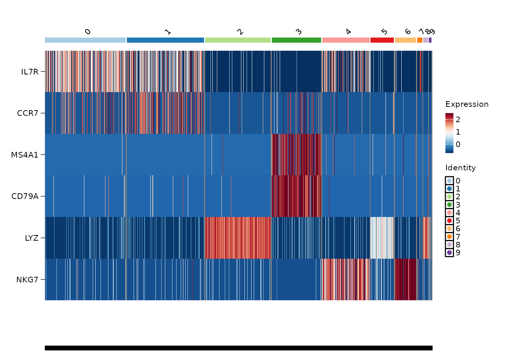
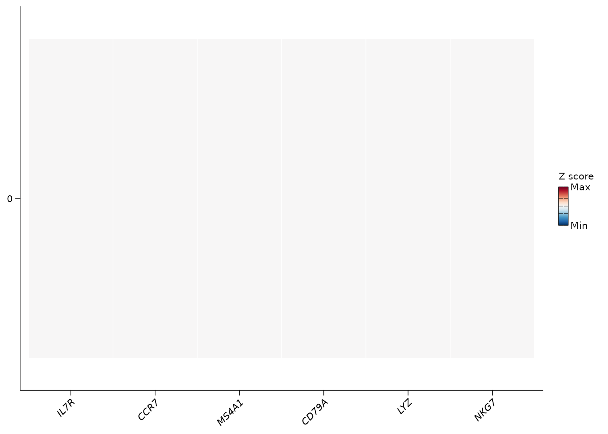
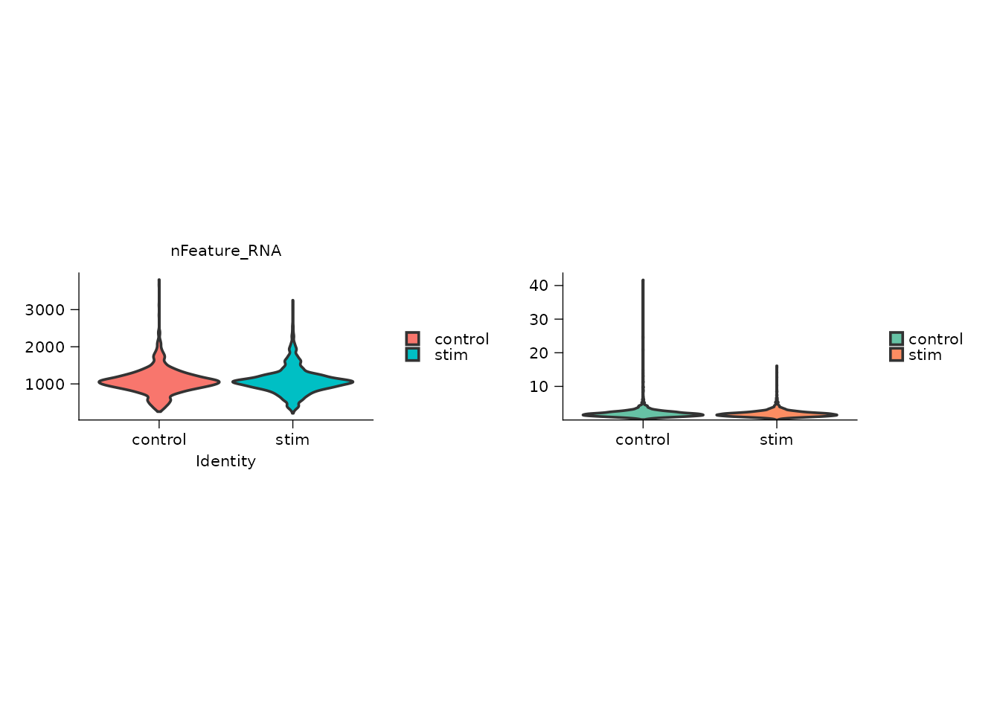
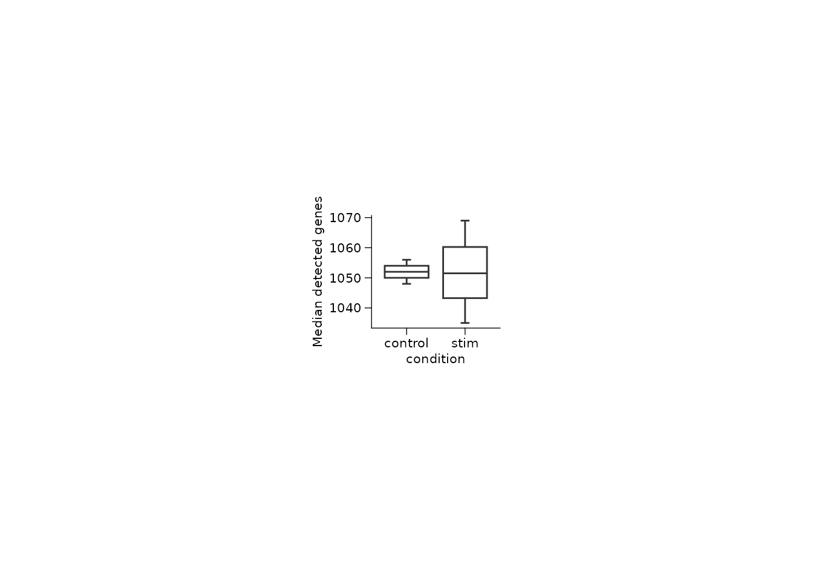
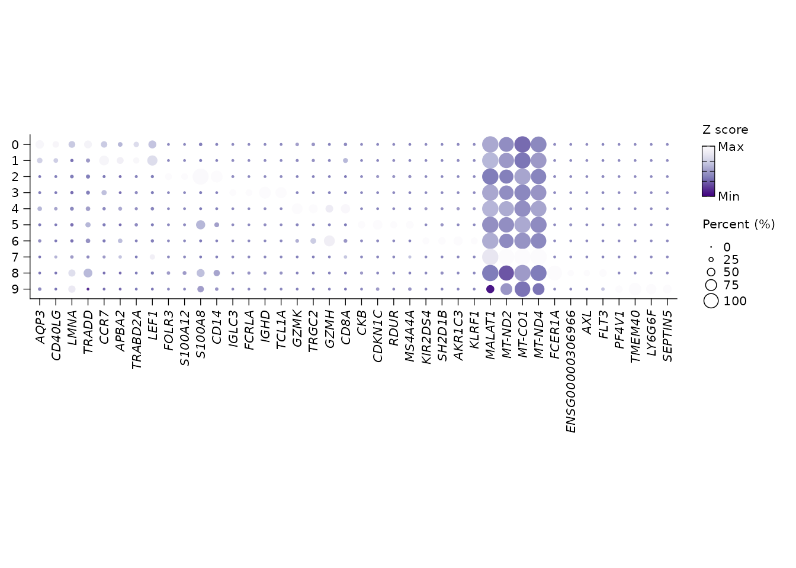
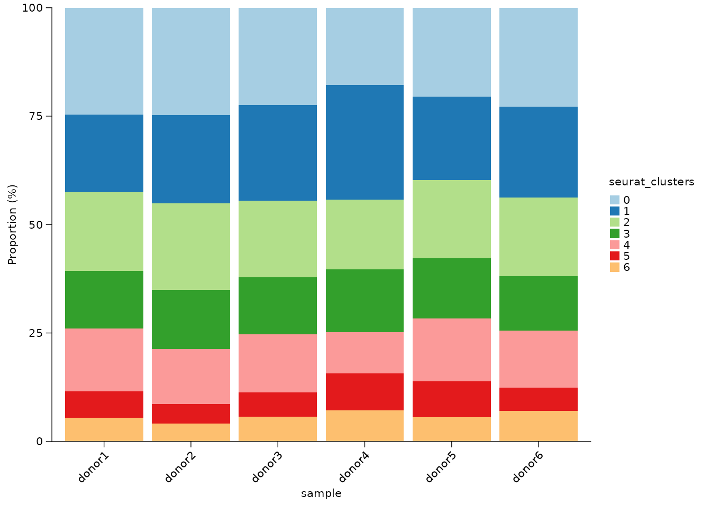
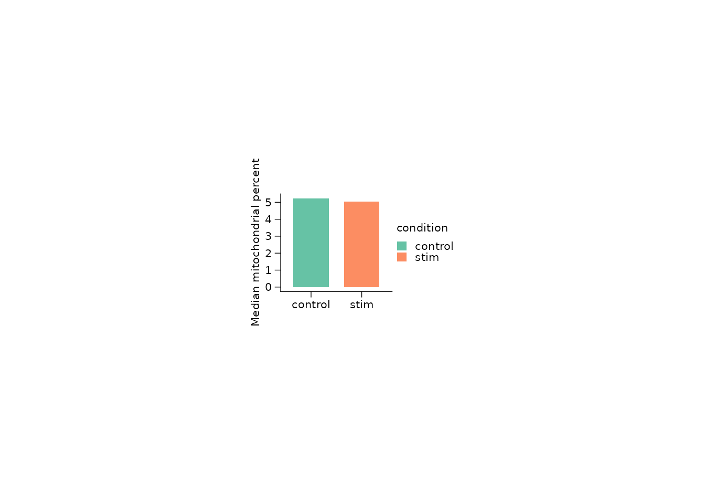

# Visualization with Shennong

Visualization is a first-class part of Shennong. The plotting helpers
wrap the common Seurat and ggplot2 patterns used in single-cell reports:
automatic point sizing, stable palettes, compact panel sizing,
rasterized scatter plots for large objects, and direct support for
stored Shennong results.

This article uses PBMC3k as the running example. The chunks are
displayed by default and are evaluated only with
`SHENNONG_RUN_VIGNETTES=true`.

## Prepare one clustered object

The plot wrappers expect the same Seurat object produced by the analysis
workflow. For a fast demonstration, this example clusters PBMC3k with
fewer PCs and variable features than a full analysis.

``` r

library(Shennong)
library(Seurat)
library(dplyr)
library(ggplot2)

pbmc <- sn_load_data("pbmc3k")
#> INFO [2026-05-05 20:35:28] Initializing Seurat object for project: pbmc3k.
#> INFO [2026-05-05 20:35:28] Running QC metrics for human.
#> INFO [2026-05-05 20:35:28] Seurat object initialization complete.

pbmc <- sn_run_cluster(
  object = pbmc,
  normalization_method = "seurat",
  nfeatures = 1500,
  npcs = 20,
  dims = 1:15,
  resolution = 0.6,
  species = "human",
  verbose = FALSE
)
```

## Dimensional maps: labels, palettes, and rasterization

[`sn_plot_dim()`](https://songqi.org/shennong/dev/reference/sn_plot_dim.md)
is the default map for categorical metadata. It hides axes by default,
chooses a practical point size from the number of cells, and uses a
named palette registry instead of requiring every script to hand-code
colors.

``` r

sn_plot_dim(
  object = pbmc,
  reduction = "umap",
  group_by = "seurat_clusters",
  label = TRUE,
  label_halo = FALSE,
  palette = "Paired",
  title = "PBMC3k clusters"
)
```



When you need colors programmatically, use the same registry directly.

``` r

sn_list_palettes()
```



``` r


cluster_cols <- sn_get_palette(
  palette = "Paired",
  n = length(levels(pbmc$seurat_clusters)),
  palette_type = "discrete"
)

cluster_cols
#>  [1] "#A6CEE3" "#1F78B4" "#B2DF8A" "#33A02C" "#FB9A99" "#E31A1C"
#>  [7] "#FDBF6F" "#FF7F00" "#CAB2D6" "#6A3D9A"
```

## Feature maps: expression and density modes

[`sn_plot_feature()`](https://songqi.org/shennong/dev/reference/sn_plot_feature.md)
covers standard expression maps and density-style maps. The same
function handles legends, shared scales, rasterization, and panel
sizing. Rasterization is enabled by default; when `ggrastr` is available
the point layer is rasterized after the regular ggplot point size is
applied, so small values such as `pt_size = 0.01` behave like ordinary
[`geom_point()`](https://ggplot2.tidyverse.org/reference/geom_point.html)
sizes.

``` r

sn_plot_feature(
  object = pbmc,
  features = c("IL7R", "MS4A1", "LYZ"),
  reduction = "umap",
  mode = "expression",
  palette = "YlOrRd",
  title = "Canonical PBMC markers"
)
```



Density mode is useful when expression is sparse and you want to
emphasize where a marker-defined state sits in the embedding.

``` r

sn_plot_feature(
  object = pbmc,
  features = "IL7R",
  reduction = "umap",
  mode = "density",
  density_style = "galaxy",
  title = "IL7R density"
)
```

## Focused heatmaps for selected genes

When the question is about a known marker panel, a heatmap is usually
clearer than another embedding.
[`sn_plot_heatmap()`](https://songqi.org/shennong/dev/reference/sn_plot_heatmap.md)
validates the requested genes and can draw either cell-level or
group-averaged heatmaps. The default `mode = "cells"` follows Seurat’s
heatmap backend but hides cell names and ticks, uses an 8 pt group
label, rasterizes by default, and colors the group bar with a Paired
palette.

``` r

sn_plot_heatmap(
  object = pbmc,
  features = c("IL7R", "CCR7", "MS4A1", "CD79A", "LYZ", "NKG7"),
  group_by = "seurat_clusters",
  palette = "RdBu",
  label_angle = 45
)
```



Use `mode = "average"` when the comparison is about the group-level
pattern rather than every individual cell. This averages expression
within each group and then z-scores each gene by default, giving a
compact marker-panel summary.

``` r

sn_plot_heatmap(
  object = pbmc,
  features = c("IL7R", "CCR7", "MS4A1", "CD79A", "LYZ", "NKG7"),
  group_by = "seurat_clusters",
  mode = "average",
  palette = "RdBu"
)
```



Use `split_by` when the same marker panel should be inspected separately
across samples, conditions, or batches.

``` r

sn_plot_heatmap(
  object = pbmc,
  features = c("IL7R", "CCR7", "MS4A1", "CD79A", "LYZ", "NKG7"),
  group_by = "seurat_clusters",
  split_by = "sample"
)
```

## Distribution plots for metadata and scores

Shennong wraps common summary plots so a report can move from cell-level
maps to sample-level summaries without switching visual grammar.

``` r

pbmc$sample <- rep(paste0("donor", 1:6), length.out = ncol(pbmc))
pbmc$condition <- ifelse(pbmc$sample %in% paste0("donor", 1:3), "control", "stim")

sn_plot_violin(
  object = pbmc,
  features = c("nFeature_RNA", "percent.mt"),
  group_by = "condition",
  palette = "Set2"
)
```



``` r


qc_summary <- pbmc[[]] |>
  dplyr::group_by(sample, condition) |>
  dplyr::summarise(
    median_features = median(nFeature_RNA),
    median_mito = median(percent.mt),
    .groups = "drop"
  )

sn_plot_boxplot(
  qc_summary,
  x = condition,
  y = median_features,
  y_label = "Median detected genes",
  panel_widths = 80,
  panel_heights = 70
)
```



## Marker dot plots from stored DE results

The DE workflow can store markers under `object@misc$de_results`. Once
stored, `sn_plot_dot(features = "top_markers")` can reuse that result
directly instead of asking users to manually copy marker lists between
scripts.

``` r

pbmc <- sn_find_de(
  object = pbmc,
  analysis = "markers",
  group_by = "seurat_clusters",
  layer = "data",
  store_name = "cluster_markers",
  return_object = TRUE,
  verbose = FALSE
)

sn_plot_dot(
  x = pbmc,
  features = "top_markers",
  de_name = "cluster_markers",
  group_by = "seurat_clusters",
  n = 4,
  palette = "Purples"
)
```



## Composition plots for sample-level summaries

[`sn_calculate_composition()`](https://songqi.org/shennong/dev/reference/sn_calculate_composition.md)
creates the table;
[`sn_plot_composition()`](https://songqi.org/shennong/dev/reference/sn_plot_composition.md)
displays it. Keeping those steps separate makes the denominator and
grouping explicit.

``` r

composition <- sn_calculate_composition(
  x = pbmc,
  group_by = "sample",
  variable = "seurat_clusters",
  measure = "both",
  min_cells = 10
)

sn_plot_composition(
  composition,
  x = sample,
  fill = seurat_clusters,
  y = proportion,
  position = "stack",
  palette = "Paired"
)
```



## Standard ggplot2 still fits

When a plot is not covered by an `sn_plot_*()` wrapper, use plain
ggplot2 and resolve colors through Shennong. If `catplot` is installed,
its compact theme is a good final layer for manuscript-style figures.

``` r

condition_cols <- sn_get_palette("Set2", n = 2, palette_type = "discrete")
names(condition_cols) <- c("control", "stim")

p <- ggplot(qc_summary, aes(x = condition, y = median_mito, fill = condition)) +
  geom_col(width = 0.7) +
  scale_fill_manual(values = condition_cols) +
  labs(x = NULL, y = "Median mitochondrial percent")

if (requireNamespace("catplot", quietly = TRUE)) {
  p <- p + catplot::theme_cat(panel_widths = 80, panel_heights = 70)
}

p
```


