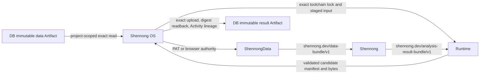

# Shennong Ecosystem Coordination Ledger

Snapshot date: 2026-07-27

This is the maintainer-facing source of truth for cross-repository work in the
Shennong ecosystem. It records what is present in source, what is committed,
what is published, which interfaces actually interoperate, and which modality
claims have end-to-end evidence.

The five repositories in scope are:

1. `/home/duansq/dev/packages/shennong`
2. `/home/duansq/dev/packages/shennong-data`
3. `/home/duansq/dev/services/shennong.one/shennong-os`
4. `/home/duansq/dev/services/shennong.one/shennong-runtime`
5. `/home/duansq/dev/services/shennong.one/shennong-db`

`/home/duansq/dev/services/shennong.one` contains the aggregate architecture
document and repository directories, but is not itself a Git repository.

## Executive verdict

The five repositories now have a source-level governed analysis loop with
versioned contracts and explicit authority boundaries:

The five implementation revisions are committed and pushed, and the OS,
Runtime, and DB OCI images are published and inspected. The loop is still
**not deployed and not yet proven by one modality fixture crossing all five
repositories**. `docs/codex/ecosystem-lock.json` records this source and
publication milestone while keeping `deployed` set to `false`.

The adopted cross-repository contracts are:

- `shennong.dev/data-bundle/v1`: immutable data identity, modality, assay and
  materialization metadata for ShennongData-to-analysis handoff;
- `shennong.dev/analysis-result-bundle/v1`: a credential-free candidate result
  with canonical analysis result, input references, execution/package
  provenance, and output artifact descriptors;
- `shennong.dev/runtime-r-toolchain/v1`: Runtime's canonical Shennong and
  ShennongData package commits, source digests, package versions, and lock
  digest;
- OS personal access tokens and project authorization as the supported
  headless user boundary; and
- DB project-scoped exact reads, content SHA-256, bounded exact upload lookup,
  zero-byte artifact support, and authenticated service-only redirect
  suppression as the promotion/readback boundary.

Authority is intentionally asymmetric. A producer Result Bundle may include
optional execution claims, but it cannot assign platform run, project, actor,
plan-step, or immutable Artifact identities. OS derives those from its
authorized Job and DB records, retains caller claims only as unverified
provenance, and Runtime supplies the canonical output identifiers, sizes, and
digests.

Shennong remains the analysis/result-semantics owner; ShennongData owns the R
discovery/materialization boundary; ShennongDB owns immutable Resources,
revisions, Artifact bytes, and research-graph lineage; OS owns users, projects,
authorization, orchestration, and platform provenance; Runtime owns isolated
execution, toolchain admission, logs, and candidate output manifests.

Project resource discovery is currently a bounded snapshot. Stable cursor
pagination and resumable discovery are follow-up work; callers must not treat
the current bounded list as an exhaustive catalog for an arbitrarily large
project.

## Evidence vocabulary

Use these terms consistently:

- **Source present**: code exists in the current working tree.
- **Committed**: code is part of the repository HEAD.
- **Published**: the commit is present in the published package or image.
- **Deployed**: the running service has been queried successfully.
- **End to end**: a real, modality-appropriate fixture crossed ShennongDB,
  Shennong OS, ShennongData materialization, Shennong Runtime, the Shennong
  analysis/result API, and immutable result persistence.

An uploaded file, a registry entry, a method discoverable through MCP, or a
successful generic script is not by itself evidence of modality compatibility.

## Repository state

| Repository | Version and revision | Working/deployment state | Validation observed in this audit |
|---|---|---|---|
| Shennong | `0.2.0.9000`; implementation HEAD `e58f7fbfea1ea02cebc07efddcabb66d6e8bb48a`; Runtime analysis pin `c1d958db3319f635ff5d6f9ad484a208774a4a39` | Both revisions are on `origin/main`. The coordination-document commit containing this ledger is intentionally not part of the Runtime package pin. No package release or live deployment was asserted | `test_local`: `PASS 2576`, `FAIL 0`, `WARN 0`, `SKIP 4`; rebuilt source check after the optional-test dependency fix: `PASS 2168`, `FAIL 0`, `WARN 0`, `SKIP 14`, with only the local CodeGraph socket NOTE. R-CMD-check `30215609091`, coverage `30215609075`, and pkgdown `30215609067` are green |
| ShennongData | `0.2.0.9000`; `17f0f0e87dd8ad2a3751dd11c58c8aa43823aa69` | `main == origin/main`; the pre-existing untracked architecture-design document remains intentionally outside the implementation commit. No package release or deployment was asserted | Full package suite: `PASS 193`; source build, pkgdown, and `R CMD check` passed. R-CMD-check `30210855773`, coverage `30210855775`, and pkgdown `30210855771` are green |
| Shennong OS | `1.0.0`; `e3f421bcba70e85a82596634178f24f3270df621` | `main == origin/main`; CI and Docker publication are complete. No live deployment was verified | Rust: 81 passed and 2 PostgreSQL tests passed separately; fmt, clippy, audit, OpenAPI, Compose/Dockerfile/Caddy/systemd checks passed. Web: 159 passed plus typecheck, lint, and production build. Agent: 32 passed plus typecheck, all 8 Skills, and build. CI `30214570590` and Docker publish `30214570549` passed |
| Shennong Runtime | `1.0.0`; `1649f1da43b25d79e8d820bd1ef093cf49a77114` | `main == origin/main`; CI and Docker publication are complete. No live deployment was verified | Rust: 66 passed; Python: 7 passed; fmt, clippy, OpenAPI, Compose/shell syntax, and audit gate passed with the documented inactive `sqlx` RSA advisory exception. CI `30211448950` and Docker publish `30211448939` passed. The image reported the exact package commits and toolchain digest through `/v1/info` in a local mock deployment |
| ShennongDB | `1.0.0`; `24445c3b08bb708bcdc2d1cf2eccba1735815633` | `main == origin/main`; CI and Docker publication are complete. No live deployment was verified | Rust: 97 passed and 2 ignored; fmt, clippy, official OpenAPI validation, local/S3 Docker headless contracts, and Trivy with zero HIGH/CRITICAL findings passed. CI `30212925592` and Docker publish `30212925566` passed |

The published OCI indexes and amd64 manifests are:

- OS:
  `sha256:718b5be9e42c4dda71c57dec78c2fdcf0533a6a40eb94edd5cee498f191c9615`
  and
  `sha256:00ccb208854cde6c4bfb0f4597644ba39a020d3debcc1ebd60ae3f3564f27136`;
- Runtime:
  `sha256:6506ce58451b15cd100ac23e14524f75aae2b4c120bc7852a4e6bd8ee1e0226b`
  and
  `sha256:647756eef172b4aa440fe72d56397e75e7ce13afa8070007aedf67b2d382bb07`;
- DB:
  `sha256:0c4220718d9fe5684dcba963c1b9abad9d753b4a4b86177067b5e5fef6b4e5f3`
  and
  `sha256:6748f0e8fb62a0c9c0436296fd15bfaf7b9fec9f519529a81e1d61e1a39ef434`.

Their revision labels resolve exactly to the implementation revisions in the
lock. None of the three services is recorded as deployed.

## Current architecture and security boundary

Runtime still has no general DB credential, and analysis workloads do not gain
direct DB administration authority. OS is the only component allowed to
translate user/project authority into narrowly scoped DB reads and promotion
writes. The internal `X-Shennong-No-Redirect: 1` request is honored only for an
authenticated headless service administrator without a user identity; ordinary
users, wrong credentials, and unauthenticated callers cannot use it to turn an
object-store redirect into a privileged byte proxy.

ShennongData never receives the DB administrator key. It uses an OS-issued PAT
or browser-mediated authority, requires an explicit project for inspect, query,
resolve, and download, and limits projectless access to public discovery. DB
content SHA-256 and byte size are rechecked at the handoff and promotion
boundaries.

## Interface ledger

| Boundary | Current contract state | Evidence and remaining work |
|---|---|---|
| ShennongData -> Shennong | **Implemented and pushed.** `shennong.dev/data-bundle/v1` plus direct sparse Matrix and Seurat/SummarizedExperiment materializers replace the broken implicit long-table recipe | Tests cover structural zero versus missing-feature semantics, partial-result provenance, multimodal descriptors, and installed-package compatibility. This is a package integration contract, not a five-service fixture |
| User R client -> OS -> DB | **Implemented and pushed in Data and OS.** OS PATs and project RBAC are the supported headless route. Projectless calls are restricted to public discovery; inspect/query/resolve/download require a project UUID | Keep the DB administrator credential out of ShennongData. A deployed PAT issuance/use/revocation smoke test remains pending |
| ShennongData artifact download | **Implemented and pushed.** Governed same-origin/path policy, redirect credential stripping, root-confined trusted local mode, size and SHA-256 verification | Presigned cross-origin object-store URLs receive no API Bearer. Add deployed gateway and object-store fixtures after OS/DB publication |
| DB query -> ShennongData matrix | **Implemented and pushed.** Sparse matrices are built directly; unobserved combinations are structural zero; absent requested features remain distinguishable; partial results carry provenance | Wider modality-specific axes and companion artifacts belong in follow-up contract versions |
| DB revision and exact graph reads | **Implemented, pushed, and published.** Explicit revision mismatch fails closed. Project-scoped exact Resource, Entity, and Activity reads give OS a stable lineage readback surface | Local and remote gates passed. Project resource discovery remains a bounded snapshot and still needs stable cursor pagination |
| OS/DB artifact byte read | **Implemented, pushed, and published.** Content responses expose `X-Content-Sha256`; OS requests service-only `X-Shennong-No-Redirect: 1`, streams bytes through bounded clients, and revalidates size and digest | The no-redirect path is unavailable to user-bearing, wrong, or unauthenticated principals. Local and S3 Docker contracts passed; live deployment verification remains |
| OS/DB upload promotion | **Implemented, pushed, and published.** OS uses deterministic names and a project-scoped exact filename lookup rather than loading every upload; duplicate deterministic candidates fail closed; DB accepts and hashes zero-byte files | Exact lookup is bounded so project size cannot inflate promotion responses. Local/S3, duplicate, Range, zero-byte, and digest component gates passed; the five-repository fixture remains |
| OS/DB -> Runtime input | **Implemented and pushed.** Authorized staged data is bound to the project/job and canonical digest; the producer may identify it by Resource or Artifact, and OS resolves a unique canonical data artifact | Project workspace scripts/configuration are `code_refs`, not data lineage; every governed analysis must have at least one staged data Artifact |
| OS -> Runtime admission | **Runtime producer and OS consumer are published.** Runtime exposes `shennong.dev/runtime-r-toolchain/v1`; OS requires exact schema, canonical lock SHA, package versions, and 40-hex package commits | A broad SemVer health check is no longer sufficient. Optional scientific backend environments still require method-level availability locks |
| Shennong/Runtime -> OS candidate result | **Implemented across pushed Core, Runtime, and OS revisions.** Runtime validates `shennong.dev/analysis-result-bundle/v1` before success, canonicalizes output identifier/size/SHA from actual files, journals outputs, and serves authenticated succeeded-job bytes | A path-only producer output is valid. UTF-8 content is returned as text and other content as base64. Runtime enforces owner/scope, no-follow reads, size/digest revalidation, and a 64 MiB bound |
| OS -> DB result authority | **Implemented, pushed, and published in OS/DB.** OS derives execution/project/plan/actor from Job, spec, manifest, and DB state, promotes bytes, verifies exact readback, and writes Resource/Artifact/Activity lineage before platform completion | Producer execution claims are optional consistency hints only. Caller provenance is retained under unverified claims and cannot mint platform identities |
| Empty output semantics | **Aligned and validated in components.** Core and Runtime accept zero-byte output Artifacts; DB upload/readback does the same; OS promotion does not impose an incompatible positive-size rule | SHA-256 of the empty byte sequence and exact `Content-Length: 0` passed component contracts; the deployed five-repository fixture remains |
| Skills and optional backends | **Partially locked.** Runtime's toolchain binds the two R package commits and source digests; package Skills remain versioned with source | Complete Skill-mirror digests and per-method optional environment availability are still P1 |

### 2026-07-26 pre-implementation findings (historical)

The table below is retained as the point-in-time defect inventory that drove
the current contracts. Its "current state" and priority labels are historical;
use the ledger above for the 2026-07-27 state.

| Boundary | Current state | Finding and required decision | Priority |
|---|---|---|---|
| ShennongData -> Shennong | Broken documented handoff | The documented `sn_load_data()` -> `sn_assay(layer = "expression")` -> `collect()` -> `sn_initialize_seurat_object()` chain does not run against current Toil. The layer name is wrong, collection requires explicit features, the default result is long-form, and Shennong expects a matrix-like input. Standardize on an explicit materialization such as `shape = "sparse"` or a versioned Seurat/SummarizedExperiment converter and test the installed packages together | P0 contract |
| User R client -> DB | Direct headless access is incompatible | ShennongData sends Bearer authentication, while headless DB requires an admin/service header and an admin principal without a user id. The target user path is `ShennongData -> OS/public gateway -> DB`; do not add the DB admin key to the user package | P0 architecture |
| ShennongData -> OS gateway | Target path is incomplete | OS proxies only a subset of the resource/query surface and lacks several manifest, agent-resource, axes, metadata, genes, batch, stream, and artifact-download routes required by the client. OS currently authenticates browser session tokens and has no implemented personal-access-token issuance contract for headless R. ShennongData still defaults to `http://127.0.0.1:8000`, not the OS gateway | P0 architecture |
| ShennongData artifact download | Unsafe trust boundary | Resource metadata can direct the client to an arbitrary HTTP(S) URL while the current API Bearer is attached, and can nominate `file://` or a local path. Enforce allowed origin/scheme, never forward the API Bearer cross-origin, use presigned object-store URLs without that token, and disable local paths except in an explicit root-confined trusted mode | P0 security |
| DB query -> ShennongData matrix | Incorrect sparse semantics | Missing long-table combinations become `NA` rather than structural zero, and the sparse path first allocates a dense matrix. Build the sparse matrix directly, distinguish missing features from zero measurements, and carry partial-result status into provenance | P0 correctness |
| OS -> DB | Main service boundary exists; DB MCP fails against default/production headless V1 | Bundled DB MCP sends Bearer authentication that headless mode rejects, and its context-pack route still uses `/projects/` instead of `/research-projects/`. The DB server's agent manifest also advertises the old `/api/v1/projects/*` path. User-facing MCP should go through OS; a trusted operator MCP would require an explicit separate admin-key model | P0 |
| OS/DB -> Runtime input | Missing general staging | Current staging accepts at most 32 UTF-8 project records and 1 MiB total. It cannot carry H5AD/H5Seurat, 10x matrices, fragments, BAM, or spatial images. Add an OS-issued, digest-bound, size-bound, project/job-bound binary grant for immutable DB artifacts | P0 |
| Runtime -> OS/DB result | Metadata-only and non-transactional | Runtime returns an artifact manifest. `artifact.register` is a separate model action that records a locator in OS PostgreSQL; it does not copy bytes or create a ShennongDB immutable Artifact. A job can be marked complete before expected artifacts are present or scientifically validated | P0 |
| Runtime -> R backends | Discovery works; execution availability does not | The image installs only `Depends`, `Imports`, and `LinkingTo`, not most `Suggests`. MCP `initialize` and `tools/list` prove discovery only. Seurat, SingleR, edgeR, DESeq2, limma, CellChat, Banksy, nnSVG, and many other backends are not guaranteed. Pixi availability currently checks the executable, not whether a method environment is resolved/materialized. Runtime `/v1/health`, OS `/healthz`, and the current broad `runtime >=1.0.0 <2.0.0` Skill constraint cannot reject the old `1.0.0` image that lacks the toolchain. Admission must verify the requested method/environment and compatibility lock, not only health, SemVer, or MCP startup | P1 |
| DB revision -> query/cache | Provenance can be mislabeled | `ResourceQuery.version` is client-controlled, but the handler reads the current Resource and Artifacts. A response/cache entry can therefore be labeled as a historical version without resolving that immutable revision. Bind queries and caches to resolved revision/content digests | P0 correctness |
| DB OpenAPI -> OS/Data/MCP | Contract is incomplete | Several important request bodies are `{}` and error bodies do not match implementation. Capabilities combine 14 registerable/materializable/queryable artifact formats into one list even though the general local/S3 file query supports only CSV, TSV, and TXT; the advertised maximum limit is 100,000 while the planner limit is 10,000. Split those capabilities, generate a typed contract from the effective Rust router/types, and run consumer contract tests | P1 |
| Shennong result -> ecosystem artifact | No mapping | Shennong schema `1.0.0` is an in-memory/stored analytical result contract. It is not mapped to DB ResourceRevision/Artifact/Activity, Runtime job identity, immutable input revisions, or output checksums | P1 |
| Package Skills -> OS Skills | Duplicated without a lock | Runtime copies package Skills, while OS maintains a separate mirror for the agent. There is no digest compatibility check, so package workflows and orchestration instructions can drift | P1 |
| Shennong registry -> MCP | Filter defect | `sn_list_methods(available = TRUE/FALSE)` currently compares the `available` column with itself because the right-hand name is resolved in dplyr's data mask. Both values return all registry rows and the read-only MCP inherits the error. Use `.env$available` and add true/false regression tests | P2 |

Additional package API drift:

- ShennongData documentation and Skills refer to `sn_resolve_features()`,
  `sn_slice_head()`, and `sn_write_query()`, but the installed package does not
  export them.
- ShennongData's compatibility document still targets ShennongDB `0.5.2`; the
  current DB source is `1.0.0`.
- ShennongData's default endpoint remains `http://127.0.0.1:8000`; it neither
  identifies the intended OS gateway nor matches a reviewed service in the
  current default topology.
- `sn_api_compatibility()` infers support from advertised capability names; it
  does not perform a minimal inspect/query probe and can report a false
  positive.
- Shennong's `sn_initialize_seurat_object()` handles one matrix or multiple file
  paths, but not a `Read10X()` multi-feature list. A synthetic Gene Expression
  plus Antibody Capture list currently fails before creating RNA and ADT assays.

## Historical baseline evidence pointers

These pointers were captured in the 2026-07-26 pre-implementation audit. They
explain the defects that drove this milestone; line numbers may drift as the
candidate OS/DB changes are finalized.

Core Shennong:

- `R/analysis_registry.R:162-175`: method availability filtering.
- `R/analysis_adapters.R:1-29`: CITE-seq-only multimodal entry point.
- `R/analysis_bulk.R:1274-1286`: bulk workflow dispatcher.
- `R/preprocessing.R:216-321`: Seurat initialization and matrix/path boundary.
- `R/analysis_result.R:1-40`: analytical result schema `1.0.0`.

ShennongData:

- `/home/duansq/dev/packages/shennong-data/R/artifact.R:36-74`: trusted path,
  URL, and Bearer forwarding behavior.
- `/home/duansq/dev/packages/shennong-data/R/result.R:262`: long-to-matrix
  construction.
- `/home/duansq/dev/packages/shennong-data/R/http.R:74`: authentication
  boundary.
- `vignettes/data-io-projects.Rmd:63`: current cross-package recipe.

OS and Runtime:

- `/home/duansq/dev/services/shennong.one/shennong-runtime/container/runtime.Dockerfile:25`
  and `:65`: exact package pins, install, and Skill copy.
- `/home/duansq/dev/services/shennong.one/shennong-os/apps/server/src/handlers/integration.rs:1560`:
  current input staging.
- `/home/duansq/dev/services/shennong.one/shennong-os/apps/server/src/handlers/integration.rs:2548`:
  OS artifact registration.
- `/home/duansq/dev/services/shennong.one/shennong-os/apps/server/src/handlers/runtime_control.rs:660`
  and `:705`: job success and plan completion ordering.
- `/home/duansq/dev/services/shennong.one/shennong-runtime/container/install-shennong-r-packages.R:11`:
  hard-dependency-only package installation.

ShennongDB:

- `/home/duansq/dev/services/shennong.one/shennong-db/crates/shennong-auth/src/lib.rs:182`
  and `crates/shennong-server/src/main.rs:683`: headless authentication.
- `/home/duansq/dev/services/shennong.one/shennong-db/crates/shennong-mcp/src/main.rs:81`,
  `:122`, and `:298`: MCP token/header and stale project route.
- `/home/duansq/dev/services/shennong.one/shennong-db/crates/shennong-query/src/lib.rs:532`:
  gene-only feature query.
- `/home/duansq/dev/services/shennong.one/shennong-db/crates/shennong-schema/src/lib.rs:699`
  and `crates/shennong-server/src/main.rs:5173`: client version versus resolved
  Resource revision.

## Modality compatibility

Platform compatibility requires all of the following:

1. a typed, scientifically adequate data contract;
2. safe materialization and transfer at realistic size;
3. a reproducible Runtime environment with the required backend;
4. a stable Shennong analysis/result API;
5. a real end-to-end fixture with immutable result promotion and provenance.

| Modality | Shennong analysis package | Data/DB contract | OS/Runtime and result loop | Ecosystem verdict |
|---|---|---|---|---|
| Bulk omics | Strong for **bulk RNA expression plus sample/clinical metadata**: QC, DE, pathway scoring, WGCNA, survival, and related workflows. This is not a general proteomics, metabolomics, epigenomics, or bulk-ATAC implementation | Data Bundle v1 can describe bulk RNA matrices, sample metadata, and immutable inputs; direct sparse materialization and zero/missing semantics are covered. Other bulk assay semantics are not | Generic governed staging, toolchain admission, Result Bundle validation, and promotion now exist in source, but there is no bulk-specific five-repository fixture or guaranteed optional backend set | **Partial: bulk RNA only; not general bulk omics and not end to end** |
| scRNA-seq | Strongest Shennong modality: Seurat workflows, annotation, clustering/integration, DE, programs, communication, trajectory, velocity/fate adapters, and canonical result storage | Data Bundle v1 and ShennongData converters cover count-like expression plus cell/feature metadata. DB has a real PBMC3K/10x MEX provider and its headless Docker path was exercised | OS has sc/snRNA routing; the generic Runtime/result/promotion contracts are implemented. Evidence currently stops at component/package tests and a real DB PBMC3K flow, not one five-repository run | **Most ready; partial platform support, no deployed five-repository E2E** |
| Single-cell spatial | Substantial for prepared coordinate-bearing Seurat/spot objects: SVG, domains, neighborhoods, deconvolution/mapping, integration, and communication | Data Bundle v1 can declare spatial modality and companions, but typed coordinate frames, images, FOVs, segmentation, molecules, and realistic multi-artifact materialization are incomplete | Generic transfer/result contracts are compatible in shape; no spatial router/environment lock or promoted Visium/Xenium/CosMx fixture crosses the services | **Partial for prepared Visium-like objects; not an end-to-end single-cell spatial platform** |
| CITE-seq | Strong on an already prepared Seurat object with RNA and ADT assays through WNN, totalVI, Coralysis, and MMoCHi | Data Bundle v1 can describe multiple assays and feature types, and package fixtures cover prepared inputs; DB query/materialization does not yet prove a realistic RNA+ADT companion bundle | Generic governed execution and promotion contracts exist; no CITE-specific routing, backend lock, or five-repository fixture | **Prepared-object package and contract support only; not end to end** |
| scATAC-seq | No public production ATAC/multiome workflow, ChromatinAssay/fragments/peak implementation, or validated Signac/ArchR/chromVAR result path | Data Bundle v1 has modality/companion descriptors and DB can retain opaque artifacts, but no complete fragments, peaks, genome-build, peak-by-cell, or interval-query materializer is proven | Generic byte staging could carry files, but there is no ATAC router, environment lock, analysis, scientific validation, or result fixture | **Descriptor/transport contract only; analysis and platform support are not implemented** |

The key wording for public documentation should therefore be:

- supported analysis: prepared scRNA-seq, prepared CITE-seq, bulk RNA
  transcriptomics, and prepared coordinate-bearing spatial transcriptomics;
- cross-cutting platform contracts: governed data, exact Runtime toolchain,
  candidate results, byte promotion, digest verification, and lineage now
  exist in source;
- ecosystem compatibility: none of the five modalities has a deployed,
  all-five-repository end-to-end fixture;
- explicitly unsupported as an analytical platform: scATAC-seq and general
  bulk omics beyond transcriptomics.

## Adopted shared contracts

The base contracts below are implemented in the repositories identified in the
ledger. Modality-specific companion semantics remain extension work.

### 1. Data bundle

`shennong.dev/data-bundle/v1` carries:

- `schema_version`, resource id, immutable revision id, artifact id, content
  digest, byte size, and media/serialization format;
- data model and modality;
- organism, reference assembly, annotation release, and identifier namespace;
- one or more assays with assay name, feature type, measure, unit,
  transformation/normalization, matrix orientation, sparsity semantics, and
  feature/observation axes;
- explicit companion roles:
  - bulk: expression matrix, sample metadata, design/contrast;
  - scRNA: matrix, cell metadata, annotations, embeddings;
  - spatial: matrix, coordinates, spatial frame, image, scale factors,
    segmentation/molecules where applicable;
  - CITE-seq: Gene Expression and Antibody Capture assays with feature types;
  - scATAC: fragments, peaks, peak matrix, genome build, and optional gene
    activity;
- missing-feature and partial-result status, rather than silently substituting
  `NA` or dropping requested entities.

### 2. Analysis request

OS creates a governed Job/request binding:

- project, plan step, user authority, and approved intent;
- immutable input bundle revisions/digests;
- Shennong workflow and parameters;
- package commit/tarball digest, Runtime image digest, environment lock digest,
  and required backend availability;
- expected result schema, required artifact roles, resource limits, and
  validation policy.

### 3. Result bundle and promotion

Runtime success produces a validated candidate bundle containing:

- Runtime job and plan-step identity;
- exact input revisions;
- Shennong `analysis_result` schema/version and validation result;
- package, R/Python, backend, image, environment, and random-seed provenance;
- every output file's role, size, digest, and media type.

Shennong implements the package-owned local candidate boundary as
`shennong.dev/analysis-result-bundle/v1` through
`sn_build_result_bundle()`, `sn_validate_result_bundle()`, and
`sn_export_result_bundle()`. Runtime validates the bundle against its exact
toolchain and actual output files before success. OS consumes it as an
untrusted producer claim, derives platform execution authority, promotes the
bytes, verifies exact DB readback, and then writes platform lineage.

Core's default empty `execution` value serializes as `[]` and means "no
producer execution claims." Generic `execution.job_id` is not a Runtime UUID;
only an explicit `runtime_job_id` participates in that consistency check.
Runtime-assigned Artifact identity, byte size, and digest override path-only
producer descriptions. Zero-byte outputs are valid.

### 4. Ecosystem compatibility lock

The machine-readable compatibility lock is
`docs/codex/ecosystem-lock.json`. A deployable release records:

- all five Git commits;
- R package tarball digests and API/result-schema versions;
- OS, Runtime, and DB image digests;
- OS/Runtime/DB API versions;
- Skill and workflow-recipe digests;
- environment lock digests and the actual available method set.

All five implementation revisions, all three service image digests, and their
CI evidence are populated for this milestone. The lock remains a `candidate`
with `deployed: false` until live services report the locked revisions.
Compose and production deployment must consume immutable image digests rather
than floating `latest` tags.

## Prioritized roadmap

### P0: deploy and prove the loop

Completed in this milestone:

1. Independent OS/DB security review and final acceptance, including zero-byte
   local/S3 output, exact duplicate handling, project isolation, digest
   readback, and stable terminal provenance.
2. Independent OS/DB commits and pushes, green remote CI and Docker
   publication, plus inspected immutable image digests and revision labels.

Next:

3. Deploy OS, Runtime, and DB by immutable digest; verify `/healthz`,
   `/v1/info`, API contracts, database migrations, PAT issuance/revocation, and
   service-only no-redirect behavior against the locked versions.
4. Run PBMC3K through the entire DB -> OS/PAT -> ShennongData Data Bundle ->
   Runtime/Shennong -> Result Bundle -> OS promotion -> DB readback path.
5. Require scientific assertions and exact Resource/Artifact/Activity lineage
   before declaring scRNA-seq end to end.

### P1: versioned interoperability and modality foundations

1. Add stable cursor pagination to project resource discovery, preserve
   snapshot identity across pages, and give ShennongData bounded resumable
   traversal.
2. Generate and validate typed consumer contracts across DB, OS, Runtime,
   ShennongData, and Shennong.
3. Materialize and admit reproducible optional backend environments rather than
   installing only hard R dependencies.
4. Add complete multi-assay and feature-type support, then spatial companions and
   scATAC/RNA+ATAC contracts.
5. Add a digest check between package-versioned Skills and OS mirrors.
6. Add bulk RNA, spatial, CITE-seq, and scATAC fixtures in that order, without
   turning generic file transport into a modality-support claim.

### P2: API/documentation cleanup

1. Generate the agent Runtime JobSpec type from Runtime OpenAPI and reconcile
   approval-lineage retry semantics.
2. Add release automation that rejects `pending`, floating tags, missing
   digests, or `deployed=true` without live version evidence in the ecosystem
   lock.
3. Archive or annotate historical interface evidence when source movement makes
   its line pointers stale.

## End-to-end release gates

Do not mark a modality compatible until its fixture proves:

1. immutable DB registration and revision selection;
2. user-authorized discovery through OS;
3. safe, digest-verified input staging without DB admin credentials;
4. installed ShennongData materialization into a versioned input contract that
   the installed Shennong consumer accepts;
5. Runtime admission against the exact package/image/environment lock;
6. real Shennong execution with the modality's required companions;
7. `sn_validate_result()` plus modality-specific scientific assertions;
8. output-byte promotion to immutable DB Artifacts with complete lineage;
9. discovery and retrieval of the stored result from the project;
10. live deployed versions match the tested compatibility lock.

Minimum fixtures should include bulk RNA with design/clinical metadata, PBMC3K
scRNA with cell metadata, Visium plus a true single-cell spatial companion
fixture, RNA+ADT CITE-seq, and 10x scATAC with fragments and peaks.

## Operating from the Shennong repository

This repository is the coordination center, not a monorepo. For every
cross-repository change:

1. read this document and inspect all affected repositories independently;
2. record branch, HEAD, upstream divergence, dirty files, and published/deployed
   versions before editing;
3. name the versioned contract and its producer/consumer owners;
4. add producer, consumer, and real cross-repository fixture tests;
5. update this ledger when an interface or modality status changes;
6. close and publish each repository independently, preserving unrelated work;
7. verify the deployed compatibility lock before claiming end-to-end support.

Do not run aggregate Git operations from `shennong.one`; it is not a repository.
Do not treat local commits, dirty-tree code, green unit tests, or floating
`latest` images as deployed ecosystem progress.
