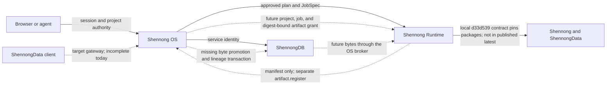

# Shennong Ecosystem Audit and Coordination Baseline

Snapshot date: 2026-07-26

This is the maintainer-facing source of truth for cross-repository work in the
Shennong ecosystem. It records what is present in source, what is committed,
what is published, which interfaces actually interoperate, and which modality
claims have end-to-end evidence.

The five repositories in scope are:

1. `/home/duansq/dev/packages/shennong`
2. `/home/duansq/dev/packages/shennong-data`
3. `/home/duansq/dev/services/shennong.one/shennong-os`
4. `/home/duansq/dev/services/shennong.one/shennong-runtime`
5. `/home/duansq/dev/services/shennong.one/shennong-db`

`/home/duansq/dev/services/shennong.one` contains the aggregate architecture
document and repository directories, but is not itself a Git repository.

## Executive verdict

The ownership boundaries are directionally correct:

- Shennong owns analysis APIs and analytical result semantics.
- ShennongData owns discovery, query, download, and materialization.
- ShennongDB owns governed Resources, append-only Resource revisions, Artifact
  metadata/bytes, and data/research-graph lineage.
- Shennong OS owns users, projects, authorization, plans, Runs/Jobs, agent
  tools, orchestration, and their control-plane provenance.
- Shennong Runtime owns isolated execution state and logs.

The ecosystem is not yet a closed analytical loop. The control plane is the
most mature cross-service layer. The data plane, environment contract, and
result promotion path remain incomplete:

```text
governed data revision
  -> OS-authorized discovery and artifact grant
  -> ShennongData versioned materialization and handoff
  -> reproducible analysis environment
  -> Shennong analysis and result validation
  -> immutable result artifact and lineage
```

No reviewed modality currently completes that path across all five
repositories. Shennong itself has strong analysis coverage for scRNA-seq,
prepared CITE-seq, bulk RNA-seq, and coordinate-bearing spatial transcriptomics,
but package-level analysis coverage must not be presented as platform-level
compatibility.

## Evidence vocabulary

Use these terms consistently:

- **Source present**: code exists in the current working tree.
- **Committed**: code is part of the repository HEAD.
- **Published**: the commit is present in the published package or image.
- **Deployed**: the running service has been queried successfully.
- **End to end**: a real, modality-appropriate fixture crossed ShennongDB,
  Shennong OS, ShennongData materialization, Shennong Runtime, the Shennong
  analysis/result API, and immutable result persistence.

An uploaded file, a registry entry, a method discoverable through MCP, or a
successful generic script is not by itself evidence of modality compatibility.

## Repository state

| Repository | Version and revision | Working/deployment state | Validation observed in this audit |
|---|---|---|---|
| Shennong | `0.2.0.9000`, `8a2a3a334098983674082fa323df3c6f8e927e5b`, `main == origin/main` | Large pre-existing uncommitted analysis, result-contract, data-ownership, documentation, and validation work; the current Runtime pin contains only committed HEAD | Full local suite: `PASS 2543`, `SKIP 4`, `FAIL 1`; the failure is a names-only mismatch in Scissor sample alignment at `test-abundance.R:443`. Focused bulk, spatial, clustering/multimodal, MCP, and data-I/O suites passed |
| ShennongData | `0.2.0`, `b560e1d68429b74cf688c23e4b6b6700d68d9d2b`, `main == origin/main` | Package tree is clean apart from the pre-existing untracked `ShennongData_R_client_architecture_design.md` | 110 tests passed; source build and `_R_CHECK_FORCE_SUGGESTS_=false R CMD check --no-manual` reported `Status: OK` |
| Shennong OS | `1.0.0`, `bed5187025d4fa3f342a0ac518a96f10454a0c8b` | Clean tree, but `main` is one commit ahead of `origin/main`; governed bioinformatics orchestration is local-only. Published `latest` was built from older revision `e2320643277b6721ff6c0baa680b93034814d441` | Server tests: 55 passed, 2 ignored |
| Shennong Runtime | `1.0.0`, `d33d539cab75a78955dd99a75512e07a677c518a` | Clean tree, but `main` is one commit ahead of `origin/main`; the preinstalled R toolchain is local-only. Published `latest` was built from older revision `7b987cd7e5ca098d27186dbbd9d51f2f3b72ec89` | Workspace tests: 50 passed across 9 suites |
| ShennongDB | `1.0.0`, `2709acadcd33bb52ab33bffc1fd3e695dfc79eac`, `main == origin/main` | Dirty pre-existing PBMC3K/10x MEX work: four tracked files and untracked `providers/pbmc-3k.yaml`. This work is neither part of HEAD nor a published image | `cargo fmt`, workspace tests (81 passed, 2 ignored), clippy, OpenAPI JSON syntax parsing, Compose configuration parsing, Python syntax, and `git diff --check` passed; no automated PBMC3K materialization/query test was found in or executed from the current checkout |

At the audit snapshot, the OS `latest` image digest was
`sha256:5339274bad76ce01c8a17d661b0ac5f59301a4dc4190356057b77d858581bfad`
and the Runtime `latest` digest was
`sha256:be0bdf2d0085dc54fee8832789192f519cee44248c9f4321291a0821fef12ce9`.
The OS default host port `18081` was not listening; a separately probed Runtime
standalone port `18080` was also not listening. The default three-image Compose
topology does not publish Runtime to the host. Docker daemon socket access was
unavailable. Published-image metadata could be inspected, but no live
deployment was verified. Do not translate the source and CI findings above
into a production-health claim.

## Current architecture and missing loop



Runtime correctly has no general DB credential and workloads cannot use the
Runtime private network to connect directly to DB. Preserve that security
boundary. The missing piece is an OS-brokered, narrowly authorized binary data
grant, not a DB admin key inside Runtime or an R package.

## Interface ledger

| Boundary | Current state | Finding and required decision | Priority |
|---|---|---|---|
| ShennongData -> Shennong | Broken documented handoff | The documented `sn_load_data()` -> `sn_assay(layer = "expression")` -> `collect()` -> `sn_initialize_seurat_object()` chain does not run against current Toil. The layer name is wrong, collection requires explicit features, the default result is long-form, and Shennong expects a matrix-like input. Standardize on an explicit materialization such as `shape = "sparse"` or a versioned Seurat/SummarizedExperiment converter and test the installed packages together | P0 contract |
| User R client -> DB | Direct headless access is incompatible | ShennongData sends Bearer authentication, while headless DB requires an admin/service header and an admin principal without a user id. The target user path is `ShennongData -> OS/public gateway -> DB`; do not add the DB admin key to the user package | P0 architecture |
| ShennongData -> OS gateway | Target path is incomplete | OS proxies only a subset of the resource/query surface and lacks several manifest, agent-resource, axes, metadata, genes, batch, stream, and artifact-download routes required by the client. OS currently authenticates browser session tokens and has no implemented personal-access-token issuance contract for headless R. ShennongData still defaults to `http://127.0.0.1:8000`, not the OS gateway | P0 architecture |
| ShennongData artifact download | Unsafe trust boundary | Resource metadata can direct the client to an arbitrary HTTP(S) URL while the current API Bearer is attached, and can nominate `file://` or a local path. Enforce allowed origin/scheme, never forward the API Bearer cross-origin, use presigned object-store URLs without that token, and disable local paths except in an explicit root-confined trusted mode | P0 security |
| DB query -> ShennongData matrix | Incorrect sparse semantics | Missing long-table combinations become `NA` rather than structural zero, and the sparse path first allocates a dense matrix. Build the sparse matrix directly, distinguish missing features from zero measurements, and carry partial-result status into provenance | P0 correctness |
| OS -> DB | Main service boundary exists; DB MCP fails against default/production headless V1 | Bundled DB MCP sends Bearer authentication that headless mode rejects, and its context-pack route still uses `/projects/` instead of `/research-projects/`. The DB server's agent manifest also advertises the old `/api/v1/projects/*` path. User-facing MCP should go through OS; a trusted operator MCP would require an explicit separate admin-key model | P0 |
| OS/DB -> Runtime input | Missing general staging | Current staging accepts at most 32 UTF-8 project records and 1 MiB total. It cannot carry H5AD/H5Seurat, 10x matrices, fragments, BAM, or spatial images. Add an OS-issued, digest-bound, size-bound, project/job-bound binary grant for immutable DB artifacts | P0 |
| Runtime -> OS/DB result | Metadata-only and non-transactional | Runtime returns an artifact manifest. `artifact.register` is a separate model action that records a locator in OS PostgreSQL; it does not copy bytes or create a ShennongDB immutable Artifact. A job can be marked complete before expected artifacts are present or scientifically validated | P0 |
| Runtime -> R backends | Discovery works; execution availability does not | The image installs only `Depends`, `Imports`, and `LinkingTo`, not most `Suggests`. MCP `initialize` and `tools/list` prove discovery only. Seurat, SingleR, edgeR, DESeq2, limma, CellChat, Banksy, nnSVG, and many other backends are not guaranteed. Pixi availability currently checks the executable, not whether a method environment is resolved/materialized. Runtime `/v1/health`, OS `/healthz`, and the current broad `runtime >=1.0.0 <2.0.0` Skill constraint cannot reject the old `1.0.0` image that lacks the toolchain. Admission must verify the requested method/environment and compatibility lock, not only health, SemVer, or MCP startup | P1 |
| DB revision -> query/cache | Provenance can be mislabeled | `ResourceQuery.version` is client-controlled, but the handler reads the current Resource and Artifacts. A response/cache entry can therefore be labeled as a historical version without resolving that immutable revision. Bind queries and caches to resolved revision/content digests | P0 correctness |
| DB OpenAPI -> OS/Data/MCP | Contract is incomplete | Several important request bodies are `{}` and error bodies do not match implementation. Capabilities combine 14 registerable/materializable/queryable artifact formats into one list even though the general local/S3 file query supports only CSV, TSV, and TXT; the advertised maximum limit is 100,000 while the planner limit is 10,000. Split those capabilities, generate a typed contract from the effective Rust router/types, and run consumer contract tests | P1 |
| Shennong result -> ecosystem artifact | No mapping | Shennong schema `1.0.0` is an in-memory/stored analytical result contract. It is not mapped to DB ResourceRevision/Artifact/Activity, Runtime job identity, immutable input revisions, or output checksums | P1 |
| Package Skills -> OS Skills | Duplicated without a lock | Runtime copies package Skills, while OS maintains a separate mirror for the agent. There is no digest compatibility check, so package workflows and orchestration instructions can drift | P1 |
| Shennong registry -> MCP | Filter defect | `sn_list_methods(available = TRUE/FALSE)` currently compares the `available` column with itself because the right-hand name is resolved in dplyr's data mask. Both values return all registry rows and the read-only MCP inherits the error. Use `.env$available` and add true/false regression tests | P2 |

Additional package API drift:

- ShennongData documentation and Skills refer to `sn_resolve_features()`,
  `sn_slice_head()`, and `sn_write_query()`, but the installed package does not
  export them.
- ShennongData's compatibility document still targets ShennongDB `0.5.2`; the
  current DB source is `1.0.0`.
- ShennongData's default endpoint remains `http://127.0.0.1:8000`; it neither
  identifies the intended OS gateway nor matches a reviewed service in the
  current default topology.
- `sn_api_compatibility()` infers support from advertised capability names; it
  does not perform a minimal inspect/query probe and can report a false
  positive.
- Shennong's `sn_initialize_seurat_object()` handles one matrix or multiple file
  paths, but not a `Read10X()` multi-feature list. A synthetic Gene Expression
  plus Antibody Capture list currently fails before creating RNA and ADT assays.

## Primary evidence pointers

Core Shennong:

- `R/analysis_registry.R:162-175`: method availability filtering.
- `R/analysis_adapters.R:1-29`: CITE-seq-only multimodal entry point.
- `R/analysis_bulk.R:1274-1286`: bulk workflow dispatcher.
- `R/preprocessing.R:216-321`: Seurat initialization and matrix/path boundary.
- `R/analysis_result.R:1-40`: analytical result schema `1.0.0`.

ShennongData:

- `/home/duansq/dev/packages/shennong-data/R/artifact.R:36-74`: trusted path,
  URL, and Bearer forwarding behavior.
- `/home/duansq/dev/packages/shennong-data/R/result.R:262`: long-to-matrix
  construction.
- `/home/duansq/dev/packages/shennong-data/R/http.R:74`: authentication
  boundary.
- `vignettes/data-io-projects.Rmd:63`: current cross-package recipe.

OS and Runtime:

- `/home/duansq/dev/services/shennong.one/shennong-runtime/container/runtime.Dockerfile:25`
  and `:65`: exact package pins, install, and Skill copy.
- `/home/duansq/dev/services/shennong.one/shennong-os/apps/server/src/handlers/integration.rs:1560`:
  current input staging.
- `/home/duansq/dev/services/shennong.one/shennong-os/apps/server/src/handlers/integration.rs:2548`:
  OS artifact registration.
- `/home/duansq/dev/services/shennong.one/shennong-os/apps/server/src/handlers/runtime_control.rs:660`
  and `:705`: job success and plan completion ordering.
- `/home/duansq/dev/services/shennong.one/shennong-runtime/container/install-shennong-r-packages.R:11`:
  hard-dependency-only package installation.

ShennongDB:

- `/home/duansq/dev/services/shennong.one/shennong-db/crates/shennong-auth/src/lib.rs:182`
  and `crates/shennong-server/src/main.rs:683`: headless authentication.
- `/home/duansq/dev/services/shennong.one/shennong-db/crates/shennong-mcp/src/main.rs:81`,
  `:122`, and `:298`: MCP token/header and stale project route.
- `/home/duansq/dev/services/shennong.one/shennong-db/crates/shennong-query/src/lib.rs:532`:
  gene-only feature query.
- `/home/duansq/dev/services/shennong.one/shennong-db/crates/shennong-schema/src/lib.rs:699`
  and `crates/shennong-server/src/main.rs:5173`: client version versus resolved
  Resource revision.

## Modality compatibility

Platform compatibility requires all of the following:

1. a typed, scientifically adequate data contract;
2. safe materialization and transfer at realistic size;
3. a reproducible Runtime environment with the required backend;
4. a stable Shennong analysis/result API;
5. a real end-to-end fixture with immutable result promotion and provenance.

| Modality | Shennong analysis package | Data/DB contract | OS/Runtime product path | Ecosystem verdict |
|---|---|---|---|---|
| Bulk omics | Strong for **bulk RNA expression plus sample/clinical metadata**: QC, DE, pathway scoring, WGCNA, survival, and related workflows. This is not a general proteomics, metabolomics, epigenomics, or bulk-ATAC contract | Toil supports a narrow bulk transcriptomic query path. ShennongData is partial and cannot yet safely materialize all wide/sparse cases | No bulk-specific Skill/router; large inputs cannot be staged; common optional backends are not in the default image | **Partial: bulk RNA only, not general bulk omics and not end to end** |
| scRNA-seq | Strongest modality in Shennong: Seurat workflows, annotation, clustering/integration, DE, programs, communication, trajectory, velocity/fate adapters, and result storage | ShennongData has only small conversion evidence. The DB PBMC3K provider manifest and MEX loader are uncommitted; the committed TileDB gene-expression query returns stored nonzero entries only and still lacks adequate cell/feature semantics | OS has a dedicated sc/snRNA Skill and router, but the commit/image is unpublished, optional backends are not guaranteed, and data/result transfer is incomplete | **Partial platform support; strong package analysis, no released end-to-end loop** |
| Single-cell spatial | Substantial analysis for coordinate-bearing Seurat/spot objects: SVG, domains, neighborhoods, deconvolution/mapping, integration, and communication. The main contract is metadata coordinates; it does not model complete Xenium/CosMx segmentation, image, molecule, or FOV semantics | ShennongData recognizes a spatial label, and explicitly selected coordinate fields may survive as ordinary `colData`/`meta.data`, but it does not define or automatically materialize typed coordinates, spatial frames, images, FOV, or segmentation semantics. DB has no spatial frame, coordinate, image, or companion-artifact query contract | No spatial Skill/router/resource profile; optional spatial environments are not materialized; only `cpu-small` batch admission is available | **Partial for prepared Visium-like objects; not compatible as an end-to-end single-cell spatial platform** |
| CITE-seq | Strong on an already prepared Seurat object with RNA and ADT assays through WNN, totalVI, Coralysis, and MMoCHi. Raw multi-feature initialization is incomplete | ShennongData/DB are gene-centric, do not preserve multi-assay feature types, and the DB query planner only accepts `feature.type == "gene"` | No CITE/ADT Skill, input schema, routed intent, backend lock, or fixture | **Package-level prepared-object support only; platform not compatible** |
| scATAC-seq | No public ATAC/multiome workflow, ChromatinAssay/fragments/peak contract, Signac/ArchR/chromVAR backend, or result schema | DB can host arbitrary raw files but has no fragments, genome interval, peak-by-cell, genome-build, or feature-type query contract; ShennongData has no ATAC converter | No ATAC Skill/router/staging/resource profile or fixture | **Not supported** |

The key wording for public documentation should therefore be:

- supported analysis: prepared scRNA-seq, prepared CITE-seq, bulk RNA
  transcriptomics, and prepared coordinate-bearing spatial transcriptomics;
- ecosystem compatibility: none of the five modalities is yet end to end;
- explicitly unsupported at platform level: scATAC-seq and general bulk omics
  beyond transcriptomics.

## Proposed shared contracts

These are target contracts, not descriptions of current behavior.

### 1. Data bundle

Every materialized analysis input should carry:

- `schema_version`, resource id, immutable revision id, artifact id, content
  digest, byte size, and media/serialization format;
- data model and modality;
- organism, reference assembly, annotation release, and identifier namespace;
- one or more assays with assay name, feature type, measure, unit,
  transformation/normalization, matrix orientation, sparsity semantics, and
  feature/observation axes;
- explicit companion roles:
  - bulk: expression matrix, sample metadata, design/contrast;
  - scRNA: matrix, cell metadata, annotations, embeddings;
  - spatial: matrix, coordinates, spatial frame, image, scale factors,
    segmentation/molecules where applicable;
  - CITE-seq: Gene Expression and Antibody Capture assays with feature types;
  - scATAC: fragments, peaks, peak matrix, genome build, and optional gene
    activity;
- missing-feature and partial-result status, rather than silently substituting
  `NA` or dropping requested entities.

### 2. Analysis request

OS should create a versioned request binding:

- project, plan step, user authority, and approved intent;
- immutable input bundle revisions/digests;
- Shennong workflow and parameters;
- package commit/tarball digest, Runtime image digest, environment lock digest,
  and required backend availability;
- expected result schema, required artifact roles, resource limits, and
  validation policy.

### 3. Result bundle and promotion

Runtime success should produce a candidate bundle containing:

- Runtime job and plan-step identity;
- exact input revisions;
- Shennong `analysis_result` schema/version and validation result;
- package, R/Python, backend, image, environment, and random-seed provenance;
- every output file's role, size, digest, and media type.

Shennong now implements the package-owned local candidate boundary as
`shennong.dev/analysis-result-bundle/v1` through
`sn_build_result_bundle()`, `sn_validate_result_bundle()`, and
`sn_export_result_bundle()`. This is source-level progress only: OS and Runtime
do not yet consume it, and Shennong does not authorize access, transfer bytes,
or promote artifacts.

OS should then verify and promote the bytes into immutable ShennongDB Artifacts,
write activity/input/output lineage, and only then mark the plan step complete.
Promotion should be idempotent and transactional from the user's perspective.

### 4. Ecosystem compatibility lock

A deployable release should record:

- all five Git commits;
- R package tarball digests and API/result-schema versions;
- OS, Runtime, and DB image digests;
- OS/Runtime/DB API versions;
- Skill and workflow-recipe digests;
- environment lock digests and the actual available method set.

Compose and production deployment should consume immutable image digests rather
than floating `latest` tags.

## Prioritized roadmap

### P0: safety, correctness, and the real data loop

1. Fix ShennongData artifact URL/origin handling and local-file trust.
2. Fix long-to-matrix zero semantics, direct sparse construction, and partial
   query provenance.
3. Complete the OS/public gateway routes and non-browser token contract, then
   declare it as the only supported user/headless data entry; repair or retire
   direct DB MCP/client paths that contradict that model.
4. Fix DB MCP authentication and `research-projects` routes.
5. Resolve DB queries against immutable revisions and bind caches to digests.
6. Implement OS-brokered immutable binary input grants and reverse
   Runtime-output promotion into DB.
7. Require expected artifacts plus `analysis.validate` before a plan step can
   become complete.

### P1: versioned interoperability and modality foundations

1. Adopt the shared data, analysis-request, result, and compatibility contracts
   above.
2. Generate/validate consumer contracts across DB, OS, Runtime, ShennongData,
   and Shennong; replace `{}` OpenAPI request bodies.
3. Publish the current OS/Runtime commits, build immutable images, deploy them,
   and verify live service/image/package revisions.
4. Materialize and admit reproducible optional backend environments rather than
   installing only hard R dependencies.
5. Add multi-assay and feature-type support, then spatial companions and
   scATAC/RNA+ATAC contracts.
6. Map Shennong analytical results to DB Artifact/Activity lineage.
7. Add a digest check between package-versioned Skills and OS mirrors.

### P2: API/documentation cleanup

1. Repair the ShennongData -> Shennong recipe with a real Toil fixture and an
   installed-package integration test.
2. Export or remove ShennongData APIs referenced by installed documentation.
3. Fix `sn_list_methods(available=...)` and its MCP regression coverage.
4. Support 10x multi-feature lists in Shennong initialization.
5. Generate the agent Runtime JobSpec type from Runtime OpenAPI and reconcile
   approval-lineage retry semantics.

## End-to-end release gates

Do not mark a modality compatible until its fixture proves:

1. immutable DB registration and revision selection;
2. user-authorized discovery through OS;
3. safe, digest-verified input staging without DB admin credentials;
4. installed ShennongData materialization into a versioned input contract that
   the installed Shennong consumer accepts;
5. Runtime admission against the exact package/image/environment lock;
6. real Shennong execution with the modality's required companions;
7. `sn_validate_result()` plus modality-specific scientific assertions;
8. output-byte promotion to immutable DB Artifacts with complete lineage;
9. discovery and retrieval of the stored result from the project;
10. live deployed versions match the tested compatibility lock.

Minimum fixtures should include bulk RNA with design/clinical metadata, PBMC3K
scRNA with cell metadata, Visium plus a true single-cell spatial companion
fixture, RNA+ADT CITE-seq, and 10x scATAC with fragments and peaks.

## Operating from the Shennong repository

This repository is the coordination center, not a monorepo. For every
cross-repository change:

1. read this document and inspect all affected repositories independently;
2. record branch, HEAD, upstream divergence, dirty files, and published/deployed
   versions before editing;
3. name the versioned contract and its producer/consumer owners;
4. add producer, consumer, and real cross-repository fixture tests;
5. update this ledger when an interface or modality status changes;
6. close and publish each repository independently, preserving unrelated work;
7. verify the deployed compatibility lock before claiming end-to-end support.

Do not run aggregate Git operations from `shennong.one`; it is not a repository.
Do not treat local commits, dirty-tree code, green unit tests, or floating
`latest` images as deployed ecosystem progress.
